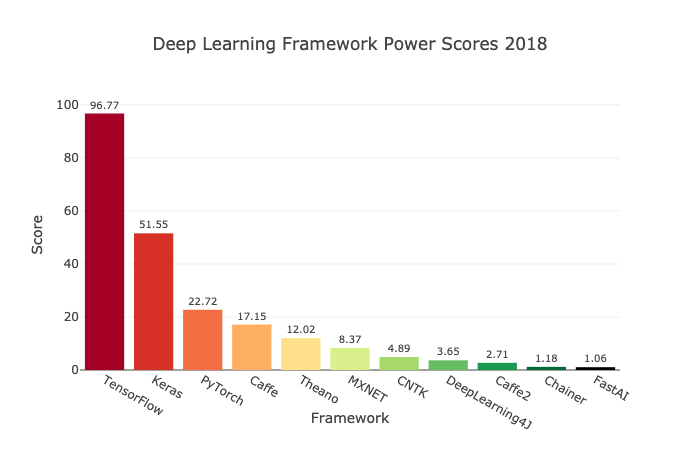
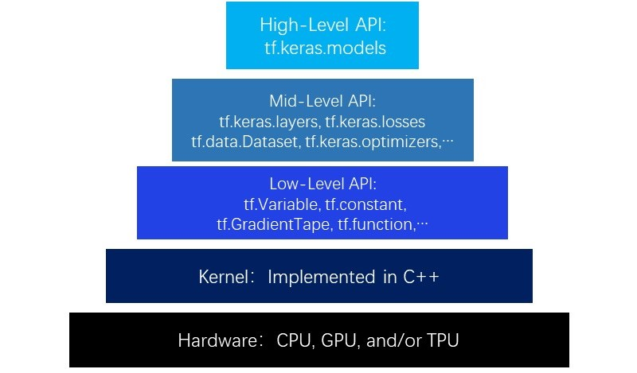

# TF2-Course
This is a introduction for TensorFlow2 which is extremely friendly to human being.

## Tensorflow

### Brief Introduction

- TensorFlow™ 是一个采用数据流图（data flow graphs），用于数值计算的开源软件库
- 节点（Nodes）在图中表示数学操作，图中的线（edges）则表示在节点间相互联系的多维数据数组，即张量（tensor）
- 它灵活的架构让你可以在多种平台上展开计算，例如台式计算机中的一个或多个 CPU（或 GPU），服务器，移动设备等等
- TensorFlow 支持 CNN，RNN 和 LSTM 算法，这都是目前在 Image，Speech 和 NLP 最流行的深度神经网路模型
- TensorFlow 最初由 Google 大脑小组（隶属于 Google 机器智能研究机构）的研究员和工程师们开发的第二代人工智能学习系统，用于机器学习和深度神经网络方面的研究，但这个系统的通用性使其也可广泛用于其他计算领域

### Various Mainstream Frameworks

| 名称        | 简介                                                         |
| :--------- | ------------------------------------------------------------ |
| Caffe      | 深度学习最古老的框架，代码没做优化，适合源码阅读，理解机器学习，文档少，大多框架基于此，早期的论文使用 caffe 较多 |
| Pytorch    | Facebook 人工智能学院创立的框架，具有良好的易用性，设计简洁 |
| Mxnet      | 框架文档少，资料少，但是优化好，灵活性强，内存显存复用优化，运行速度比较快 |
| Tensorflow | google 支持，文档齐全，开源资源多，使用人员较多 |

### Features of TensorFlow

- **高度的灵活性**，TensorFlow 不是一个严格的 “神经网络” 库，只要你可以将你的计算表示为一个数据流图，你就可以使用Tensorflow
- **真正的可移植性**，TensorFlow 不仅支持在 CPU 和 GPU 上运行，还支持在台式机，服务器，手机移动设备上运行，以及多 CPU 上规模化运算等
- **将科研和产品联系在一起**，使用 Tensorflow 可以让应用型研究者将想法迅速运用到产品中， 也可以让学术性研究者更直接地彼此分享代码，从而提高科研产出率
- **自动求微分**，基于梯度的机器学习算法会受益于 Tensorflow 自动求微分的能力，只需要定义预测模型的结构，将这个结构和目标函数（objective function）结合在一 起，并添加数据，Tensorflow 将自动为你计算相关的微分导数
- **多语言支持**，可以直接写 python/c++ 程序，也可以用交互式的 ipython 界面来用 Tensorflow 尝试些想法，它可以帮你将笔记，代码，可视化等有条理地归置好，还鼓励创造最喜欢的语言界面，比如 Go，Java， Lua，Javascript，或者是 R
- **性能最优化**，Tensorflow 给予了线程，队列，异步操作等以最佳的支持，Tensorflow 可以将硬件的计算潜能全部发挥出来，也可以自由地将 Tensorflow 图中的计算元素分配到不同设备

### Complete Export of Models Using SavedModel

在部署模型时，我们的第一步往往是将训练好的整个模型完整导出为一系列标准格式的文件，然后即可在不同的平台上部署模型文件，TensorFlow 为我们提供了 SavedModel 这一格式

SavedModel 包含了一个 TensorFlow 程序的完整信息， **不仅包含参数的权值，还包含计算的流程（即计算图）**，当模型导出为 SavedModel 文件时，无需建立模型的源代码即可再次运行模型，这使得 SavedModel 尤其适用于模型的分享和部署

事实上 TensorFlow Serving（服务器端部署模型），TensorFlow Lite（移动端部署模型）以及 TensorFlow.js 都会用到这一格式

Keras 模型均可方便地导出为 SavedModel 格式

### The Hierarchy of TensorFlow

TensorFlow 的层次结构从低到高可以分成如下 5 层

- 最底层为 **硬件层**，TensorFlow 支持 CPU，GPU 或 TPU 加入计算资源池
- 第二层为 C++ 实现的 **内核层**，kernel 可以跨平台分布运行
- 第三层为 Python 实现的操作符，提供了封装 C++ 内核的 **低阶 API** 指令，主要包括各种张量操作算子，计算图，自动微分
    - 如 `tf.Variable`， `tf.constant,tf.function`， `tf.GradientTape`， `tf.nn.softmax` 等等
    - 如果把模型比作一个房子，那么第三层 API 就是【模型之砖】
- 第四层为 Python 实现的模型组件，对低阶 API 进行了函数封装，形成 **中阶 API**，主要包括各种模型层，损失函数，优化器，数据管道，特征列等等
    - 如 `tf.keras.layers`， `tf.keras.losses`， `tf.keras.metrics`， `tf.keras.optimizers`， `tf.data.DataSet`， `tf.feature_column`
    - 如果把模型比作一个房子，那么第四层API就是【模型之墙】
- 第五层为 Python 实现的模型成品，一般为按照 OOP 方式封装的 **高阶 API**，主要为 `tf.keras.models` 提供的模型的类接口
    - 如果把模型比作一个房子，那么第五层 API 就是模型本身，即【模型之屋】

