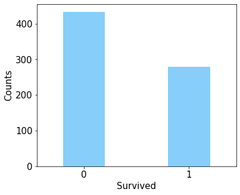
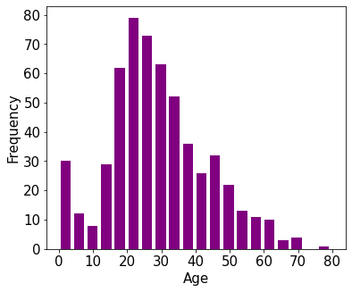
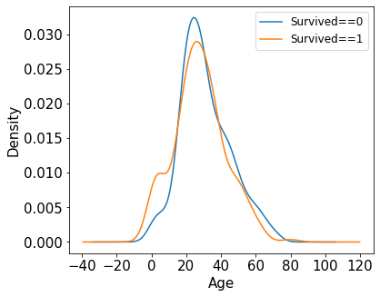
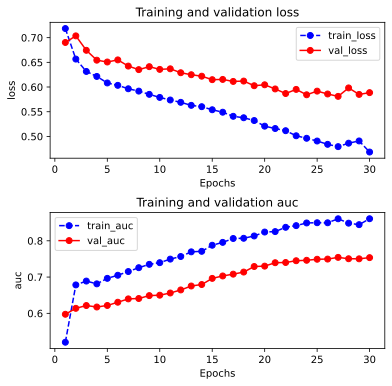

# Modeling Procedure for Structured Data

## Preparation of Data

Titanic 数据集的目标是根据乘客信息预测他们在 Titanic 号撞击冰山沉没后能否生存

### Display the Data

结构化数据一般会使用 Pandas 中的 DataFrame 进行预处理

```python
import numpy as np 
import pandas as pd 
import matplotlib.pyplot as plt
import tensorflow as tf 
from tensorflow.keras import models, layers

dftrain_raw = pd.read_csv('./data/titanic/train.csv')
dftest_raw = pd.read_csv('./data/titanic/test.csv')
dftrain_raw.head(10)
```

**output**


### Field Description

| Field Name | Field Description | Other Remarks |
|:--- |:--- |:---|
| Survived | `0` 代表死亡，`1` 代表存活 | 相当于机器学习中的 y 标签 |
| Pclass | 乘客所持票类，有三种值 `(1, 2, 3)` | 可转换成 onehot 编码 |
| Name | 乘客姓名 | 可舍去 |
| Sex | 性别 | 转换成 bool 特征 |
| Age | 乘客年龄（有缺失） | 数值特征，添加 “年龄是否缺失” 作为辅助特征 |
| SibSp | 乘客兄弟姐妹/配偶的个数 | 数值特征 |
| Parch | 乘客父母/孩子的个数 | 数值特征 |
| Ticket | 票号(字符串) | 可舍去 |
| Fare | 乘客所持票的价格（一个小于 500 的浮点数） | 数值特征 |
| Cabin | 乘客所在船舱（有缺失） | 添加 “所在船舱是否缺失” 作为辅助特征 |
| Embarked | 乘客登船港口，S、C、Q（有缺失）| 转换成 onehot 编码，四维度 `'S', 'C', 'Q', NaN`

### Exploratory Data Analysis

利用 Pandas 的数据可视化功能我们可以简单地进行探索性数据分析 **EDA（Exploratory Data Analysis）**

#### Label Distribution

```python
%matplotlib inline
%config InlineBackend.figure_format = 'png'
ax = dftrain_raw['Survived'].value_counts().plot(
    kind='bar',
    figsize=(6, 5), 
    fontsize=15, 
    rot=0, 
    width=0.4, 
    facecolor='lightskyblue')
ax.set_ylabel('Counts', fontsize=15)
ax.set_xlabel('Survived', fontsize=15)
```



#### Age Distribution

```python
%matplotlib inline
%config InlineBackend.figure_format = 'png'
ax = dftrain_raw['Age'].plot(
    kind='hist', 
    bins=20, 
    color='purple',
    figsize=(6, 5),
    fontsize=15,
    width=3)
ax.set_ylabel('Frequency', fontsize=15)
ax.set_xlabel('Age', fontsize=15)
plt.show()
```



#### Correlation of Age and Label

```python
%matplotlib inline
%config InlineBackend.figure_format = 'png'
ax = dftrain_raw.query('Survived==0')['Age'].plot(
    kind='density',
    figsize=(6, 5),
    fontsize=15)
dftrain_raw.query('Survived==1')['Age'].plot(
    kind='density',
    figsize=(6, 5),
    fontsize=15)
ax.legend(['Survived==0', 'Survived==1'], fontsize=12)
ax.set_ylabel('Density', fontsize=15)
ax.set_xlabel('Age', fontsize=15)
plt.show()
```



### Data Preprocessing

首先我们进行一些数据预处理

```python
def preprocessing(dfdata):

    dfresult = pd.DataFrame()

    # Pclass
    dfPclass = pd.get_dummies(dfdata['Pclass'])
    dfPclass.columns = ['Pclass_' + str(x) for x in dfPclass.columns]
    dfresult = pd.concat([dfresult, dfPclass], axis = 1)

    # Sex
    dfSex = pd.get_dummies(dfdata['Sex'])
    dfresult = pd.concat([dfresult,dfSex], axis = 1)

    # Age
    dfresult['Age'] = dfdata['Age'].fillna(0)
    dfresult['Age_null'] = pd.isna(dfdata['Age']).astype('int32')

    # SibSp, Parch, Fare
    dfresult['SibSp'] = dfdata['SibSp']
    dfresult['Parch'] = dfdata['Parch']
    dfresult['Fare'] = dfdata['Fare']

    # Carbin
    dfresult['Cabin_null'] =  pd.isna(dfdata['Cabin']).astype('int32')

    # Embarked
    dfEmbarked = pd.get_dummies(dfdata['Embarked'], dummy_na=True)
    dfEmbarked.columns = ['Embarked_' + str(x) for x in dfEmbarked.columns]
    dfresult = pd.concat([dfresult, dfEmbarked], axis = 1)

    return(dfresult)
```

可以查看一下数据的结构

```python
x_train = preprocessing(dftrain_raw)
y_train = dftrain_raw['Survived'].values

x_test = preprocessing(dftest_raw)
y_test = dftest_raw['Survived'].values

print("x_train.shape =", x_train.shape)
print("x_test.shape =", x_test.shape)
```

**output**

```console
x_train.shape = (712, 15)
x_test.shape = (179, 15)
```

## Define the Model

Keras 接口有以下 3 种方式构建模型

- 使用 Sequential 按层顺序构建模型
- 使用函数式 API 构建任意结构模型
- 继承 Model 基类构建自定义模型

此处选择使用最简单的 Sequential，按层顺序模型

```python
tf.keras.backend.clear_session()

model = models.Sequential()
model.add(layers.Dense(20, activation='relu', input_shape=(15, ), name="input"))
model.add(layers.Dense(10, activation='relu', name="hidden"))
model.add(layers.Dense(1, activation='sigmoid', name="output"))

model.summary()
```

**output**

```console
Model: "sequential"
_________________________________________________________________
Layer (type)                 Output Shape              Param #   
=================================================================
input (Dense)                (None, 20)                320       
_________________________________________________________________
hidden (Dense)               (None, 10)                210       
_________________________________________________________________
output (Dense)               (None, 1)                 11        
=================================================================
Total params: 541
Trainable params: 541
Non-trainable params: 0
_________________________________________________________________
```

### Training Model

训练模型通常有 3 种方法

- 内置 `fit` 方法
- 内置 `train_on_batch` 方法
- 自定义训练循环

此处我们选择最常用也最简单的内置 `fit` 方法

```python
# 二分类问题选择二元交叉熵损失函数
model.compile(
    optimizer='adam',
    loss='binary_crossentropy',
    metrics=['AUC']
)

history = model.fit(
    x_train, y_train,
    batch_size=64,
    epochs=30,
    validation_split=0.2    # 分割一部分训练数据用于验证
)
```

**output**

```console
Epoch 1/30
9/9 [==============================] - 0s 39ms/step - loss: 0.7971 - auc: 0.4318 - val_loss: 0.7954 - val_auc: 0.4884
Epoch 2/30
9/9 [==============================] - 0s 5ms/step - loss: 0.7152 - auc: 0.5317 - val_loss: 0.7817 - val_auc: 0.5779
Epoch 3/30
9/9 [==============================] - 0s 7ms/step - loss: 0.6885 - auc: 0.6098 - val_loss: 0.7448 - val_auc: 0.5778
Epoch 4/30
9/9 [==============================] - 0s 6ms/step - loss: 0.6495 - auc: 0.6491 - val_loss: 0.7107 - val_auc: 0.5941
Epoch 5/30
9/9 [==============================] - 0s 6ms/step - loss: 0.6280 - auc: 0.6734 - val_loss: 0.6779 - val_auc: 0.6270
Epoch 6/30
9/9 [==============================] - 0s 5ms/step - loss: 0.6123 - auc: 0.7085 - val_loss: 0.6553 - val_auc: 0.6546
Epoch 7/30
9/9 [==============================] - 0s 5ms/step - loss: 0.6077 - auc: 0.7174 - val_loss: 0.6454 - val_auc: 0.6584
Epoch 8/30
9/9 [==============================] - 0s 5ms/step - loss: 0.6045 - auc: 0.7226 - val_loss: 0.6432 - val_auc: 0.6636
Epoch 9/30
9/9 [==============================] - 0s 5ms/step - loss: 0.5997 - auc: 0.7275 - val_loss: 0.6452 - val_auc: 0.6640
Epoch 10/30
9/9 [==============================] - 0s 6ms/step - loss: 0.5942 - auc: 0.7328 - val_loss: 0.6435 - val_auc: 0.6658
Epoch 11/30
9/9 [==============================] - 0s 10ms/step - loss: 0.5922 - auc: 0.7359 - val_loss: 0.6404 - val_auc: 0.6678
Epoch 12/30
9/9 [==============================] - 0s 6ms/step - loss: 0.5876 - auc: 0.7402 - val_loss: 0.6387 - val_auc: 0.6733
Epoch 13/30
9/9 [==============================] - 0s 5ms/step - loss: 0.5847 - auc: 0.7444 - val_loss: 0.6357 - val_auc: 0.6752
Epoch 14/30
9/9 [==============================] - 0s 5ms/step - loss: 0.5820 - auc: 0.7479 - val_loss: 0.6326 - val_auc: 0.6805
Epoch 15/30
9/9 [==============================] - 0s 5ms/step - loss: 0.5786 - auc: 0.7527 - val_loss: 0.6304 - val_auc: 0.6832
Epoch 16/30
9/9 [==============================] - 0s 5ms/step - loss: 0.5751 - auc: 0.7570 - val_loss: 0.6291 - val_auc: 0.6875
Epoch 17/30
9/9 [==============================] - 0s 6ms/step - loss: 0.5740 - auc: 0.7582 - val_loss: 0.6266 - val_auc: 0.6926
Epoch 18/30
9/9 [==============================] - 0s 5ms/step - loss: 0.5812 - auc: 0.7571 - val_loss: 0.6296 - val_auc: 0.6917
Epoch 19/30
9/9 [==============================] - 0s 5ms/step - loss: 0.5683 - auc: 0.7668 - val_loss: 0.6343 - val_auc: 0.6928
Epoch 20/30
9/9 [==============================] - 0s 5ms/step - loss: 0.5669 - auc: 0.7667 - val_loss: 0.6229 - val_auc: 0.7013
Epoch 21/30
9/9 [==============================] - 0s 5ms/step - loss: 0.5631 - auc: 0.7734 - val_loss: 0.6238 - val_auc: 0.7031
Epoch 22/30
9/9 [==============================] - 0s 5ms/step - loss: 0.5597 - auc: 0.7779 - val_loss: 0.6226 - val_auc: 0.7051
Epoch 23/30
9/9 [==============================] - 0s 5ms/step - loss: 0.5570 - auc: 0.7800 - val_loss: 0.6258 - val_auc: 0.7055
Epoch 24/30
9/9 [==============================] - 0s 5ms/step - loss: 0.5538 - auc: 0.7843 - val_loss: 0.6247 - val_auc: 0.7116
Epoch 25/30
9/9 [==============================] - 0s 6ms/step - loss: 0.5504 - auc: 0.7894 - val_loss: 0.6247 - val_auc: 0.7125
Epoch 26/30
9/9 [==============================] - 0s 6ms/step - loss: 0.5464 - auc: 0.7949 - val_loss: 0.6241 - val_auc: 0.7145
Epoch 27/30
9/9 [==============================] - 0s 6ms/step - loss: 0.5433 - auc: 0.7968 - val_loss: 0.6244 - val_auc: 0.7177
Epoch 28/30
9/9 [==============================] - 0s 8ms/step - loss: 0.5412 - auc: 0.8006 - val_loss: 0.6251 - val_auc: 0.7175
Epoch 29/30
9/9 [==============================] - 0s 6ms/step - loss: 0.5371 - auc: 0.8043 - val_loss: 0.6307 - val_auc: 0.7159
Epoch 30/30
9/9 [==============================] - 0s 5ms/step - loss: 0.5352 - auc: 0.8089 - val_loss: 0.6254 - val_auc: 0.7183
```

### Evaluation Model

可以评估一下模型在训练集和验证集上的效果

```python
%matplotlib inline
%config InlineBackend.figure_format = 'svg'

import matplotlib.pyplot as plt

def plot_metric(history, metric):
    train_metrics = history.history[metric]
    val_metrics = history.history['val_'+ metric]
    epochs = range(1, len(train_metrics) + 1)
    plt.plot(epochs, train_metrics, 'bo--')
    plt.plot(epochs, val_metrics, 'ro-')
    plt.title('Training and validation '+ metric)
    plt.xlabel("Epochs")
    plt.ylabel(metric)
    plt.legend(["train_" + metric, 'val_' + metric])
#     plt.show()
```

可以查看一下，`"loss"` 和 `"auc"` 随着 epoch 增加的变化曲线

```python
plt.figure(figsize=(6, 6))
plt.subplots_adjust(hspace=0.4)     # 适当调整一下子图之间的纵间距
plt.subplot(2, 1, 1)
plot_metric(history, "loss")
plt.subplot(2, 1, 2)
plot_metric(history, "auc")
```



我们再看一下模型在测试集上的效果

```python
model.evaluate(x=x_test, y=y_test)
```

**output**

```console
6/6 [==============================] - 0s 2ms/step - loss: 0.5336 - auc: 0.8045
[0.5336199998855591, 0.8045293092727661]
```

### Use the Model

我们可以以生成模式一样预测一个生存的概率

```python
# 预测概率
model.predict(x_test[0:10])
# model(tf.constant(x_test[0:10].values, dtype=tf.float32)) # 等价写法
```

**output**

```console
array([[0.18057439],
       [0.40997833],
       [0.40195692],
       [0.69858134],
       [0.4668072 ],
       [0.39097822],
       [0.2679355 ],
       [0.44945693],
       [0.43588743],
       [0.18819675]], dtype=float32)
```

也可以以判别模式一样预测一个是否生存的类别

```python
# 预测类别
(model.predict(x_test[0:10]) > 0.5).astype("int32")
# model.predict_classes(x_test[0:10])   # Sequential.predict_classes is deprecated and will be removed after 2021-01-01
```

**output**

```
array([[0],
       [0],
       [0],
       [1],
       [0],
       [0],
       [0],
       [0],
       [0],
       [0]], dtype=int32)
```

### Save the Model


可以使用 Keras 方式保存模型，也可以使用 TensorFlow 原生方式保存，前者仅仅适用于 Python 环境的恢复模型，后者则可以跨平台进行模型部署，推荐使用后一种方式进行保存

#### Keras Method of Saving

```python
# 保存模型结构及权重
model.save('./data/keras_model.h5')  

del model  # 删除现有模型

# identical to the previous one
model = models.load_model('./data/keras_model.h5')
model.evaluate(x_test, y_test)
```

**output**

```
6/6 [==============================] - 0s 8ms/step - loss: 0.5336 - auc: 0.8045
[0.5336199998855591, 0.8045293092727661]
```

也可以仅仅保留模型结构

```python
# 保存模型结构
json_str = model.to_json()

# 恢复模型结构
model_json = models.model_from_json(json_str)
```

主要将各层之间的权重系数保存下来

```python
# 保存模型权重
model.save_weights('./data/keras_model_weight.h5')

# 恢复模型结构
model_json = models.model_from_json(json_str)
model_json.compile(
        optimizer='adam',
        loss='binary_crossentropy',
        metrics=['AUC']
    )

# 加载权重
model_json.load_weights('./data/keras_model_weight.h5')
model_json.evaluate(x_test, y_test)
```

**output**

```
6/6 [==============================] - 0s 2ms/step - loss: 0.5336 - auc: 0.8045
[0.5336199998855591, 0.8045293092727661]
```

#### TensorFlow Method of Saving

```python
# 保存权重，该方式仅仅保存权重张量
model.save_weights('./data/tf_model_weights.ckpt', save_format="tf")
```

保存完整的模型

```python
# 保存模型结构与模型参数到文件，该方式保存的模型具有跨平台性便于部署
model.save('./data/tf_model_savedmodel', save_format="tf")

model_loaded = tf.keras.models.load_model('./data/tf_model_savedmodel')
model_loaded.evaluate(x_test, y_test)
```

**output**

```
INFO:tensorflow:Assets written to: ./data/tf_model_savedmodel/assets

6/6 [==============================] - 0s 3ms/step - loss: 0.5336 - auc: 0.8045
[0.5336199998855591, 0.8045293092727661]
```
