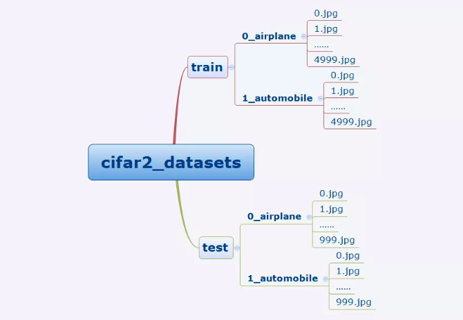
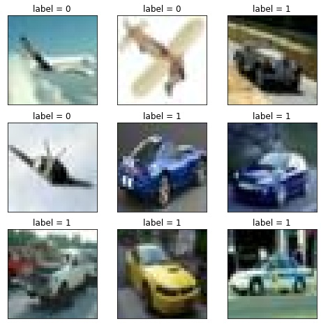
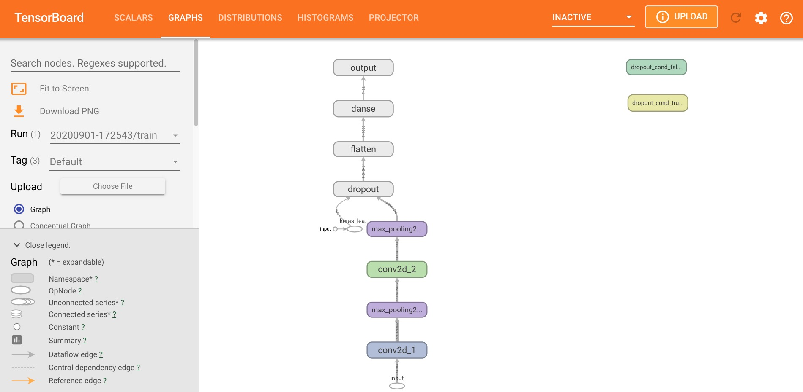
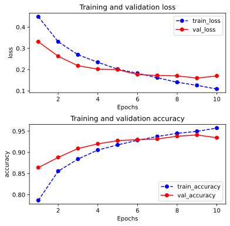

# Modeling Procedure for Images

## Preparation of Data

Cifar2 数据集为 Cifar10 数据集的子集，只包括前两种类别 airplane 和 automobile，其中

- 训练集有 airplane 和 automobile 图片各 5000 张
- 测试集有 airplane 和 automobile 图片各 1000 张

Cifar2 任务的目标是训练一个模型来对 airplane 和 automobile 两种图片进行分类

我们准备的 Cifar2 数据集的文件结构如下所示



在 TensorFlow中 准备图片数据的常用方案有两种

- 使用 `tf.keras` 中的 `ImageDataGenerator` 工具构建图片数据生成器，相对简单
- 使用 `tf.data.Dataset` 搭配 `tf.image` 中的一些图片处理方法构建数据管道，是 TensorFlow 的原生方法，更加灵活，使用得当的话也可以获得更好的性能

我们此处介绍第二种方法

```python
import tensorflow as tf 
from tensorflow.keras import datasets, layers, models

BATCH_SIZE = 100

def load_image(img_path, size = (32, 32)):
    label = tf.constant(1, tf.int8) if tf.strings.regex_full_match(img_path, ".*automobile.*") \
            else tf.constant(0, tf.int8)
    img = tf.io.read_file(img_path)
    img = tf.image.decode_jpeg(img) # 注意此处为jpeg格式
    img = tf.image.resize(img, size) / 255.0
    return(img, label)
```

接着，`tf.data.Dataset.prefetch()` 使用了一个后台进程和一个内部的缓存提前从数据集中获取数据，每次获取的数据必须大于等于单个训练步骤所需的数据，可以通过 `tf.data.experimental.AUTOTUNE` 来自动设置参数

```python
# 使用并行化预处理 num_parallel_calls 和预存数据 prefetch 来提升性能
ds_train = tf.data.Dataset.list_files("./data/cifar2/train/*/*.jpg") \
           .map(load_image, num_parallel_calls=tf.data.experimental.AUTOTUNE) \
           .shuffle(buffer_size=1000).batch(BATCH_SIZE) \
           .prefetch(tf.data.experimental.AUTOTUNE)

ds_test = tf.data.Dataset.list_files("./data/cifar2/test/*/*.jpg") \
           .map(load_image, num_parallel_calls=tf.data.experimental.AUTOTUNE) \
           .batch(BATCH_SIZE) \
           .prefetch(tf.data.experimental.AUTOTUNE)
```

查看部分样本

```python
%matplotlib inline
%config InlineBackend.figure_format = 'jpg'

#查看部分样本
from matplotlib import pyplot as plt 

plt.figure(figsize=(8, 8)) 
for i, (img, label) in enumerate(ds_train.unbatch().take(9)):
    ax = plt.subplot(3, 3, i+1)
    ax.imshow(img.numpy())
    ax.set_title("label = %d"%label)
    ax.set_xticks([])
    ax.set_yticks([]) 
```



查看数据维度

```python
for x, y in ds_train.take(1):
    print(x.shape, y.shape)
```

**output**

```console
(100, 32, 32, 3) (100,)
```

## Define the Model

Keras 接口有以下 3 种方式构建模型

- 使用 Sequential 按层顺序构建模型
- 使用函数式 API 构建任意结构模型
- 继承 Model 基类构建自定义模型

此处选择使用函数式 API 构建模型

```python
tf.keras.backend.clear_session() # 清空会话

inputs = layers.Input(shape=(32, 32, 3), name="input")
x = layers.Conv2D(32, kernel_size=(3, 3), name="conv2d_1")(inputs)
x = layers.MaxPool2D(name="max_pooling2d_1")(x)
x = layers.Conv2D(64, kernel_size=(5, 5), name="conv2d_2")(x)
x = layers.MaxPool2D(name="max_pooling2d_2")(x)
x = layers.Dropout(rate=0.1, name="dropout")(x)
x = layers.Flatten(name="flatten")(x)
x = layers.Dense(32, activation='relu', name="danse")(x)
outputs = layers.Dense(1, activation='sigmoid', name="output")(x)

model = models.Model(inputs=inputs, outputs=outputs, name="model")

model.summary()
```

**output**

```console
Model: "model"
_________________________________________________________________
Layer (type)                 Output Shape              Param #   
=================================================================
input (InputLayer)           [(None, 32, 32, 3)]       0         
_________________________________________________________________
conv2d_1 (Conv2D)            (None, 30, 30, 32)        896       
_________________________________________________________________
max_pooling2d_1 (MaxPooling2 (None, 15, 15, 32)        0         
_________________________________________________________________
conv2d_2 (Conv2D)            (None, 11, 11, 64)        51264     
_________________________________________________________________
max_pooling2d_2 (MaxPooling2 (None, 5, 5, 64)          0         
_________________________________________________________________
dropout (Dropout)            (None, 5, 5, 64)          0         
_________________________________________________________________
flatten (Flatten)            (None, 1600)              0         
_________________________________________________________________
danse (Dense)                (None, 32)                51232     
_________________________________________________________________
output (Dense)               (None, 1)                 33        
=================================================================
Total params: 103,425
Trainable params: 103,425
Non-trainable params: 0
_________________________________________________________________
```

## Training Model

训练模型通常有 3 种方法

- 内置 `fit` 方法
- 内置 `train_on_batch` 方法
- 自定义训练循环

此处我们选择最常用也最简单的内置 `fit` 方法

```python
# import os
import datetime
from pathlib import Path

stamp = datetime.datetime.now().strftime("%Y%m%d-%H%M%S")
logdir = str(Path('./data/autograph/' + stamp))

tensorboard_callback = tf.keras.callbacks.TensorBoard(logdir, histogram_freq=1)

model.compile(
    optimizer=tf.keras.optimizers.Adam(learning_rate=0.001),
    loss=tf.keras.losses.binary_crossentropy,
    metrics=["accuracy"]
)

history = model.fit(ds_train, epochs=10, validation_data=ds_test,
                    callbacks=[tensorboard_callback], workers=4)
```

**output**

```console
Epoch 1/10
100/100 [==============================] - 13s 129ms/step - loss: 0.0968 - accuracy: 0.9626 - val_loss: 0.1628 - val_accuracy: 0.9360
Epoch 2/10
100/100 [==============================] - 12s 117ms/step - loss: 0.0755 - accuracy: 0.9718 - val_loss: 0.1680 - val_accuracy: 0.9365
Epoch 3/10
100/100 [==============================] - 11s 106ms/step - loss: 0.0648 - accuracy: 0.9780 - val_loss: 0.1720 - val_accuracy: 0.9370
Epoch 4/10
100/100 [==============================] - 10s 103ms/step - loss: 0.0609 - accuracy: 0.9793 - val_loss: 0.1660 - val_accuracy: 0.9420
Epoch 5/10
100/100 [==============================] - 10s 98ms/step - loss: 0.0496 - accuracy: 0.9817 - val_loss: 0.1725 - val_accuracy: 0.9395
Epoch 6/10
100/100 [==============================] - 10s 100ms/step - loss: 0.0434 - accuracy: 0.9850 - val_loss: 0.1961 - val_accuracy: 0.9335
Epoch 7/10
100/100 [==============================] - 11s 110ms/step - loss: 0.0376 - accuracy: 0.9875 - val_loss: 0.2184 - val_accuracy: 0.9305
Epoch 8/10
100/100 [==============================] - 10s 101ms/step - loss: 0.0307 - accuracy: 0.9907 - val_loss: 0.1832 - val_accuracy: 0.9425
Epoch 9/10
100/100 [==============================] - 10s 101ms/step - loss: 0.0233 - accuracy: 0.9932 - val_loss: 0.2030 - val_accuracy: 0.9455
Epoch 10/10
100/100 [==============================] - 10s 103ms/step - loss: 0.0259 - accuracy: 0.9921 - val_loss: 0.2111 - val_accuracy: 0.9430
```

## Evaluation Model

可以查看计算图，注意路径不需要引号

```python
%load_ext tensorboard
# %tensorboard --logdir ./data/autograph/
```

可以查看已经开启的 TensorBoard

```python
from tensorboard import notebook
notebook.list()
```

**output**

```console
Known TensorBoard instances:
  - port 6006: logdir ./data/autograph/ (started 0:00:03 ago; pid 36334)
```

在 `tensorboard` 库中查看模型

```python
# 在 tensorboard 中查看模型
notebook.start("--logdir ./data/autograph/")
```

**output**

```console
Reusing TensorBoard on port 6006 (pid 36334), started 0:16:55 ago. (Use '!kill 36334' to kill it.)
```



可以清晰的观察到网络结构，数据流等情况

```python
import pandas as pd 
dfhistory = pd.DataFrame(history.history)
dfhistory.index = range(1, len(dfhistory) + 1)
dfhistory.index.name = 'epoch'

dfhistory
```

**output**

| epoch | loss | accuracy | val_loss | val_accuracy |
|:---|:---:|:---:|:---:|:---:|
| 1	| 0.449009 | 0.7866 | 0.331269 | 0.8640 |
| 2 | 0.331418 | 0.8556 | 0.263134 | 0.8880 |
| 3	| 0.270019 | 0.8842 | 0.218141 | 0.9090 |
| 4	| 0.234814 | 0.9054	| 0.202480 | 0.9200 |
| 5	| 0.202122 | 0.9176	| 0.199820 | 0.9275 |
| 6	| 0.182991 | 0.9285	| 0.177118 | 0.9300 |
| 7	| 0.161947 | 0.9374	| 0.172488 | 0.9315 |
| 8	| 0.140671 | 0.9448	| 0.170727 | 0.9380 |
| 9	| 0.126156 | 0.9496	| 0.160099 | 0.9410 |
| 10 | 0.108902 | 0.9573 | 0.170625 | 0.9345 |

可以评估一下模型在训练集和验证集上的效果

```python
%matplotlib inline
%config InlineBackend.figure_format = 'svg'

import matplotlib.pyplot as plt

def plot_metric(history, metric):
    train_metrics = history.history[metric]
    val_metrics = history.history['val_' + metric]
    epochs = range(1, len(train_metrics) + 1)
    plt.plot(epochs, train_metrics, 'bo--')
    plt.plot(epochs, val_metrics, 'ro-')
    plt.title('Training and validation '+ metric)
    plt.xlabel("Epochs")
    plt.ylabel(metric)
    plt.legend(["train_" + metric, 'val_' + metric])
    # plt.show()
```

可以查看一下，`"loss"` 和 `"accuracy"` 随着 epoch 增加的变化曲线

```python
plt.figure(figsize=(6, 6))
plt.subplots_adjust(hspace=0.4)     # 适当调整一下子图之间的纵间距
plt.subplot(2, 1, 1)
plot_metric(history, "loss")
plt.subplot(2, 1, 2)
plot_metric(history, "accuracy")
```



我们再看一下模型在测试集上的效果

```python
# 可以使用 evaluate 对数据进行评估
val_loss, val_accuracy = model.evaluate(ds_test, workers=4)
print(val_loss, val_accuracy)
```

**output**

```console
20/20 [==============================] - 1s 35ms/step - loss: 0.1706 - accuracy: 0.9345
0.17062519490718842 0.934499979019165
```

## Use the Model

可以使用 `model.predict(ds_test)` 进行预测

```python
model.predict(ds_test)
```

**output**

```console
array([[0.9996369 ],
       [0.99610496],
       [0.9995226 ],
       ...,
       [0.9983187 ],
       [0.1212841 ],
       [0.99217534]], dtype=float32)
```

也可以使用 `model.predict_on_batch(x_test)` 对一个 batch 进行预测

```python
for x,y in ds_test.take(1):
    print(model.predict_on_batch(x[0:20]))
```

**output**

```console
[[2.89505213e-01]
 [1.35202135e-05]
 [7.44611025e-04]
 [6.99073076e-04]
 [7.29461432e-01]
 [8.14574232e-05]
 [9.98318672e-01]
 [5.59424162e-02]
 [7.05548446e-05]
 [2.00748444e-04]
 [1.61284208e-03]
 [2.72640586e-03]
 [3.89826528e-06]
 [3.22553247e-01]
 [2.03045905e-02]
 [9.98455346e-01]
 [9.96827304e-01]
 [7.45079815e-02]
 [9.55962539e-02]
 [9.99922097e-01]]
```

## Save the Model

推荐使用 TensorFlow 原生方式保存模型

- 保存权重，该方式仅仅保存权重张量

```python
model.save_weights('./data/tf_model_weights.ckpt', save_format="tf")
```

- 保存模型结构与模型参数到文件,该方式保存的模型具有跨平台性便于部署

```python
model.save('./data/tf_model_savedmodel', save_format="tf")

model_loaded = tf.keras.models.load_model('./data/tf_model_savedmodel')
model_loaded.evaluate(ds_test)
```

**output**

```console
INFO:tensorflow:Assets written to: ./data/tf_model_savedmodel/assets
20/20 [==============================] - 1s 33ms/step - loss: 0.1706 - accuracy: 0.9345
[0.17062519490718842, 0.934499979019165]
```
