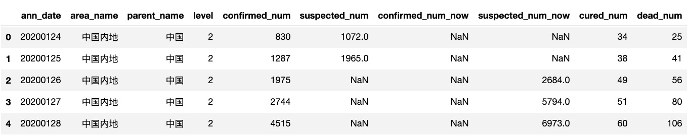
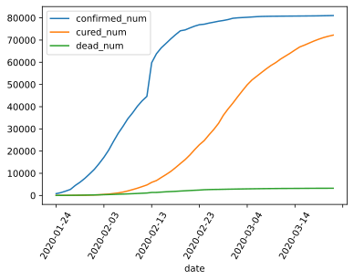
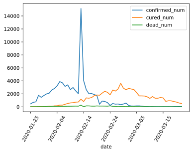
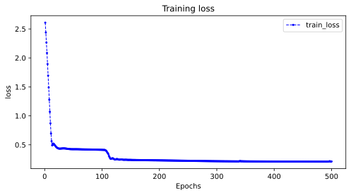

# Modeling Procedure for Temporal Sequences

国内的新冠肺炎疫情从发现至今已经持续 N 个多月了，这场起源于吃野味的灾难给大家的生活造成了诸多方面的影响

当时大家几乎天天在想，国内的新冠肺炎疫情何时结束呢？什么时候才可以重获自由呢？

本篇文章将利用 TensorFlow2.0 建立时间序列 RNN 模型，去重温那段对国内新冠肺炎疫情结束时间预测的往事

## Preparation of Data

对于本次预测研究，我们以事后诸葛的角度，引入一些规则

- 不考虑后面各种形式的境外输入
- 不考虑后续部分地区的二次爆发
- 主要探究国内第一波疫情的整体结束情况

### Get Data from Tushare

在我们互金领域使用最广的 Tushare 包，也提供了接口来支持疫情数据，获取的方法最简单

- 接口，`ncov_num`
- 描述，获取新冠状肺炎疫情感染人数统计数据
- 限量，单次最大 2000

**输入参数**

| Name         | Type     | Default | Description         |
| :----------- | :------- | :---    | :------------------ |
| country      | str      | N       | 国家名称             |
| province     | str      | N       | 省份简称（北京、上海）  |
| publish_date | datetime | N       | 公布日期             |
| start_date   | datetime | N       | 开始日期（YYYYMMDD）  |
| end_date     | datetime | N       | 结束日期（YYYYMMDD）  |

**输出参数**

| Name              | Type | Default  | Description |
| :---------------- | :--- | :------- | :---------- |
| area_id           | str  | N        | 地区代码     |
| publish_date      | str  | Y        | 发布日期     |
| country           | str  | Y        | 国家        |
| country_enname    | str  | Y        | 国家英文名   |
| province          | str  | Y        | 省份        |
| province_short    | str  | Y        | 省份简称     |
| province_enname   | str  | Y        | 省份英文名   |
| confirmed_num     | int  | Y        | 累计确诊病例  |
| confirmed_num_now | int  | Y        | 现有确诊病例  |
| suspected_num     | int  | Y        | 疑似感染病例  |
| cured_num         | int  | Y        | 治愈人数     |
| dead_num          | int  | Y        | 死亡人数     |
| update_time       | str  | Y        | 更新时间     |

- 设置 Tushare 的 Token

```python
import tushare as ts
import pandas as pd
from datetime import datetime

TOKEN = "xxxxxxxxxxxxxxxxxxxx Your Token xxxxxxxxxxxxxxxxxxxx"
pro = ts.pro_api(TOKEN)
```

- `ncov_num` 是一个免费的接口，我们可以查看数据格式

```python
df = pro.ncov_num(level=2)  # 仅中国地区
len_df = df.shape[0]
df.head()
```

**output**



- 调整一下日期的格式

```python
df = df.rename(columns={'ann_date': 'date'})

date_value = list(df["date"])

for idx in range(len(date_value)):
    date_value[idx] = datetime.strftime(
        datetime.strptime(date_value[idx], "%Y%m%d"), "%Y-%m-%d"
    )

df["date"] = date_value
```

- 精简数据表格

```python
col_n = ['date', 'confirmed_num', 'cured_num', 'dead_num']
df_new = pd.DataFrame(df, columns = col_n)
```

- 导出表格

```python
file_name = "covid-19.csv"
df_new.to_csv("./data/" + file_name, index=None)
```

### Understand the Data

```python
import numpy as np
import pandas as pd
import matplotlib.pyplot as plt
import tensorflow as tf
from tensorflow.keras import models, layers, losses, metrics, callbacks
```

- 数据可视化

```python
%matplotlib inline
%config InlineBackend.figure_format = 'svg'

df = pd.read_csv("./data/covid-19.csv")
df.plot(x="date", y=["confirmed_num", "cured_num", "dead_num"], figsize=(6, 4))
plt.xticks(rotation=60)
```

**output**



```python
dfdata = df.set_index("date")
dfdiff = dfdata.diff(periods=1).dropna()
dfdiff = dfdiff.reset_index("date")

dfdiff.plot(x="date", y=["confirmed_num", "cured_num", "dead_num"], figsize=(6, 4))
plt.xticks(rotation=60)
dfdiff = dfdiff.drop("date", axis=1).astype("float32")
```



```python
# 用某日前 8 天窗口数据作为输入预测该日数据
WINDOW_SIZE = 8

def batch_dataset(dataset):
    dataset_batched = dataset.batch(WINDOW_SIZE, drop_remainder=True)
    return dataset_batched

ds_data = tf.data.Dataset.from_tensor_slices(tf.constant(dfdiff.values, dtype=tf.float32)) \
   .window(WINDOW_SIZE,shift=1).flat_map(batch_dataset)

ds_label = tf.data.Dataset.from_tensor_slices(
    tf.constant(dfdiff.values[WINDOW_SIZE:], dtype=tf.float32))

# 数据较小，可以将全部训练数据放入到一个 batch 中，提升性能
ds_train = tf.data.Dataset.zip((ds_data, ds_label)).batch(len_df).cache()
```

## Define the Model

Keras 接口有以下 3 种方式构建模型

- 使用 Sequential 按层顺序构建模型
- 使用函数式 API 构建任意结构模型
- 继承 Model 基类构建自定义模型

此处选择使用函数式 API 构建任意结构模型

```python
# 考虑到新增确诊，新增治愈，新增死亡人数数据不可能小于 0，设计如下结构
class Block(layers.Layer):
    def __init__(self, **kwargs):
        super(Block, self).__init__(**kwargs)

    def call(self, x_input, x):
        x_out = tf.maximum((1 + x) * x_input[:, -1, :], 0.0)
        return x_out

    def get_config(self):  
        config = super(Block, self).get_config()
        return config
```

堆叠层结构

```python
tf.keras.backend.clear_session()
x_input = layers.Input(shape=(None, 3), dtype=tf.float32, name="input")
x = layers.LSTM(3, return_sequences=True, input_shape=(None, 3), name="lstm_1")(x_input)
x = layers.LSTM(3, return_sequences=True, input_shape=(None, 3), name="lstm_2")(x)
x = layers.LSTM(3, return_sequences=True, input_shape=(None, 3), name="lstm_3")(x)
x = layers.LSTM(3, input_shape=(None, 3), name="lstm_4")(x)
x = layers.Dense(3)(x)

x = Block()(x_input, x)
model = models.Model(inputs=[x_input], outputs=[x], name="model")
model.summary()
```

**output**

```console
Model: "model"
__________________________________________________________________________________________________
Layer (type)                    Output Shape         Param #     Connected to                     
==================================================================================================
input (InputLayer)              [(None, None, 3)]    0                                            
__________________________________________________________________________________________________
lstm_1 (LSTM)                   (None, None, 3)      84          input[0][0]                      
__________________________________________________________________________________________________
lstm_2 (LSTM)                   (None, None, 3)      84          lstm_1[0][0]                     
__________________________________________________________________________________________________
lstm_3 (LSTM)                   (None, None, 3)      84          lstm_2[0][0]                     
__________________________________________________________________________________________________
lstm_4 (LSTM)                   (None, 3)            84          lstm_3[0][0]                     
__________________________________________________________________________________________________
dense (Dense)                   (None, 3)            12          lstm_4[0][0]                     
__________________________________________________________________________________________________
block (Block)                   (None, 3)            0           input[0][0]                      
                                                                 dense[0][0]                      
==================================================================================================
Total params: 348
Trainable params: 348
Non-trainable params: 0
__________________________________________________________________________________________________
```

## Training Model

训练模型通常有 3 种方法

- 内置 `fit` 方法
- 内置 `train_on_batch` 方法
- 自定义训练循环

此处我们选择最常用也最简单的内置 `fit` 方法

**注**&nbsp; 循环神经网络调试较为困难，需要设置多个不同的学习率多次尝试，以取得较好的效果

```python
# 自定义损失函数，考虑平方差和预测目标的比值
class MSPE(losses.Loss):
    def call(self,y_true,y_pred):
        err_percent = (y_true - y_pred) ** 2 / (tf.maximum(y_true ** 2, 1e-7))
        mean_err_percent = tf.reduce_mean(err_percent)
        return mean_err_percent

    def get_config(self):
        config = super(MSPE, self).get_config()
        return config
```

可以对学习率适当调整的训练过程

```python
import os
import datetime

optimizer = tf.keras.optimizers.Adam(learning_rate=0.01)
model.compile(optimizer=optimizer,loss=MSPE(name="MSPE"))

stamp = datetime.datetime.now().strftime("%Y%m%d-%H%M%S")
logdir = os.path.join('data', 'autograph', stamp)

tb_callback = tf.keras.callbacks.TensorBoard(logdir, histogram_freq=1)
# 如果 loss 在 100 个 epoch 后没有提升，学习率减半
lr_callback = tf.keras.callbacks.ReduceLROnPlateau(monitor="loss", factor=0.5, patience=100)
# 当 loss 在 200 个 epoch 后没有提升，则提前终止训练
stop_callback = tf.keras.callbacks.EarlyStopping(monitor="loss", patience=200)
callbacks_list = [tb_callback, lr_callback, stop_callback]

history = model.fit(ds_train, epochs=500, callbacks=callbacks_list)
```

**output**

```console
Epoch 1/500
2/2 [==============================] - 0s 184ms/step - loss: 2.8318
Epoch 2/500
2/2 [==============================] - 0s 29ms/step - loss: 2.4329
Epoch 3/500
2/2 [==============================] - 0s 26ms/step - loss: 2.1221
Epoch 4/500
2/2 [==============================] - 0s 24ms/step - loss: 1.8391
Epoch 5/500
2/2 [==============================] - 0s 35ms/step - loss: 1.5675
Epoch 6/500
2/2 [==============================] - 0s 74ms/step - loss: 1.3006
Epoch 7/500
2/2 [==============================] - 0s 56ms/step - loss: 1.0437
Epoch 8/500
2/2 [==============================] - 0s 32ms/step - loss: 0.8134
Epoch 9/500
2/2 [==============================] - 0s 24ms/step - loss: 0.6301
Epoch 10/500
2/2 [==============================] - 0s 24ms/step - loss: 0.5062

...

Epoch 491/500
2/2 [==============================] - 0s 14ms/step - loss: 0.2175
Epoch 492/500
2/2 [==============================] - 0s 20ms/step - loss: 0.2174
Epoch 493/500
2/2 [==============================] - 0s 11ms/step - loss: 0.2174
Epoch 494/500
2/2 [==============================] - 0s 13ms/step - loss: 0.2174
Epoch 495/500
2/2 [==============================] - 0s 13ms/step - loss: 0.2173
Epoch 496/500
2/2 [==============================] - 0s 16ms/step - loss: 0.2173
Epoch 497/500
2/2 [==============================] - 0s 11ms/step - loss: 0.2172
Epoch 498/500
2/2 [==============================] - 0s 17ms/step - loss: 0.2172
Epoch 499/500
2/2 [==============================] - 0s 17ms/step - loss: 0.2171
Epoch 500/500
2/2 [==============================] - 0s 13ms/step - loss: 0.2171
```

## Evaluation Model

评估模型一般要设置验证集或者测试集，由于此例数据较少，我们仅仅可视化损失函数在训练集上的迭代情况。

```python
%matplotlib inline
%config InlineBackend.figure_format = 'svg'

import matplotlib.pyplot as plt

def plot_metric(history, metric):
    train_metrics = history.history[metric]
    epochs = range(1, len(train_metrics) + 1)
    plt.figure(figsize=(8, 4))
    plt.plot(epochs, train_metrics, 'bo--', markersize=2, linewidth=1)
    plt.title('Training '+ metric)
    plt.xlabel("Epochs")
    plt.ylabel(metric)
    plt.legend(["train_" + metric])
#     plt.show()
```

查看损失函数曲线

```python
plot_metric(history, "loss")
```



## Use the Model

此处我们使用模型预测疫情结束时间，即新增确诊病例为 0 的时间

```python
# 使用 dfresult 记录现有数据以及此后预测的疫情数据
dfresult = dfdiff[["confirmed_num", "cured_num", "dead_num"]].copy()
# dfresult.tail()
```

预测此后 `200` 天的新增走势，将其结果添加到 `dfresult` 中

```python
for i in range(200):
    arr_predict = model.predict(tf.constant(tf.expand_dims(dfresult.values[- len_df:, :], axis = 0)))

    dfpredict = pd.DataFrame(tf.cast(tf.floor(arr_predict), tf.float32).numpy(),
                columns=dfresult.columns)
    dfresult = dfresult.append(dfpredict, ignore_index=True)
```

为了方便后续的日期比较，这里定义一个基准日期 `base_date`

```python
base_date = datetime.strptime("2020-01-24", "%Y-%m-%d")
```

### About Confirmed Number

查看 **确诊人数** 首次等于 `0` 的情况

```python
dfresult.query("confirmed_num==0").head()
```

第 `66 + 1` 天开始新增确诊降为 0，即预计 3 月 31 日新增确诊降为 0

```python
no_confirmed_date = base_date + timedelta(
    days=int(dfresult.query("confirmed_num==0").index[0] + 1)
)

print(datetime.strftime(no_confirmed_date, "%Y-%m-%d"))
```

**output**

```console
2020-03-31
```

### About Cured Number

查看 **治愈人数** 首次等于 `0` 的情况

```python
dfresult.query("cured_num==0").head()
```

第 `108 + 1` 天开始新增治愈降为 0，即 5 月 12 日左右全部治愈，该预测稍有问题，如果将每天新增治愈人数加起来，将超过累计确诊人数

```python
dno_cured_date = base_date + timedelta(
    days=int(dfresult.query("cured_num==0").index[0] + 1)
)

print(datetime.strftime(no_cured_date, "%Y-%m-%d"))
```

**output**

```console
2020-05-12
```

### About Dead Number

查看 **死亡人数** 首次等于 `0` 的情况

```python
dfresult.query("dead_num==0").head()
```

第 `60 + 1` 天开始，新增死亡降为 0，即大约 3 月 25 日左右

```python
no_dead_date = base_date + timedelta(
    days=int(dfresult.query("dead_num==0").index[0] + 1)
)

print(datetime.strftime(no_dead_date, "%Y-%m-%d"))
```

**output**

```console
2020-03-25
```

## Save the Model

推荐使用 TensorFlow 原生方式保存模型

```python
model.save('./data/tf_model_savedmodel', save_format="tf")
```

**output**

```console
INFO:tensorflow:Assets written to: ./data/tf_model_savedmodel/assets
```

重新使用导入的模型

```python
model_loaded = tf.keras.models.load_model('./data/tf_model_savedmodel', compile=False)
optimizer = tf.keras.optimizers.Adam(learning_rate=0.001)
model_loaded.compile(optimizer=optimizer, loss=MSPE(name = "MSPE"))
model_loaded.predict(ds_train)
```

**output**

```console
array([[1.31635791e+03, 9.41352158e+01, 3.28035593e+00],
       [1.62365442e+03, 7.38105698e+01, 6.67005730e+00],
       [1.77165845e+03, 1.57248596e+02, 6.23267651e+00],
       [2.02752991e+03, 1.67945786e+02, 6.99809265e+00],
       [2.43704956e+03, 2.78126770e+02, 7.10743809e+00],
       [2.31663940e+03, 2.79196503e+02, 7.98219967e+00],
       [1.97108765e+03, 4.13981018e+02, 7.98219967e+00],
       [2.12285449e+03, 5.45556335e+02, 9.40368652e+00],
       [1.66316406e+03, 6.40761292e+02, 9.73172283e+00],
       [1.86447461e+03, 6.76062012e+02, 1.06064844e+01],
       [1.54714392e+03, 7.64848633e+02, 1.18092813e+01],
       [1.26367859e+03, 7.95870483e+02, 1.06064844e+01],
       [9.50173340e+03, 1.25264026e+03, 2.77736797e+01],
       [2.53801831e+03, 8.68611328e+02, 1.42148757e+00],
       [1.65626550e+03, 1.46872327e+03, 1.56363630e+01],
       [1.25928857e+03, 1.41523743e+03, 1.55270176e+01],
       [1.28437402e+03, 1.52434863e+03, 1.14812460e+01],
       [7.57791626e+02, 1.81346765e+03, 7.86518707e+01],
       [4.73259735e+02, 1.89092322e+03, 1.26874252e+02],
       [1.33143845e+02, 1.80372900e+03, 1.04682953e+02],
       [3.65839905e+02, 2.11021753e+03, 1.08637497e+02],
       [3.59850739e+02, 2.38676807e+03, 1.03330063e+02],
       [3.04145111e+02, 2.20739380e+03, 8.55798950e+01],
       [1.26434555e+02, 1.77023865e+03, 9.70881805e+01],
       [3.34138306e+02, 2.43976636e+03, 4.23934669e+01],
       [2.76576202e+02, 2.25899634e+03, 3.17700634e+01],
       [2.95181549e+02, 2.48016846e+03, 2.15432148e+01],
       [2.22920013e+02, 3.26660718e+03, 3.26862564e+01],
       [2.91091278e+02, 2.60192212e+03, 3.49148674e+01],
       [3.90621307e+02, 2.36562964e+03, 2.60004330e+01],
       [1.37705933e+02, 2.55863184e+03, 3.12005196e+01],
       [8.52140732e+01, 2.47295337e+03, 2.30289536e+01],
       [8.11237946e+01, 2.39178418e+03, 2.82290401e+01],
       [9.47580490e+01, 1.97421411e+03, 2.30289536e+01],
       [9.74848938e+01, 1.51605933e+03, 2.22860851e+01],
       [6.74895477e+01, 1.51335364e+03, 2.08003464e+01],
       [2.99953537e+01, 1.49802173e+03, 2.00574760e+01],
       [2.72685032e+01, 1.38438489e+03, 1.63431282e+01],
       [1.29525385e+01, 1.16973767e+03, 1.26287813e+01],
       [1.63611012e+01, 1.42316577e+03, 1.63431282e+01],
       [1.02256889e+01, 1.18867712e+03, 8.17156410e+00],
       [1.36342516e+01, 1.18867712e+03, 5.20008659e+00],
       [7.49883842e+00, 1.28968762e+03, 9.65730381e+00],
       [1.36342516e+01, 1.23557483e+03, 7.42869473e+00],
       [1.09074011e+01, 7.55774963e+02, 1.04001732e+01],
       [1.43159637e+01, 8.38747864e+02, 9.65730381e+00],
       [8.86226368e+00, 8.31532837e+02, 8.17156410e+00],
       [2.31782265e+01, 7.38639282e+02, 5.94295597e+00],
       [2.65867901e+01, 6.58372009e+02, 2.22860861e+00],
       [2.79502144e+01, 5.32108887e+02, 5.20008659e+00]], dtype=float32)
```
