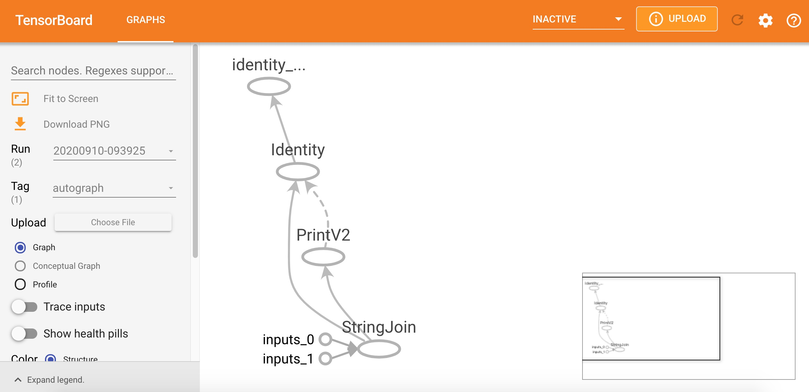

# Three Types of Graph

计算图的构建方式有三种 

- **静态计算图**
    - 在TensorFlow 1.0 时代，采用的是静态计算图
    - 需要先使用 TensorFlow 的各种算子创建计算图，然后再开启一个会话 Session，显式执行计算图
    - 静态图会对计算步骤进行一定的优化，剪去和结果无关的计算步骤
- **动态计算图**
    - 而在 TensorFlow2.0 时代，采用的是动态计算图
    - 即每使用一个算子后，该算子会被动态加入到隐含的默认计算图中立即执行得到结果，而无需开启 Session
    - 使用动态计算图即 Eager Excution 的 **优点** 是方便调试程序，它会让 TensorFlow 代码的表现和 Python 原生代码的表现一样，写起来就像写 Numpy 一样，各种日志打印，控制流全部都是可以使用的
    - 使用动态计算图的 **缺点** 是运行效率相对会低一些，因为使用动态图会有许多次 Python 进程和 TensorFlow 的 C++ 进程之间的通信，而静态计算图构建完成之后几乎全部在 TensorFlow 内核上使用 C++ 代码执行，效率更高

- **Autograph**
    - 使用 `tf.function` 构建静态图的方式叫做 Autograph
    - 如果需要在 TensorFlow2.0 中使用静态图，可以使用 `@tf.function` 装饰器将普通 Python 函数转换成对应的 TensorFlow 计算图构建代码，运行该函数就相当于在 TensorFlow1.0 中用 Session 执行代码
    
## Introduction to Calculation Charts

计算图由两部分组成

- **节点（nodes）**
    - 表示操作符 Operator，或者称之为算子

- **线（edges）**
    - 线表示计算间的依赖
    - 实线表示有数据传递依赖，传递的数据即张量
    - 虚线通常可以表示控制依赖，即执行先后顺序


## Static Calculation Chart

### TF1.0 Static Calculation Chart

在 TensorFlow1.0 中，使用静态计算图分两步

1. 定义计算图
1. 在会话中执行计算图

```python
import tensorflow as tf

# 定义计算图
g = tf.Graph()
with g.as_default():
    # placeholder 为占位符，执行会话时候指定填充对象
    x = tf.placeholder(name='x', shape=[], dtype=tf.string)
    y = tf.placeholder(name='y', shape=[], dtype=tf.string)
    z = tf.string_join([x, y], name = 'join', separator=' ')

# 执行计算图
with tf.Session(graph=g) as sess:
    print(sess.run(fetches=z, feed_dict={x: "hello", y: "world"}))
```

### TF2.0 Nostalgic Static Calculation Chart

TensorFlow2.0 为了确保对老版本 tensorflow 项目的兼容性，在 `tf.compat.v1` 子模块中保留了对 TensorFlow1.0 那种静态计算图构建风格的支持，可称之为怀旧版静态计算图，已经不推荐使用了

```python
import tensorflow as tf

g = tf.compat.v1.Graph()
with g.as_default():
    x = tf.compat.v1.placeholder(name='x', shape=[], dtype=tf.string)
    y = tf.compat.v1.placeholder(name='y', shape=[], dtype=tf.string)
    z = tf.strings.join([x, y], name="join", separator=" ")

with tf.compat.v1.Session(graph=g) as sess:
    # fetches的结果非常像一个函数的返回值，而feed_dict中的占位符相当于函数的参数序列。
    result = sess.run(fetches=z, feed_dict={x: "hello", y: "world"})
    print(result)
```

**output**

```console
b'hello world'
```

## Dynamic Calculation Chart

在 TensorFlow2.0 中，使用的是动态计算图和 Autograph

动态计算图已经不区分计算图的定义和执行了，而是定义后立即执行，因此称之为 **Eager Excution**，Eager 这个英文单词的原意是 "迫不及待的"，也就是立即执行的意思

```python
# 动态计算图在每个算子处都进行构建，构建后立即执行
x = tf.constant("hello")
y = tf.constant("world")
z = tf.strings.join([x, y], separator=" ")

tf.print(z)
```

**output**

```console
hello world
```

也可以将输入和输出封装成函数

```python
# 可以将动态计算图代码的输入和输出关系封装成函数
def strjoin(x, y):
    z =  tf.strings.join([x, y],separator = " ")
    tf.print(z)
    return z

result = strjoin(tf.constant("hello"),tf.constant("world"))
print(result)
```

**output**

```console
hello world
tf.Tensor(b'hello world', shape=(), dtype=string)
```

## Autograph

动态计算图运行效率相对较低，可以用 `@tf.function` 装饰器将普通 Python 函数转换成和 TensorFlow1.0 对应的静态计算图构建代码

实践中，我们一般会先用动态计算图调试代码，然后在需要提高性能的的地方利用 `@tf.function` 切换成 Autograph 获得更高的效率，当然，`@tf.function` 的使用需要遵循一定的规范

```python
import tensorflow as tf

# 使用 autograph 构建静态图
@tf.function
def strjoin(x,y):
    z =  tf.strings.join([x, y], separator=" ")
    tf.print(z)
    return z

result = strjoin(tf.constant("hello"), tf.constant("world"))

print(result)
```

**output**

```console
hello world
tf.Tensor(b'hello world', shape=(), dtype=string)
```

启动 autograph 并记录日志

```python
import datetime

# 创建日志
import os
stamp = datetime.datetime.now().strftime("%Y%m%d-%H%M%S")
logdir = os.path.join('data', 'autograph', stamp)

writer = tf.summary.create_file_writer(logdir)

# 开启 autograph 跟踪
tf.summary.trace_on(graph=True, profiler=True) 

# 执行 autograph
result = strjoin("hello", "world")

# 将计算图信息写入日志
with writer.as_default():
    tf.summary.trace_export(
        name="autograph",
        step=0,
        profiler_outdir=logdir
    )
```

**output**

```console
xxxxxx: I tensorflow/core/profiler/lib/profiler_session.cc:164] Profiler session started.
hello world
```

启动 Tensorboard 查看

```python
# 启动 tensorboard 在 jupyter 中的魔法命令
%load_ext tensorboard
```

```python
# 启动 tensorboard
%tensorboard --logdir ./data/autograph/
```



查看占用 `6006` 的 PID

```bash
lsof -i:6006
```

结束之

```bash
kill -9 xxxxx
```
