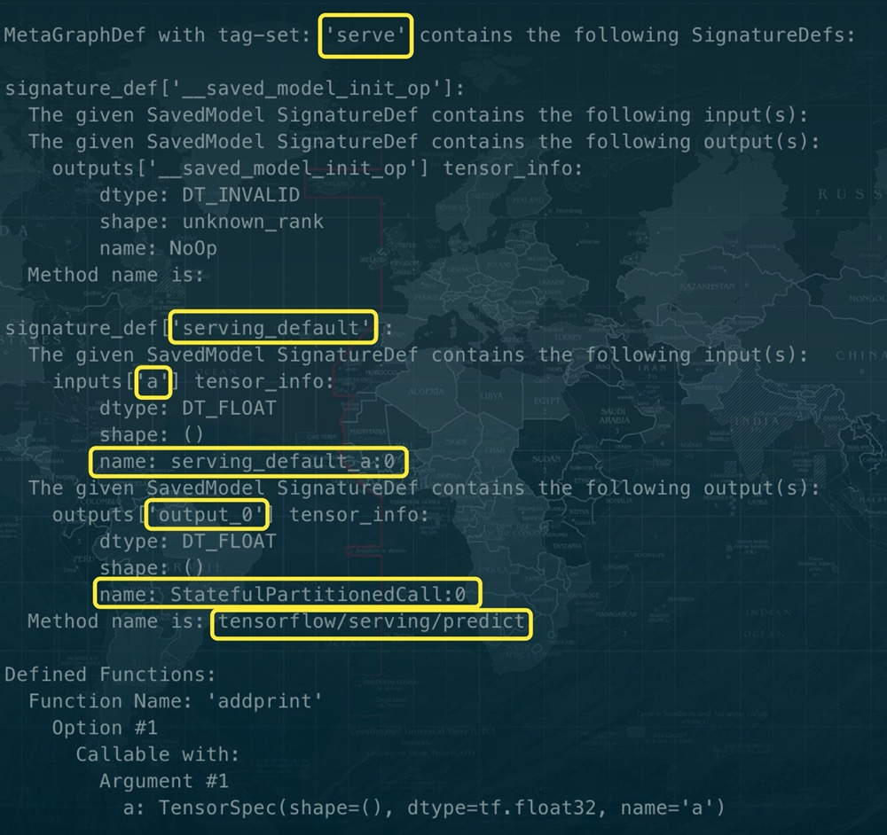
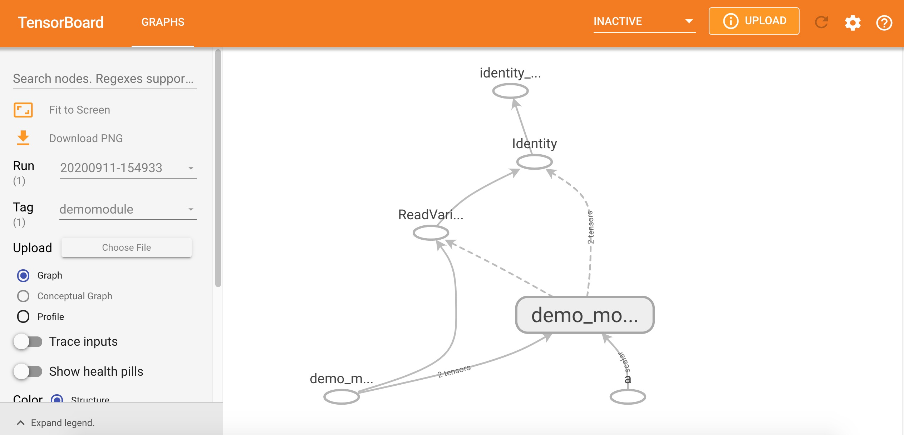

# AutoGraph and tf.Module

有三种计算图的构建方式
- 静态计算图
- 动态计算图
- Autograph

TensorFlow2.0 主要使用的是动态计算图和 Autograph
- 动态计算图易于调试，编码效率较高，但执行效率偏低
- 静态计算图执行效率很高，但较难调试
- Autograph 机制可以将动态图转换成静态计算图，兼收执行效率和编码效率之利

不过 Autograph 机制能够转换的代码并不是没有任何约束的，有一些编码规范需要遵循，否则可能会转换失败或者不符合预期

前面已经介绍了 Autograph 的编码规范和 Autograph 转换成静态图的原理，本节介绍使用 `tf.Module` 来更好地构建Autograph

## Overview of Autograph and tf.Module


前面在介绍 Autograph 的编码规范时提到构建 Autograph 时应该避免在 `@tf.function` 修饰的函数内部定义 `tf.Variable`，但是如果在函数外部定义 `tf.Variable` 的话，又会显得这个函数有外部变量依赖，封装不够完美

- 一种简单的思路是定义一个类，并将相关的 `tf.Variable` 创建放在类的初始化方法中，而将函数的逻辑放在其他方法中，这样一顿猛如虎的操作之后，我们会觉得一切都如同 **人法地 地法天 天法道 道法自然** 般的自然
- 惊喜的是，TensorFlow 提供了一个基类 `tf.Module`，通过继承它构建子类，我们不仅可以获得以上的自然而然，而且可以非常方便地管理变量，还可以非常方便地管理它引用的其它 Module，最重要的是，我们能够利用 `tf.saved_model` 保存模型并实现跨平台部署使用

实际上，`tf.keras.models.Model`, `tf.keras.layers.Layer` 都是继承自 `tf.Module` 的，提供了方便的变量管理和所引用的子模块管理的功能

**因此，利用 `tf.Module` 提供的封装，再结合 TensoFlow 丰富的低阶 API，实际上我们能够基于 TensorFlow 开发任意机器学习模型（而非仅仅是神经网络模型），并实现跨平台部署使用**

## Encapsulating Autograph with tf.Module

定义一个简单的 function

```python
import tensorflow as tf 
x = tf.Variable(1.0, dtype=tf.float32)

# 在 tf.function 中用 input_signature 限定输入张量的签名类型，shape 和 dtype
@tf.function(input_signature=[tf.TensorSpec(shape=[], dtype=tf.float32)])    
def add_print(a):
    x.assign_add(a)
    tf.print(x)
    return(x)
```

查看运行结果

```python
outer = add_print(tf.constant(3.0))
# add_print(tf.constant(3))     # 输入不符合张量签名的参数将报错
```

**output**

```console
4
```

下面利用 tf.Module 的子类化将其封装一下

```python
class DemoModule(tf.Module):
    def __init__(self, init_value=tf.constant(0.0), name=None):
        super(DemoModule, self).__init__(name=name)
        with self.name_scope:   # 相当于 with tf.name_scope("demo_module")
            self.x = tf.Variable(init_value, dtype=tf.float32, trainable=True)

     
    @tf.function(input_signature=[tf.TensorSpec(shape=[], dtype=tf.float32)])  
    def addprint(self, a):
        with self.name_scope:
            self.x.assign_add(a)
            tf.print(self.x)
            return(self.x)
```

查看执行结果

```python
demo = DemoModule(init_value=tf.constant(1.0))
result = demo.addprint(tf.constant(5.0))
```

**output**

```console
6
```

查看模块中的全部变量和全部可训练变量

```python
print(demo.variables)
print(demo.trainable_variables)
```

**output**

```console
(<tf.Variable 'demo_module/Variable:0' shape=() dtype=float32, numpy=6.0>,)
(<tf.Variable 'demo_module/Variable:0' shape=() dtype=float32, numpy=6.0>,)
```

查看模块中的全部子模块

```python
demo.submodules
```

**output**

```console
()
```

使用 tf.saved_model 保存模型，并指定需要跨平台部署的方法

```python
tf.saved_model.save(demo, "./data/demo/1", signatures={"serving_default": demo.addprint})
```

**output**

```console
INFO:tensorflow:Assets written to: ./data/demo/1/assets
```

加载模型

```python
demo2 = tf.saved_model.load("./data/demo/1")
outer = demo2.addprint(tf.constant(5.0))
```

**output**

```console
11
```

查看模型文件相关信息，黄框标出来的输出信息在模型部署和跨平台使用时有可能会用到

```jupyter
!saved_model_cli show --dir ./data/demo/1 --all
```

**output**



在 TensorBoard 中查看计算图，模块会被添加模块名 `demo_module`，方便层次化呈现计算图结构

```python
import datetime

# 创建日志
stamp = datetime.datetime.now().strftime("%Y%m%d-%H%M%S")
logdir = './data/demomodule/%s' % stamp
writer = tf.summary.create_file_writer(logdir)

# 开启 autograph 跟踪
tf.summary.trace_on(graph=True, profiler=True)

# 执行 autograph
demo = DemoModule(init_value = tf.constant(0.0))
result = demo.addprint(tf.constant(5.0))

# 将计算图信息写入日志
with writer.as_default():
    tf.summary.trace_export(
        name="demomodule",
        step=0,
        profiler_outdir=logdir)
```

启动 TensorBoard 在 Jupyter 中的魔法命令

```python
%reload_ext tensorboard
```

查看已经启动的 `notebook`

```python
from tensorboard import notebook
notebook.list()
```

启动 TensorBoard 的服务

```python
notebook.start("--logdir ./data/demomodule/")
```

**output**

```console
Launching TensorBoard...
Please visit http://localhost:6006 in a web browser.
```



除了利用 `tf.Module` 的子类化实现封装，也可以通过给 `tf.Module` 添加属性的方法进行封装

```python
mymodule = tf.Module()
mymodule.x = tf.Variable(0.0)

@tf.function(input_signature=[tf.TensorSpec(shape=[], dtype=tf.float32)])  
def addprint(a):
    mymodule.x.assign_add(a)
    tf.print(mymodule.x)
    return mymodule.x

mymodule.addprint = addprint
```

运行查看结果

```python
outer = mymodule.addprint(tf.constant(1.0)).numpy()
```

**output**

```console
1.0
```

查看模块中的全部变量

```python
print(mymodule.variables)
```

**output**

```console
(<tf.Variable 'Variable:0' shape=() dtype=float32, numpy=0.0>,)
```

保存与重新加载模型

```python
# 使用 tf.saved_model 保存模型
tf.saved_model.save(mymodule, "./data/mymodule",
    signatures = {"serving_default": mymodule.addprint})

# 加载模型
mymodule2 = tf.saved_model.load("./data/mymodule")
outer = mymodule2.addprint(tf.constant(5.0))
```

**output**

```console
INFO:tensorflow:Assets written to: ./data/mymodule/assets
6
```

## tf.Module，tf.keras.Model & tf.keras.layers.Layer

`tf.keras` 中的模型和层都是继承 `tf.Module` 实现的，也具有变量管理和子模块管理功能

```python
import tensorflow as tf
from tensorflow.keras import models, layers, losses, metrics
```

确认子类关系

```python
print(issubclass(tf.keras.Model, tf.Module))
print(issubclass(tf.keras.layers.Layer, tf.Module))
print(issubclass(tf.keras.Model, tf.keras.layers.Layer))
```

**output**

```console
True
True
True
```

创建一个 Sequential Model

```python
tf.keras.backend.clear_session() 

model = models.Sequential()

model.add(layers.Dense(4, input_shape=(10,)))
model.add(layers.Dense(2))
model.add(layers.Dense(1))
model.summary()
```

```console
Model: "sequential"
_________________________________________________________________
Layer (type)                 Output Shape              Param #
=================================================================
dense (Dense)                (None, 4)                 44
_________________________________________________________________
dense_1 (Dense)              (None, 2)                 10
_________________________________________________________________
dense_2 (Dense)              (None, 1)                 3
=================================================================
Total params: 57
Trainable params: 57
Non-trainable params: 0
_________________________________________________________________
```

查看模型的变量

```python
model.variables
```

**output**

```console
[<tf.Variable 'dense/kernel:0' shape=(10, 4) dtype=float32, numpy=
 array([[ 0.4943527 , -0.39085922,  0.52881885, -0.07730675],
        [-0.3939086 ,  0.12685955,  0.45285738,  0.32996833],
        [ 0.43380713,  0.15975279, -0.15538937,  0.55364573],
        [-0.00550234,  0.04478794,  0.64382946,  0.6060035 ],
        [-0.48891062,  0.4910792 ,  0.47110188, -0.00750053],
        [-0.5170571 , -0.1159786 , -0.35078558,  0.09626162],
        [ 0.5612619 ,  0.11453754, -0.29413873,  0.34878182],
        [ 0.4849869 ,  0.1914581 ,  0.15693426, -0.07098323],
        [-0.30537584,  0.4992156 ,  0.24452364, -0.43180597],
        [ 0.18790197,  0.10599327,  0.2549042 , -0.38162076]],
       dtype=float32)>,
 <tf.Variable 'dense/bias:0' shape=(4,) dtype=float32, numpy=array([0., 0., 0., 0.], dtype=float32)>,
 <tf.Variable 'dense_1/kernel:0' shape=(4, 2) dtype=float32, numpy=
 array([[-0.4724939 , -0.17477989],
        [-0.6302929 ,  0.19676185],
        [-0.22155881,  0.5320916 ],
        [ 0.10025787,  0.250448  ]], dtype=float32)>,
 <tf.Variable 'dense_1/bias:0' shape=(2,) dtype=float32, numpy=array([0., 0.], dtype=float32)>,
 <tf.Variable 'dense_2/kernel:0' shape=(2, 1) dtype=float32, numpy=
 array([[-1.389439 ],
        [-1.2026259]], dtype=float32)>,
 <tf.Variable 'dense_2/bias:0' shape=(1,) dtype=float32, numpy=array([0.], dtype=float32)>]
```

冻结部分变量

```python
model.layers[0].trainable = False # 冻结第 0 层的变量，使其不可训练
model.trainable_variables
```

**output**

```console
[<tf.Variable 'dense_1/kernel:0' shape=(4, 2) dtype=float32, numpy=
 array([[-0.4724939 , -0.17477989],
        [-0.6302929 ,  0.19676185],
        [-0.22155881,  0.5320916 ],
        [ 0.10025787,  0.250448  ]], dtype=float32)>,
 <tf.Variable 'dense_1/bias:0' shape=(2,) dtype=float32, numpy=array([0., 0.], dtype=float32)>,
 <tf.Variable 'dense_2/kernel:0' shape=(2, 1) dtype=float32, numpy=
 array([[-1.389439 ],
        [-1.2026259]], dtype=float32)>,
 <tf.Variable 'dense_2/bias:0' shape=(1,) dtype=float32, numpy=array([0.], dtype=float32)>]
```

查看子模块

```python
model.submodules
```

**output**

```console
(<tensorflow.python.keras.engine.input_layer.InputLayer at 0x13781a7f0>,
 <tensorflow.python.keras.layers.core.Dense at 0x1377bc760>,
 <tensorflow.python.keras.layers.core.Dense at 0x10d541130>,
 <tensorflow.python.keras.layers.core.Dense at 0x10d541a00>)
```

查看层结构

```python
model.layers
```

**output**

```console
[<tensorflow.python.keras.layers.core.Dense at 0x144daada0>,
 <tensorflow.python.keras.layers.core.Dense at 0x144d8c5c0>,
 <tensorflow.python.keras.layers.core.Dense at 0x144d7aa20>]
```

查看模型名称

```python
print(model.name)
print(model.name_scope())
```

**output**

```console
sequential
sequential
```
