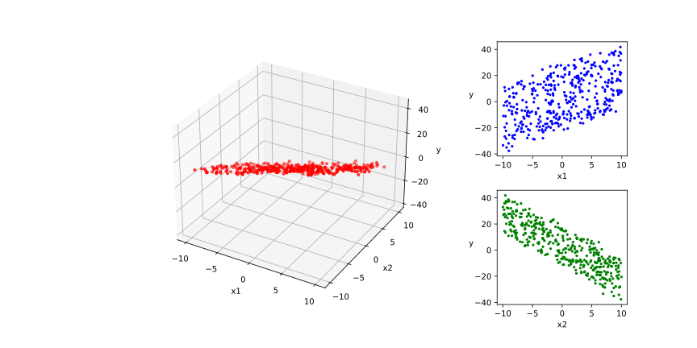
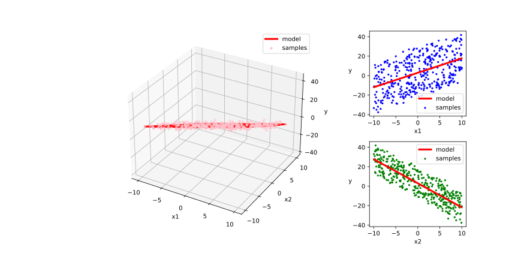
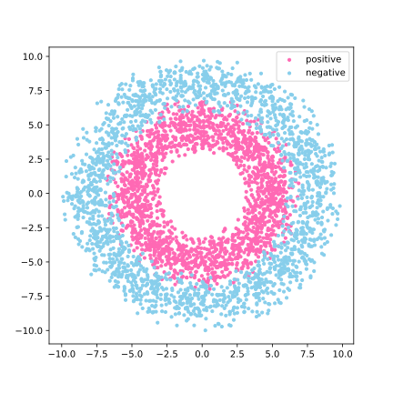
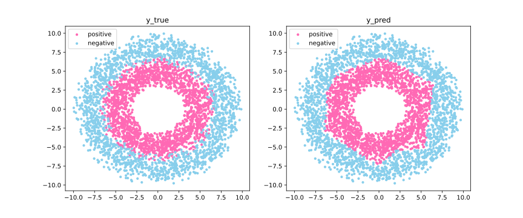

# Low-level API: Demonstration

低阶 API 主要包括 **张量操作**，**计算图** 和 **自动微分**，下面的范例使用 TensorFlow 的低阶 API 实现 **线性回归** 模型和 **DNN 二分类** 模型

首先，导入一些必要的 Package

```python
import numpy as np 
import pandas as pd
import tensorflow as tf
from matplotlib import pyplot as plt
from matplotlib.ticker import MultipleLocator, FormatStrFormatter
```

在训练的时候，打印时间分割线的函数

```python
# 打印时间分割线
@tf.function
def printbar():
    today_ts = tf.timestamp() % (24 * 60 * 60)

    hour = tf.cast(today_ts // 3600 + 8, tf.int32) % tf.constant(24)
    minite = tf.cast((today_ts % 3600) // 60, tf.int32)
    second = tf.cast(tf.floor(today_ts % 60), tf.int32)
    
    def timeformat(m):
        if tf.strings.length(tf.strings.format("{}", m)) == 1:
            return(tf.strings.format("0{}", m))
        else:
            return(tf.strings.format("{}", m))
    
    timestring = tf.strings.join([timeformat(hour), timeformat(minite), 
                timeformat(second)], separator=":")
    tf.print("==========" * 8 + timestring)
```

## Linear Regression Model

### Prepare Regression Data

首先导入一些必要的包以及生成测试的数据

```python
# 样本数量
n = 400

# 生成测试用数据集
X = tf.random.uniform([n, 2], minval=-10, maxval=10) 
w0 = tf.constant([[1.5], [-2.5]])
b0 = tf.constant([[3.0]])
Y = X @ w0 + b0 + tf.random.normal([n, 1], mean=0.0, stddev=2)  # 增加正态扰动
```

可以将需要回归的数据可视化，以便有一个直观的理解

```python
# 数据可视化
%matplotlib inline
%config InlineBackend.figure_format = 'svg'

plt.figure(figsize=(12, 6))
plt.subplots_adjust(wspace=0.05, hspace=0.3)
ax1 = plt.subplot2grid((2, 4), (0, 0), rowspan=2, colspan=3, projection="3d")
ax1.scatter3D(X[:, 0], X[:, 1], Y[:, 0], c="r", s=6)
ax1.xaxis.set_major_locator(MultipleLocator(5))
ax1.yaxis.set_major_locator(MultipleLocator(5))
ax1.zaxis.set_major_locator(MultipleLocator(20))
ax1.xaxis.set_label_text("x1")
ax1.yaxis.set_label_text("x2")
ax1.zaxis.set_label_text("y")


ax2 = plt.subplot2grid((2, 4), (0, 3), rowspan=1, colspan=1)
ax2.scatter(X[:, 0], Y, c="b", s=3)
plt.xlabel("x1")
plt.ylabel("y", rotation=0)

ax3 = plt.subplot2grid((2, 4), (1, 3), rowspan=1, colspan=1)
ax3.scatter(X[:, 1], Y, c="g", s=3)
plt.xlabel("x2")
plt.ylabel("y", rotation=0)

# plt.savefig("figs/3-6-regression-data-visualization.svg")
plt.show()
```



构建数据管道迭代器，返回 `batch_size` 对特征和其对应的标签

```python
# 构建数据管道迭代器
def data_iter(features, labels, batch_size=8):
    num_examples = len(features)
    indices = list(range(num_examples))
    np.random.shuffle(indices)      # 样本的读取顺序是随机的
    for i in range(0, num_examples, batch_size):
        indexs = indices[i: min(i + batch_size, num_examples)]
        yield tf.gather(features, indexs), tf.gather(labels, indexs)
        
# 测试数据管道效果
batch_size = 8
(features, labels) = next(data_iter(X, Y, batch_size))
print(features)
print(labels)
```

**output**

```console
tf.Tensor(
[[ 6.835396   0.1218462]
 [-7.7811146 -6.696136 ]
 [-3.9251804  7.2974854]
 [ 8.565891  -8.365827 ]
 [-3.2576895  9.756378 ]
 [ 7.43919    5.8118706]
 [-5.447936   1.4545364]
 [-0.7106285 -6.89584  ]], shape=(8, 2), dtype=float32)
tf.Tensor(
[[ 10.855344 ]
 [  6.0416603]
 [-21.982952 ]
 [ 36.787502 ]
 [-27.959581 ]
 [ -2.2372863]
 [ -8.479001 ]
 [ 19.322525 ]], shape=(8, 1), dtype=float32)
```

### Regression Model Definition

```python
w = tf.Variable(tf.random.normal(w0.shape))
b = tf.Variable(tf.zeros_like(b0, dtype=tf.float32))

# 定义模型
class LinearRegression:     
    # 正向传播
    def __call__(self, x): 
        return x @ w + b

    # 损失函数
    def loss_func(self, y_true, y_pred):  
        return tf.reduce_mean((y_true - y_pred) ** 2 / 2)

model = LinearRegression()
```

### Training Regression Model

#### Using Dynamic Diagrams

对于每个 `batch_size` ，构建一个使用 `LinearRegression()` 可以返回 `loss` 的函数

```python
# 使用动态图调试
def train_step(model, features, labels):
    with tf.GradientTape() as tape:
        predictions = model(features)
        loss = model.loss_func(labels, predictions)
    # 反向传播求梯度
    dloss_dw, dloss_db = tape.gradient(loss, [w, b])
    # 梯度下降法更新参数
    w.assign(w - 0.001 * dloss_dw)
    b.assign(b - 0.001 * dloss_db)
    
    return loss
```

测试 `train_step` 效果

```python
batch_size = 10
(features, labels) = next(data_iter(X, Y, batch_size))
train_step(model, features, labels)
```

**output**

```console
<tf.Tensor: shape=(), dtype=float32, numpy=279.47>
```

执行训练过程

```python
def train_model(model, epochs):
    for epoch in tf.range(1, epochs + 1):
        for features, labels in data_iter(X, Y, 10):
            loss = train_step(model, features, labels)

        if epoch % 50 == 0:
            printbar()
            tf.print("epoch =", epoch, "loss = ", loss)
            tf.print("w =", w)
            tf.print("b =", b)

train_model(model, epochs=200)
```

**output**

```console
================================================================================11:18:55
epoch = 50 loss =  1.55255342
w = [[1.48991203]
 [-2.47380447]]
b = [[2.54757428]]
================================================================================11:18:59
epoch = 100 loss =  3.42438745
w = [[1.47864699]
 [-2.47681856]]
b = [[2.89714432]]
================================================================================11:19:03
epoch = 150 loss =  1.92018962
w = [[1.47793055]
 [-2.47840428]]
b = [[2.94643188]]
================================================================================11:19:09
epoch = 200 loss =  1.61925852
w = [[1.47476268]
 [-2.47449207]]
b = [[2.95242333]]
```

#### Acceleration using the Autograph Mechanism

```python
@tf.function
def train_step(model, features, labels):
    with tf.GradientTape() as tape:
        predictions = model(features)
        loss = model.loss_func(labels, predictions)
    # 反向传播求梯度
    dloss_dw, dloss_db = tape.gradient(loss, [w, b])
    # 梯度下降法更新参数
    w.assign(w - 0.001 * dloss_dw)
    b.assign(b - 0.001 * dloss_db)
    
    return loss

def train_model(model,epochs):
    for epoch in tf.range(1, epochs + 1):
        for features, labels in data_iter(X, Y, 10):
            loss = train_step(model, features, labels)
        if epoch % 50 == 0:
            printbar()
            tf.print("epoch =", epoch, "loss = ", loss)
            tf.print("w =", w)
            tf.print("b =", b)

train_model(model, epochs=200)
```

**output**

```console
================================================================================11:40:52
epoch = 50 loss =  2.89565277
w = [[1.48488462]
 [-2.47608829]]
b = [[2.95347524]]
================================================================================11:40:53
epoch = 100 loss =  2.86613154
w = [[1.48176599]
 [-2.47467136]]
b = [[2.95344186]]
================================================================================11:40:54
epoch = 150 loss =  1.798949
w = [[1.48350549]
 [-2.48530936]]
b = [[2.95367765]]
================================================================================11:40:55
epoch = 200 loss =  2.25275087
w = [[1.48585248]
 [-2.47480202]]
b = [[2.95314932]]
```

将回归拟合结果可视化

```python
# 结果可视化
%matplotlib inline
%config InlineBackend.figure_format = 'svg'

plt.figure(figsize=(12, 6))
plt.subplots_adjust(wspace=0.05, hspace=0.3)
ax1 = plt.subplot2grid((2, 4), (0, 0), rowspan=2, colspan=3, projection="3d")
ax1.scatter3D(X[:, 0], X[:, 1], Y[:, 0], c="pink", s=10, label="samples")
ax1.plot3D(X[:, 0], X[:, 1], 
           w[0] * X[:, 0] + w[1] * X[:, 1] + b[0], "-r", linewidth=3.0, label="model")
ax1.xaxis.set_major_locator(MultipleLocator(5))
ax1.yaxis.set_major_locator(MultipleLocator(5))
ax1.zaxis.set_major_locator(MultipleLocator(20))
ax1.xaxis.set_label_text("x1")
ax1.yaxis.set_label_text("x2")
ax1.zaxis.set_label_text("y")
ax1.legend()

ax2 = plt.subplot2grid((2, 4), (0, 3), rowspan=1, colspan=1)
ax2.scatter(X[:, 0], Y, c="b", s=5, label="samples")
ax2.plot(X[:, 0], w[0] * X[:, 0] + b[0], "-r", linewidth=3.0, label="model")
ax2.legend()
plt.xlabel("x1")
plt.ylabel("y", rotation=0)


ax3 = plt.subplot2grid((2, 4), (1, 3), rowspan=1, colspan=1)
ax3.scatter(X[:, 1], Y, c="g", s=5, label="samples")
ax3.plot(X[:, 1], w[1] * X[:, 1] + b[0], "-r", linewidth=3.0, label="model")
ax3.legend()
plt.xlabel("x2")
plt.ylabel("y", rotation=0)
# plt.savefig("figs/3-6-visualization-of-regression-results.svg")
plt.show()
```



## DNN Two-Class Model

### Prepare Two-Class Data

生成 2 分类的数据（在普通机器学习中区分较为困难），并可视化

```python
%matplotlib inline
%config InlineBackend.figure_format = 'svg'

# 正负样本数量
n_positive, n_negative = 2000, 2000

# 生成正样本, 小圆环分布
r_p = 5.0 + tf.random.truncated_normal([n_positive, 1], 0.0, 1.0)
theta_p = tf.random.uniform([n_positive, 1], 0.0, 2 * np.pi) 
Xp = tf.concat([r_p * tf.cos(theta_p), r_p * tf.sin(theta_p)], axis=1)
Yp = tf.ones_like(r_p)

# 生成负样本, 大圆环分布
r_n = 8.0 + tf.random.truncated_normal([n_negative, 1], 0.0, 1.0)
theta_n = tf.random.uniform([n_negative, 1], 0.0, 2 * np.pi) 
Xn = tf.concat([r_n * tf.cos(theta_n), r_n * tf.sin(theta_n)], axis=1)
Yn = tf.zeros_like(r_n)

# 汇总样本
X = tf.concat([Xp, Xn], axis=0)
Y = tf.concat([Yp, Yn], axis=0)

# 可视化
plt.figure(figsize=(6, 6))
plt.scatter(Xp[:, 0].numpy(), Xp[:, 1].numpy(), c="hotpink", s=10)
plt.scatter(Xn[:, 0].numpy(), Xn[:, 1].numpy(), c="skyblue", s=10)
plt.legend(["positive", "negative"])
# plt.savefig("figs/3-6-categorical-data-visualization.svg")
```



可以像前面回归模型中一样，构建数据管道迭代器，返回 `batch_size` 对特征和其对应的标签

```python
# 构建数据管道迭代器
def data_iter(features, labels, batch_size=8):
    num_examples = len(features)
    indices = list(range(num_examples))
    np.random.shuffle(indices)      # 样本的读取顺序是随机的
    for i in range(0, num_examples, batch_size):
        indexs = indices[i: min(i + batch_size, num_examples)]
        yield tf.gather(features, indexs), tf.gather(labels, indexs)

# 测试数据管道效果
batch_size = 10
(features, labels) = next(data_iter(X, Y, batch_size))
print(features)
print(labels)
```

**output**

```console
tf.Tensor(
[[-3.3034627   6.97388   ]
 [-5.123651   -1.6873623 ]
 [ 4.4933553   0.27742022]
 [ 6.340078   -6.819982  ]
 [-3.430853   -2.6209564 ]
 [-3.1646385   1.5006043 ]
 [-2.4258964  -3.7886536 ]
 [-0.38687602  4.5730095 ]
 [-4.4283056   3.149475  ]
 [ 6.225599   -5.568595  ]], shape=(10, 2), dtype=float32)
tf.Tensor(
[[0.]
 [1.]
 [1.]
 [0.]
 [1.]
 [1.]
 [1.]
 [1.]
 [1.]
 [0.]], shape=(10, 1), dtype=float32)
```

### Two-Class Model Definition

此处范例我们利用 `tf.Module` 来组织模型变量，关于 `tf.Module` 的较详细介绍参考前一节: [03-05 AutoGraph and tf.Module](./c03-05-autograph-and-tf.Module.md)

```python
class DNNModel(tf.Module):
    def __init__(self, name=None):
        super(DNNModel, self).__init__(name=name)
        self.w1 = tf.Variable(tf.random.truncated_normal([2, 4]), dtype=tf.float32)
        self.b1 = tf.Variable(tf.zeros([1, 4]), dtype=tf.float32)
        self.w2 = tf.Variable(tf.random.truncated_normal([4, 8]), dtype=tf.float32)
        self.b2 = tf.Variable(tf.zeros([1, 8]), dtype=tf.float32)
        self.w3 = tf.Variable(tf.random.truncated_normal([8, 1]), dtype=tf.float32)
        self.b3 = tf.Variable(tf.zeros([1, 1]), dtype=tf.float32)

    # 正向传播
    @tf.function(
        input_signature=[tf.TensorSpec(shape=[None, 2], dtype=tf.float32)],
        experimental_relax_shapes=True
    )  
    def __call__(self, x):
        x = tf.nn.relu(x @ self.w1 + self.b1)
        x = tf.nn.relu(x @ self.w2 + self.b2)
        y = tf.nn.sigmoid(x @ self.w3 + self.b3)
        return y

    # 损失函数（二元交叉熵）
    @tf.function(
        input_signature=[
            tf.TensorSpec(shape=[None, 1], dtype=tf.float32), 
            tf.TensorSpec(shape=[None, 1], dtype=tf.float32)
        ],
        experimental_relax_shapes=True
    )  
    def loss_func(self, y_true, y_pred):
        # 将预测值限制在 1e-7 以上, 1 - 1e-7 以下，避免 log(0) 错误
        eps = 1e-7
        y_pred = tf.clip_by_value(y_pred, eps, 1.0 - eps)
        bce = - y_true * tf.math.log(y_pred) - (1 - y_true) * tf.math.log(1 - y_pred)
        return  tf.reduce_mean(bce)

    # 评估指标（准确率）
    @tf.function(
        input_signature=[
            tf.TensorSpec(shape=[None, 1], dtype=tf.float32),
            tf.TensorSpec(shape=[None, 1], dtype=tf.float32)
        ],
        experimental_relax_shapes=True
    ) 
    def metric_func(self, y_true, y_pred):
        y_pred = tf.where(y_pred > 0.5, tf.ones_like(y_pred, dtype=tf.float32),
                          tf.zeros_like(y_pred, dtype=tf.float32))
        acc = tf.reduce_mean(1 - tf.abs(y_true - y_pred))
        return acc

model = DNNModel()
```

测试模型结构

```python
batch_size = 10
(features, labels) = next(data_iter(X, Y, batch_size))

predictions = model(features)

loss = model.loss_func(labels, predictions)
metric = model.metric_func(labels, predictions)

tf.print("init loss:", loss)
tf.print("init metric", metric)
```

**output**

```console
init loss: 0.921482921
init metric 0.6
```

验证变量的数量

```python
print(len(model.trainable_variables))
```

**output**

```console
6
```

### Training Two-Class Model

```python
## 使用 autograph 机制转换成静态图加速
@tf.function
def train_step(model, features, labels):

    # 正向传播求损失
    with tf.GradientTape() as tape:
        predictions = model(features)
        loss = model.loss_func(labels, predictions) 

    # 反向传播求梯度
    grads = tape.gradient(loss, model.trainable_variables)

    # 执行梯度下降
    for p, dloss_dp in zip(model.trainable_variables, grads):
        p.assign(p - 0.001 * dloss_dp)

    # 计算评估指标
    metric = model.metric_func(labels, predictions)

    return loss, metric


def train_model(model, epochs):
    for epoch in tf.range(1, epochs+1):
        for features, labels in data_iter(X, Y, 100):
            loss, metric = train_step(model, features, labels)
        if epoch % 100 == 0:
            printbar()
            tf.print(
                "epoch = " + tf.as_string(epoch)
                + ", loss = " + tf.as_string(loss)
                + ", accuracy = " + tf.as_string(metric)
            )

train_model(model, epochs=1000)
```

**output**

```console
================================================================================15:32:22
epoch = 100, loss = 0.543990, accuracy = 0.770000
================================================================================15:32:25
epoch = 200, loss = 0.480271, accuracy = 0.780000
================================================================================15:32:29
epoch = 300, loss = 0.436533, accuracy = 0.760000
================================================================================15:32:32
epoch = 400, loss = 0.368662, accuracy = 0.890000
================================================================================15:32:35
epoch = 500, loss = 0.221828, accuracy = 0.920000
================================================================================15:32:38
epoch = 600, loss = 0.115654, accuracy = 0.980000
================================================================================15:32:41
epoch = 700, loss = 0.121260, accuracy = 0.970000
================================================================================15:32:44
epoch = 800, loss = 0.146101, accuracy = 0.940000
================================================================================15:32:47
epoch = 900, loss = 0.098134, accuracy = 0.970000
================================================================================15:32:50
epoch = 1000, loss = 0.117646, accuracy = 0.940000
```

将二分类结果可视化

```python
# 结果可视化
fig, (ax1, ax2) = plt.subplots(nrows=1, ncols=2, figsize=(12, 5))
ax1.scatter(Xp[:, 0], Xp[:, 1], c="hotpink")
ax1.scatter(Xn[:, 0], Xn[:, 1], c="skyblue")
ax1.legend(["positive", "negative"])
ax1.set_title("y_true")

Xp_pred = tf.boolean_mask(X, tf.squeeze(model(X) >= 0.5), axis=0)
Xn_pred = tf.boolean_mask(X, tf.squeeze(model(X) < 0.5), axis=0)

ax2.scatter(Xp_pred[:, 0], Xp_pred[:, 1], c="hotpink")
ax2.scatter(Xn_pred[:, 0], Xn_pred[:, 1], c="skyblue")
ax2.legend(["positive", "negative"])
ax2.set_title("y_pred")
```


