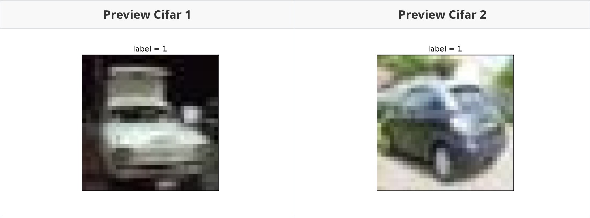

# Dataset

如果需要训练的数据大小不大，例如不到 1GB，那么可以直接全部读入内存中进行训练，这样一般效率最高，但如果需要训练的数据很大，例如超过 10GB，无法一次载入内存，那么通常需要在训练的过程中分批逐渐读入

使用 `tf.data` API 可以构建数据输入管道，轻松处理大量的数据，不同的数据格式，以及不同的数据转换

## Building a Data Pipeline

可以从如下方式构建数据管道
- **Numpy Array**
- **Pandas DataFrame**
- Python Generator
- CSV File
- 文本文件
- **文件路径**
- tfrecords 文件

其中 **加粗** 的方法构建数据管道较为常用

通过 tfrecords 文件方式构建数据管道较为复杂，需要对样本构建 `tf.Example` 后压缩成字符串写到 tfrecords 文件，读取后再解析成 `tf.Example`，但 tfrecords 文件的优点是压缩后文件较小，便于网络传播，加载速度较快

### Building from Ndarray

```python
# 从 Numpy Array 构建数据管道
import tensorflow as tf
import numpy as np
from sklearn import datasets

iris = datasets.load_iris()
ds1 = tf.data.Dataset.from_tensor_slices((iris["data"], iris["target"]))
for features, label in ds1.take(5):
    print(features, label)
```

**output**

```console
tf.Tensor([5.1 3.5 1.4 0.2], shape=(4,), dtype=float64) tf.Tensor(0, shape=(), dtype=int64)
tf.Tensor([4.9 3.  1.4 0.2], shape=(4,), dtype=float64) tf.Tensor(0, shape=(), dtype=int64)
tf.Tensor([4.7 3.2 1.3 0.2], shape=(4,), dtype=float64) tf.Tensor(0, shape=(), dtype=int64)
tf.Tensor([4.6 3.1 1.5 0.2], shape=(4,), dtype=float64) tf.Tensor(0, shape=(), dtype=int64)
tf.Tensor([5.  3.6 1.4 0.2], shape=(4,), dtype=float64) tf.Tensor(0, shape=(), dtype=int64)
```

### Building from Pandas DataFrame

```python
# 从 Pandas DataFrame 构建数据管道
import tensorflow as tf
from sklearn import datasets 
import pandas as pd

iris = datasets.load_iris()
dfiris = pd.DataFrame(iris["data"], columns=iris.feature_names)
ds2 = tf.data.Dataset.from_tensor_slices((dfiris.to_dict("list"), iris["target"]))

for features, label in ds2.take(3):
    print(features, label)
```

**output**

```console
{'sepal length (cm)': <tf.Tensor: shape=(), dtype=float32, numpy=5.1>, 'sepal width (cm)': <tf.Tensor: shape=(), dtype=float32, numpy=3.5>, 'petal length (cm)': <tf.Tensor: shape=(), dtype=float32, numpy=1.4>, 'petal width (cm)': <tf.Tensor: shape=(), dtype=float32, numpy=0.2>} tf.Tensor(0, shape=(), dtype=int64)
{'sepal length (cm)': <tf.Tensor: shape=(), dtype=float32, numpy=4.9>, 'sepal width (cm)': <tf.Tensor: shape=(), dtype=float32, numpy=3.0>, 'petal length (cm)': <tf.Tensor: shape=(), dtype=float32, numpy=1.4>, 'petal width (cm)': <tf.Tensor: shape=(), dtype=float32, numpy=0.2>} tf.Tensor(0, shape=(), dtype=int64)
{'sepal length (cm)': <tf.Tensor: shape=(), dtype=float32, numpy=4.7>, 'sepal width (cm)': <tf.Tensor: shape=(), dtype=float32, numpy=3.2>, 'petal length (cm)': <tf.Tensor: shape=(), dtype=float32, numpy=1.3>, 'petal width (cm)': <tf.Tensor: shape=(), dtype=float32, numpy=0.2>} tf.Tensor(0, shape=(), dtype=int64)
```

### Building from Python Generator

```python
# 从 Python Generator 构建数据管道
import tensorflow as tf
from matplotlib import pyplot as plt
from tensorflow.keras.preprocessing.image import ImageDataGenerator

# 定义一个从文件中读取图片的 Generator
image_generator = ImageDataGenerator(rescale=1.0 / 255).flow_from_directory(
                    "../chapter01/data/cifar2/test/",
                    target_size=(32, 32),
                    batch_size=20,
                    class_mode='binary')

classdict = image_generator.class_indices
print(classdict)

def generator():
    for features,label in image_generator:
        yield (features, label)

ds3 = tf.data.Dataset.from_generator(generator, output_types=(tf.float32, tf.int32))
```

**output**

```console
Found 2000 images belonging to 2 classes.
{'airplane': 0, 'automobile': 1}
```

预览若干张照片

```python
%matplotlib inline
%config InlineBackend.figure_format = 'svg'
plt.figure(figsize=(6, 6))
for i, (img, label) in enumerate(ds3.unbatch().take(9)):
    ax=plt.subplot(3, 3, i+1)
    ax.imshow(img.numpy())
    ax.set_title("label = %d" % label)
    ax.set_xticks([])
    ax.set_yticks([])
# plt.savefig("./figs/4-1-preview-cifar2.svg")
plt.show()
```


### Building from CSV File

```python
# 从 csv 文件构建数据管道
ds4 = tf.data.experimental.make_csv_dataset(
    file_pattern=[
        "../chapter01/data/titanic/train.csv",
        "../chapter01/data/titanic/test.csv"
    ],
    batch_size=3,
    label_name="Survived",
    na_value="",
    num_epochs=1,
    ignore_errors=True
)

for data, label in ds4.take(2):
    print(data, label)
```

**output**

```console
OrderedDict([('PassengerId', <tf.Tensor: shape=(3,), dtype=int32, numpy=array([617, 636, 633], dtype=int32)>), ('Pclass', <tf.Tensor: shape=(3,), dtype=int32, numpy=array([3, 2, 1], dtype=int32)>), ('Name', <tf.Tensor: shape=(3,), dtype=string, numpy=
array([b'Danbom, Mr. Ernst Gilbert', b'Davis, Miss. Mary',
       b'Stahelin-Maeglin, Dr. Max'], dtype=object)>), ('Sex', <tf.Tensor: shape=(3,), dtype=string, numpy=array([b'male', b'female', b'male'], dtype=object)>), ('Age', <tf.Tensor: shape=(3,), dtype=float32, numpy=array([34., 28., 32.], dtype=float32)>), ('SibSp', <tf.Tensor: shape=(3,), dtype=int32, numpy=array([1, 0, 0], dtype=int32)>), ('Parch', <tf.Tensor: shape=(3,), dtype=int32, numpy=array([1, 0, 0], dtype=int32)>), ('Ticket', <tf.Tensor: shape=(3,), dtype=string, numpy=array([b'347080', b'237668', b'13214'], dtype=object)>), ('Fare', <tf.Tensor: shape=(3,), dtype=float32, numpy=array([14.4, 13. , 30.5], dtype=float32)>), ('Cabin', <tf.Tensor: shape=(3,), dtype=string, numpy=array([b'', b'', b'B50'], dtype=object)>), ('Embarked', <tf.Tensor: shape=(3,), dtype=string, numpy=array([b'S', b'S', b'C'], dtype=object)>)]) tf.Tensor([0 1 1], shape=(3,), dtype=int32)
OrderedDict([('PassengerId', <tf.Tensor: shape=(3,), dtype=int32, numpy=array([447, 358,  97], dtype=int32)>), ('Pclass', <tf.Tensor: shape=(3,), dtype=int32, numpy=array([2, 2, 1], dtype=int32)>), ('Name', <tf.Tensor: shape=(3,), dtype=string, numpy=
array([b'Mellinger, Miss. Madeleine Violet', b'Funk, Miss. Annie Clemmer',
       b'Goldschmidt, Mr. George B'], dtype=object)>), ('Sex', <tf.Tensor: shape=(3,), dtype=string, numpy=array([b'female', b'female', b'male'], dtype=object)>), ('Age', <tf.Tensor: shape=(3,), dtype=float32, numpy=array([13., 38., 71.], dtype=float32)>), ('SibSp', <tf.Tensor: shape=(3,), dtype=int32, numpy=array([0, 0, 0], dtype=int32)>), ('Parch', <tf.Tensor: shape=(3,), dtype=int32, numpy=array([1, 0, 0], dtype=int32)>), ('Ticket', <tf.Tensor: shape=(3,), dtype=string, numpy=array([b'250644', b'237671', b'PC 17754'], dtype=object)>), ('Fare', <tf.Tensor: shape=(3,), dtype=float32, numpy=array([19.5   , 13.    , 34.6542], dtype=float32)>), ('Cabin', <tf.Tensor: shape=(3,), dtype=string, numpy=array([b'', b'', b'A5'], dtype=object)>), ('Embarked', <tf.Tensor: shape=(3,), dtype=string, numpy=array([b'S', b'S', b'C'], dtype=object)>)]) tf.Tensor([1 0 0], shape=(3,), dtype=int32)
```

### Building from Text Files

```python
# 从文本文件构建数据管道
ds5 = tf.data.TextLineDataset(
    filenames = [
        "../chapter01/data/titanic/train.csv",
        "../chapter01/data/titanic/test.csv"
    ]
).skip(1)   # 略去第一行 header

for line in ds5.take(5):
    print(line)
```

**output**

```console
tf.Tensor(b'493,0,1,"Molson, Mr. Harry Markland",male,55.0,0,0,113787,30.5,C30,S', shape=(), dtype=string)
tf.Tensor(b'53,1,1,"Harper, Mrs. Henry Sleeper (Myna Haxtun)",female,49.0,1,0,PC 17572,76.7292,D33,C', shape=(), dtype=string)
tf.Tensor(b'388,1,2,"Buss, Miss. Kate",female,36.0,0,0,27849,13.0,,S', shape=(), dtype=string)
tf.Tensor(b'192,0,2,"Carbines, Mr. William",male,19.0,0,0,28424,13.0,,S', shape=(), dtype=string)
tf.Tensor(b'687,0,3,"Panula, Mr. Jaako Arnold",male,14.0,4,1,3101295,39.6875,,S', shape=(), dtype=string)
```

### Building from File Paths

```python
ds6 = tf.data.Dataset.list_files("../chapter01/data/cifar2/train/*/*.jpg")
for file in ds6.take(5):
    print(file)
```

**output**

```console
tf.Tensor(b'../chapter01/data/cifar2/train/airplane/683.jpg', shape=(), dtype=string)
tf.Tensor(b'../chapter01/data/cifar2/train/automobile/4769.jpg', shape=(), dtype=string)
tf.Tensor(b'../chapter01/data/cifar2/train/automobile/1788.jpg', shape=(), dtype=string)
tf.Tensor(b'../chapter01/data/cifar2/train/automobile/4867.jpg', shape=(), dtype=string)
tf.Tensor(b'../chapter01/data/cifar2/train/automobile/4742.jpg', shape=(), dtype=string)
```

```python
from matplotlib import pyplot as plt

def load_image(img_path, size=(32, 32)):
    label = 1 if tf.strings.regex_full_match(img_path, ".*/automobile/.*") else 0
    img = tf.io.read_file(img_path)
    img = tf.image.decode_jpeg(img)     # 注意此处为 jpeg 格式
    img = tf.image.resize(img, size)
    return(img, label)

%matplotlib inline
%config InlineBackend.figure_format = 'svg'
for i, (img, label) in enumerate(ds6.map(load_image).take(2)):
    plt.figure(i)
    plt.imshow((img / 255.0).numpy())
    plt.title("label = %d" % label)
    plt.xticks([])
    plt.yticks([])

    plt.savefig("./figs/4-1-preview-cifar-" + str(i) + ".svg")
```



### Building from TFRecords File

```python
import os
import numpy as np

# inpath：原始数据路径, outpath: TFRecord 文件输出路径
def create_tfrecords(inpath, outpath): 
    writer = tf.io.TFRecordWriter(outpath)
    dirs = os.listdir(inpath)
    for index, name in enumerate(dirs):
        class_path = inpath + "/" + name + "/"
        for img_name in os.listdir(class_path):
            img_path = class_path + img_name
            img = tf.io.read_file(img_path)
            # img = tf.image.decode_image(img)
            # img = tf.image.encode_jpeg(img)   # 统一成jpeg格式压缩
            example = tf.train.Example(
               features=tf.train.Features(feature={
                    'label': tf.train.Feature(int64_list=tf.train.Int64List(value=[index])),
                    'img_raw': tf.train.Feature(bytes_list=tf.train.BytesList(value=[img.numpy()]))
               }))
            writer.write(example.SerializeToString())
    writer.close()

create_tfrecords("../chapter01/data/cifar2/test/", "./data/cifar2_test.tfrecords/")
```

预览若干张照片

```python
from matplotlib import pyplot as plt

def parse_example(proto):
    description = {
        'img_raw': tf.io.FixedLenFeature([], tf.string),
        'label': tf.io.FixedLenFeature([], tf.int64)
    } 
    example = tf.io.parse_single_example(proto, description)
    img = tf.image.decode_jpeg(example["img_raw"])  # 注意此处为 jpeg 格式
    img = tf.image.resize(img, (32, 32))
    label = example["label"]
    return(img, label)

ds7 = tf.data.TFRecordDataset("./data/cifar2_test.tfrecords").map(parse_example).shuffle(3000)

%matplotlib inline
%config InlineBackend.figure_format = 'svg'
plt.figure(figsize=(6, 6)) 
for i,(img,label) in enumerate(ds7.take(9)):
    ax=plt.subplot(3, 3, i + 1)
    ax.imshow((img / 255.0).numpy())
    ax.set_title("label = %d" % label)
    ax.set_xticks([])
    ax.set_yticks([])

plt.savefig("./figs/4-1-tfrecords-preview-cifar.svg")
plt.show()
```


## Application Data Conversion

Dataset 数据结构应用非常灵活，因为它本质上是一个 Sequece 序列，其每个元素可以是各种类型，例如可以是 *张量*，*列表*，*字典*，也可以是 *Dataset*，Dataset 包含了非常丰富的数据转换功能

- `map`，将转换函数映射到数据集每一个元素
- `flat_map`，将转换函数映射到数据集的每一个元素，并将嵌套的 Dataset 压平
- `interleave`，效果类似 flat_map，但可以将不同来源的数据夹在一起
- `filter`，过滤掉某些元素
- `zip`，将两个长度相同的 Dataset 横向铰合
- `concatenate`，将两个 Dataset 纵向连接
- `reduce`，执行归并操作
- `batch`，构建批次，每次放一个批次，比原始数据增加一个维度，其逆操作为 `unbatch`
- `padded_batch`，构建批次，类似 `batch`，但可以填充到相同的形状
- `window`，构建滑动窗口，返回 Dataset of Dataset
- `shuffle`，数据顺序洗牌
- `repeat`，重复数据若干次，不带参数时，重复无数次
- `shard`，采样，从某个位置开始隔固定距离采样一个元素
- `take`，采样，从开始位置取前几个元素

### Map

```python
# map，将转换函数映射到数据集每一个元素
ds = tf.data.Dataset.from_tensor_slices(["Hello World", "Hello Thailand", "Hello Bangkok"])
ds_map = ds.map(lambda x: tf.strings.split(x, " "))
for x in ds_map:
    print(x)
```

**output**

```console
tf.Tensor([b'Hello' b'World'], shape=(2,), dtype=string)
tf.Tensor([b'Hello' b'Thailand'], shape=(2,), dtype=string)
tf.Tensor([b'Hello' b'Bangkok'], shape=(2,), dtype=string)
```

### Flat Map

```python
# flat_map，将转换函数映射到数据集的每一个元素，并将嵌套的 Dataset 压平
ds = tf.data.Dataset.from_tensor_slices(["Hello World", "Hello Thailand", "Hello Bangkok"])
ds_flatmap = ds.flat_map(lambda x: tf.data.Dataset.from_tensor_slices(tf.strings.split(x, " ")))
for x in ds_flatmap:
    print(x)
```

**output**

```console
tf.Tensor(b'Hello', shape=(), dtype=string)
tf.Tensor(b'World', shape=(), dtype=string)
tf.Tensor(b'Hello', shape=(), dtype=string)
tf.Tensor(b'Thailand', shape=(), dtype=string)
tf.Tensor(b'Hello', shape=(), dtype=string)
tf.Tensor(b'Bangkok', shape=(), dtype=string)
```

### Interleave

```python
# interleave，效果类似 flat_map，但可以将不同来源的数据夹在一起
ds = tf.data.Dataset.from_tensor_slices(["Hello World", "Hello Thailand", "Hello Bangkok"])
ds_interleave = ds.interleave(lambda x: tf.data.Dataset.from_tensor_slices(tf.strings.split(x, " ")))
for x in ds_interleave:
    print(x)
```

**output**

```console
tf.Tensor(b'Hello', shape=(), dtype=string)
tf.Tensor(b'Hello', shape=(), dtype=string)
tf.Tensor(b'Hello', shape=(), dtype=string)
tf.Tensor(b'World', shape=(), dtype=string)
tf.Tensor(b'Thailand', shape=(), dtype=string)
tf.Tensor(b'Bangkok', shape=(), dtype=string)
```

### Filter

```python
# filter，过滤掉某些元素
ds = tf.data.Dataset.from_tensor_slices(["Hello World", "Hello Thailand", "Hello Bangkok"])
# 找出含有字母 a 或 B 的元素
ds_filter = ds.filter(lambda x: tf.strings.regex_full_match(x, ".*[a|B].*"))
for x in ds_filter:
    print(x)
```

**output**

```console
tf.Tensor(b'Hello Thailand', shape=(), dtype=string)
tf.Tensor(b'Hello Bangkok', shape=(), dtype=string)
```

### Zip

```python
# zip，将两个长度相同的 Dataset 横向铰合
ds1 = tf.data.Dataset.range(0, 3)
ds2 = tf.data.Dataset.range(3, 6)
ds3 = tf.data.Dataset.range(6, 9)
ds_zip = tf.data.Dataset.zip((ds1, ds2, ds3))
for x, y, z in ds_zip:
    print(x.numpy(), y.numpy(), z.numpy())
```

**output**

```console
0 3 6
1 4 7
2 5 8
```

### Condatenate

```python
# condatenate，将两个 Dataset 纵向连接
ds1 = tf.data.Dataset.range(0, 3)
ds2 = tf.data.Dataset.range(3, 6)
ds_concat = tf.data.Dataset.concatenate(ds1, ds2)
for x in ds_concat:
    print(x)
```

**output**

```console
tf.Tensor(0, shape=(), dtype=int64)
tf.Tensor(1, shape=(), dtype=int64)
tf.Tensor(2, shape=(), dtype=int64)
tf.Tensor(3, shape=(), dtype=int64)
tf.Tensor(4, shape=(), dtype=int64)
tf.Tensor(5, shape=(), dtype=int64)
```

### Reduce

```python
# reduce，执行归并操作
ds = tf.data.Dataset.from_tensor_slices([1, 2, 3, 4, 5.0])
result = ds.reduce(0.0, lambda x, y: tf.add(x, y))
print(result)
```

**output**

```console
tf.Tensor(15.0, shape=(), dtype=float32)
```

### Batch

```python
# batch，构建批次，每次放一个批次。比原始数据增加一个维度，其逆操作为 unbatch
ds = tf.data.Dataset.range(12)
ds_batch = ds.batch(4)
for x in ds_batch:
    print(x)
```

**output**

```console
tf.Tensor([0 1 2 3], shape=(4,), dtype=int64)
tf.Tensor([4 5 6 7], shape=(4,), dtype=int64)
tf.Tensor([ 8  9 10 11], shape=(4,), dtype=int64)
```

### Padded Batch

```python
# padded_batch，构建批次，类似 batch, 但可以填充到相同的形状
elements = [[1, 2], [3, 4, 5], [6, 7], [8]]
ds = tf.data.Dataset.from_generator(lambda: iter(elements), tf.int32)

ds_padded_batch = ds.padded_batch(2, padded_shapes=[4, ])
for x in ds_padded_batch:
    print(x)    
```

**output**

```console
tf.Tensor(
[[1 2 0 0]
 [3 4 5 0]], shape=(2, 4), dtype=int32)
tf.Tensor(
[[6 7 0 0]
 [8 0 0 0]], shape=(2, 4), dtype=int32)
```

### Window

```python
# window，构建滑动窗口，返回 Dataset of Dataset
ds = tf.data.Dataset.range(12)
# window 返回的是 Dataset of Dataset，可以用 flat_map 压平
# drop_remainder，表示在少于 batch_size 元素的情况下是否应删除最后一批，默认是不删除
ds_window = ds.window(3, shift=1).flat_map(lambda x: x.batch(3, drop_remainder=True))
for x in ds_window:
    print(x)

# 或者
# ds_window = ds.window(3, shift=1, drop_remainder=True)
# for window in ds_window:
#     print([elem.numpy() for elem in window])
```

**output**

```console
tf.Tensor([0 1 2], shape=(3,), dtype=int64)
tf.Tensor([1 2 3], shape=(3,), dtype=int64)
tf.Tensor([2 3 4], shape=(3,), dtype=int64)
tf.Tensor([3 4 5], shape=(3,), dtype=int64)
tf.Tensor([4 5 6], shape=(3,), dtype=int64)
tf.Tensor([5 6 7], shape=(3,), dtype=int64)
tf.Tensor([6 7 8], shape=(3,), dtype=int64)
tf.Tensor([7 8 9], shape=(3,), dtype=int64)
tf.Tensor([ 8  9 10], shape=(3,), dtype=int64)
tf.Tensor([ 9 10 11], shape=(3,), dtype=int64)
```

### Shuffle

```python
# shuffle，数据顺序洗牌
ds = tf.data.Dataset.range(12)
ds_shuffle = ds.shuffle(buffer_size=5)
for x in ds_shuffle:
    print(x)
```

**output**

```console
tf.Tensor(1, shape=(), dtype=int64)
tf.Tensor(3, shape=(), dtype=int64)
tf.Tensor(0, shape=(), dtype=int64)
tf.Tensor(4, shape=(), dtype=int64)
tf.Tensor(5, shape=(), dtype=int64)
tf.Tensor(9, shape=(), dtype=int64)
tf.Tensor(7, shape=(), dtype=int64)
tf.Tensor(8, shape=(), dtype=int64)
tf.Tensor(11, shape=(), dtype=int64)
tf.Tensor(10, shape=(), dtype=int64)
tf.Tensor(2, shape=(), dtype=int64)
tf.Tensor(6, shape=(), dtype=int64)
```

### Repeat

```python
# repeat，重复数据若干次，不带参数时，重复无数次
ds = tf.data.Dataset.range(3)
ds_repeat = ds.repeat(3)
for x in ds_repeat:
    print(x)
```

**output**

```console
tf.Tensor(0, shape=(), dtype=int64)
tf.Tensor(1, shape=(), dtype=int64)
tf.Tensor(2, shape=(), dtype=int64)
tf.Tensor(0, shape=(), dtype=int64)
tf.Tensor(1, shape=(), dtype=int64)
tf.Tensor(2, shape=(), dtype=int64)
tf.Tensor(0, shape=(), dtype=int64)
tf.Tensor(1, shape=(), dtype=int64)
tf.Tensor(2, shape=(), dtype=int64)
```

### Shard

```python
# shard，采样，从某个位置开始隔固定距离采样一个元素
ds = tf.data.Dataset.range(12)
ds_shard = ds.shard(3, index=1)

for x in ds_shard:
    print(x)
```

**output**

```console
tf.Tensor(1, shape=(), dtype=int64)
tf.Tensor(4, shape=(), dtype=int64)
tf.Tensor(7, shape=(), dtype=int64)
tf.Tensor(10, shape=(), dtype=int64)
```

### Take

```python
# take，采样，从开始位置取前几个元素
ds = tf.data.Dataset.range(12)
ds_take = ds.take(3)

list(ds_take.as_numpy_iterator())
```

**output**

```console
[0, 1, 2]
```

## Improved Pipeline Performance

训练深度学习模型常常会非常耗时，模型训练的耗时主要来自于两个部分，一部分来自 **数据准备**，另一部分来自 **参数迭代**

参数迭代过程的耗时通常依赖于 GPU 来提升，而数据准备过程的耗时则可以通过构建高效的数据管道进行提升，以下是一些构建高效数据管道的建议

1. 使用 `prefetch` 方法让数据准备和参数迭代两个过程相互并行
1. 使用 `interleave` 方法可以让数据读取过程多进程执行，并将不同来源数据夹在一起
1. 使用 `map` 时设置 `num_parallel_calls` 让数据转换过程多进程执行
1. 使用 `cache` 方法让数据在第一个 epoch 后缓存到内存中，仅限于数据集不大情形
1. 使用 `map` 转换时，先 `batch`，然后采用向量化的转换方法对每个 `batch` 进行转换

开始之前，准备一下打印时间分割线的函数

```python
import tensorflow as tf

@tf.function
def printbar():
    ts = tf.timestamp()
    today_ts = ts%(24 * 60 * 60)

    hour = tf.cast(today_ts // 3600 + 8, tf.int32) % tf.constant(24)
    minite = tf.cast((today_ts % 3600) // 60, tf.int32)
    second = tf.cast(tf.floor(today_ts % 60), tf.int32)
    
    def timeformat(m):
        if tf.strings.length(tf.strings.format("{}", m)) == 1:
            return(tf.strings.format("0{}", m))
        else:
            return(tf.strings.format("{}", m))
    
    timestring = tf.strings.join([timeformat(hour), timeformat(minite),
                timeformat(second)], separator=":")
    tf.print("==========" * 8, end="")
    tf.print(timestring)
```

### Prefetch Method

使用 `prefetch` 方法让数据准备和参数迭代两个过程相互并行

首先，模拟一个数据准备（每次 2 秒）和参数迭代（每次 1 秒）的过程（共 10 步）

```python
import time
# 数据准备和参数迭代两个过程默认情况下是串行的

# 模拟数据准备
def generator():
    for i in range(10):
        # 假设每次准备数据需要 2s
        time.sleep(2)
        yield i
ds = tf.data.Dataset.from_generator(generator, output_types=(tf.int32))

# 模拟参数迭代
def train_step():
    # 假设每一步训练需要 1s
    time.sleep(1)
```

查看总训练时间

```python
# 训练过程预计耗时 10*2 + 10*1 = 30s
printbar()
tf.print(tf.constant("start training..."))
for x in ds:
    train_step()  
printbar()
tf.print(tf.constant("end training..."))
```

**output**

```console
================================================================================10:25:53
start training...
================================================================================10:26:23
end training...
```

使用 `prefetch` 方法让数据准备和参数迭代两个过程相互并行

```python
# 训练过程预计耗时 max(10*2, 10*1) = 20s
printbar()
tf.print(tf.constant("start training with prefetch..."))

# tf.data.experimental.AUTOTUNE 可以让程序自动选择合适的参数
for x in ds.prefetch(buffer_size=tf.data.experimental.AUTOTUNE):
    train_step()  
    
printbar()
tf.print(tf.constant("end training..."))
```

**output**

```console
================================================================================10:32:51
start training with prefetch...
================================================================================10:33:12
end training...
```

### Interleave Method

使用 `interleave` 方法可以让数据读取过程多进程执行，并将不同来源数据夹在一起

使用 `flat_map` 的情况

```python
ds_files = tf.data.Dataset.list_files("../chapter01/data/titanic/*.csv")
ds = ds_files.flat_map(lambda x:tf.data.TextLineDataset(x).skip(1))
for line in ds.take(4):
    print(line)
```

**output**

```console
tf.Tensor(b'493,0,1,"Molson, Mr. Harry Markland",male,55.0,0,0,113787,30.5,C30,S', shape=(), dtype=string)
tf.Tensor(b'53,1,1,"Harper, Mrs. Henry Sleeper (Myna Haxtun)",female,49.0,1,0,PC 17572,76.7292,D33,C', shape=(), dtype=string)
tf.Tensor(b'388,1,2,"Buss, Miss. Kate",female,36.0,0,0,27849,13.0,,S', shape=(), dtype=string)
tf.Tensor(b'192,0,2,"Carbines, Mr. William",male,19.0,0,0,28424,13.0,,S', shape=(), dtype=string)
```

使用 `interleave` 方法时

```python
ds_files = tf.data.Dataset.list_files("../chapter01/data/titanic/*.csv")
ds = ds_files.interleave(lambda x:tf.data.TextLineDataset(x).skip(1))
for line in ds.take(8):
    print(line)
```

**output**

```console
tf.Tensor(b'181,0,3,"Sage, Miss. Constance Gladys",female,,8,2,CA. 2343,69.55,,S', shape=(), dtype=string)
tf.Tensor(b'493,0,1,"Molson, Mr. Harry Markland",male,55.0,0,0,113787,30.5,C30,S', shape=(), dtype=string)
tf.Tensor(b'405,0,3,"Oreskovic, Miss. Marija",female,20.0,0,0,315096,8.6625,,S', shape=(), dtype=string)
tf.Tensor(b'53,1,1,"Harper, Mrs. Henry Sleeper (Myna Haxtun)",female,49.0,1,0,PC 17572,76.7292,D33,C', shape=(), dtype=string)
tf.Tensor(b'635,0,3,"Skoog, Miss. Mabel",female,9.0,3,2,347088,27.9,,S', shape=(), dtype=string)
tf.Tensor(b'388,1,2,"Buss, Miss. Kate",female,36.0,0,0,27849,13.0,,S', shape=(), dtype=string)
tf.Tensor(b'701,1,1,"Astor, Mrs. John Jacob (Madeleine Talmadge Force)",female,18.0,1,0,PC 17757,227.525,C62 C64,C', shape=(), dtype=string)
tf.Tensor(b'192,0,2,"Carbines, Mr. William",male,19.0,0,0,28424,13.0,,S', shape=(), dtype=string)
```

### Set num_parallel_calls when using Map

使用 `map` 时设置 `num_parallel_calls` 让数据转换过程多进行执行

首先导入一个图片集合

```python
ds = tf.data.Dataset.list_files("../chapter01/data/cifar2/train/*/*.jpg")
def load_image(img_path, size=(32, 32)):
    label = 1 if tf.strings.regex_full_match(img_path, ".*/automobile/.*") else 0
    img = tf.io.read_file(img_path)
    img = tf.image.decode_jpeg(img)     # 注意此处为 jpeg 格式
    img = tf.image.resize(img, size)
    return(img, label)
```

**单线程转换时**

```python
# 单进程转换
printbar()
tf.print(tf.constant("start transformation..."))

ds_map = ds.map(load_image)
for _ in ds_map:
    pass

printbar()
tf.print(tf.constant("end transformation..."))
```

**output**

```console
================================================================================10:45:43
start transformation...
================================================================================10:45:51
end transformation...
```

**多线程转换时**

```python
# 多进程转换
printbar()
tf.print(tf.constant("start parallel transformation..."))

ds_map_parallel = ds.map(load_image, num_parallel_calls=tf.data.experimental.AUTOTUNE)
for _ in ds_map_parallel:
    pass

printbar()
tf.print(tf.constant("end parallel transformation..."))
```

**output**

```console
================================================================================10:46:36
start parallel transformation...
================================================================================10:46:38
end parallel transformation...
```

### Cache Method

使用 `cache` 方法让数据在第一个 epoch 后缓存到内存中，仅限于数据集不大情形

```python
import time

# 模拟数据准备
def generator():
    for i in range(5):
        # 假设每次准备数据需要 2s
        time.sleep(2)
        yield i
ds = tf.data.Dataset.from_generator(generator, output_types=(tf.int32))

# 模拟参数迭代
def train_step():
    # 假设每一步训练需要 0s
    pass

# 训练过程预计耗时 (5*2 + 5*0) * 3 = 30s
printbar()
tf.print(tf.constant("start training..."))
for epoch in tf.range(3):
    for x in ds:
        train_step()  
    printbar()
    tf.print("epoch =", epoch, " ended")
printbar()
tf.print(tf.constant("end training..."))
```

**output**

```console
================================================================================10:49:36
start training...
================================================================================10:49:46
epoch = 0  ended
================================================================================10:49:56
epoch = 1  ended
================================================================================10:50:06
epoch = 2  ended
================================================================================10:50:06
end training...
```

使用 `cache` 方法让数据在第一个 epoch 后缓存到内存中

```python
import time

# 模拟数据准备
def generator():
    for i in range(5):
        # 假设每次准备数据需要 2s
        time.sleep(2) 
        yield i 

# 使用 cache 方法让数据在第一个 epoch 后缓存到内存中，仅限于数据集不大情形
ds = tf.data.Dataset.from_generator(generator, output_types=(tf.int32)).cache()

# 模拟参数迭代
def train_step():
    # 假设每一步训练需要 0s
    time.sleep(0) 

# 训练过程预计耗时 (5*2 + 5*0) + (5*0 + 5*0) * 2 = 10s
printbar()
tf.print(tf.constant("start training..."))
for epoch in tf.range(3):
    for x in ds:
        train_step()
    printbar()
    tf.print("epoch =", epoch, " ended")
printbar()
tf.print(tf.constant("end training..."))
```

**output**

```console
================================================================================10:52:35
start training...
================================================================================10:52:45
epoch = 0  ended
================================================================================10:52:45
epoch = 1  ended
================================================================================10:52:45
epoch = 2  ended
================================================================================10:52:45
end training...
```

### When using Map Conversion, Batch First

使用 `map` 转换时，先 `batch`，然后采用向量化的转换方法对每个 `batch` 进行转换

**先 `map` 后 `batch`**

```python
ds = tf.data.Dataset.range(100000)
ds_map_batch = ds.map(lambda x: x ** 2).batch(20)

printbar()
tf.print(tf.constant("start scalar transformation..."))
for x in ds_map_batch:
    pass
printbar()
tf.print(tf.constant("end scalar transformation..."))
```

**output**

```console
================================================================================10:58:06
start scalar transformation...
================================================================================10:58:09
end scalar transformation...
```

**先 `batch` 后 `map`**

```python
ds = tf.data.Dataset.range(100000)
ds_batch_map = ds.batch(20).map(lambda x: x ** 2)

printbar()
tf.print(tf.constant("start vector transformation..."))
for x in ds_batch_map:
    pass
printbar()
tf.print(tf.constant("end vector transformation..."))
```

**output**

```console
================================================================================10:58:51
start vector transformation...
================================================================================10:58:52
end vector transformation...
```
