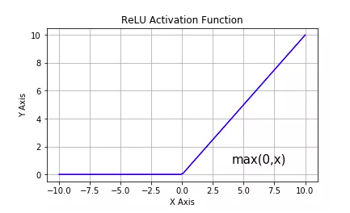

# 04-03 Activation Functions

**激活函数** 在深度学习中扮演着非常重要的角色，它给网络赋予了 **非线性**，从而使得神经网络能够 **拟合任意复杂** 的函数，如果没有激活函数，无论多复杂的网络，都等价于单一的线性变换，无法对非线性函数进行拟合

目前，深度学习中最流行的激活函数为 ReLU，但也有些新推出的激活函数，例如 Swish、GELU 据称效果优于 ReLU 激活函数，激活函数的综述介绍可以参考下面两篇文章

- [《 一文概览深度学习中的激活函数 》](https://zhuanlan.zhihu.com/p/98472075)
- [《 从 ReLU 到 GELU，一文概览神经网络的激活函数 》](https://zhuanlan.zhihu.com/p/98863801)

## General Activation Functions

- `tf.nn.sigmoid`，将实数压缩到 0 到 1 之间，一般只在二分类的最后输出层使用，主要缺陷为存在梯度消失问题，计算复杂度高，输出不以 0 为中心


- `tf.nn.softmax`，Sigmoid 的多分类扩展，一般只在多分类问题的最后输出层使用

    $$
    \mathrm{softmax}(x_i)=\frac{\mathrm{exp}(x_i)}{\sum_j \mathrm{exp}(x_j)}
    $$

    For Example

    $$
    \mathrm{pre\_output} = [1, 5, 3]
    \Longrightarrow
    \begin{cases}
        e^1 \approx 2.718 \\
        e^5 \approx 148.413 \\
        e^3 \approx 20.086
    \end{cases}
    \xRightarrow{\mathrm{totel}=e^1+e^5+e^3}
    \begin{cases}
        p_1 = e^1 / \;\mathrm{totel} \approx 0.016 \\
        p_2 = e^5 / \;\mathrm{totel} \approx 0.867 \\
        p_3 = e^3 / \;\mathrm{totel} \approx 0.117
    \end{cases}
    $$

- `tf.nn.tanh`，将实数压缩到 -1 到 1 之间，输出期望为 0，主要缺陷为存在梯度消失问题，计算复杂度高


- `tf.nn.relu`，**修正线性单元**，最流行的激活函数，一般隐藏层使用，主要缺陷是，输出不以 0 为中心，输入小于 0 时存在梯度消失问题



- `tf.nn.leaky_relu`，对修正线性单元的改进，解决了 ReLU 的梯度消失问题


- `tf.nn.elu`，指数线性单元，对 ReLU 的改进，能够缓解 ReLU 的梯度消失问题


- `tf.nn.selu`，扩展型指数线性单元，在权重用 `tf.keras.initializers.lecun_normal` 初始化前提下能够对神经网络进行自归一化，不可能出现梯度爆炸或者梯度消失问题，需要和 `Dropout` 的变种 `AlphaDropout` 一起使用


- `tf.nn.swish`，自门控激活函数，谷歌出品，相关研究指出用 `swish` 替代 `relu` 将获得轻微效果提升


* **GELU**，高斯误差线性单元激活函数，在 Transformer 中表现最好，`tf.nn` 模块尚没有实现该函数


## Using the Activation Function in the Model

在 Keras 模型中使用激活函数一般有两种方式，一种是作为某些层的 `activation` 参数指定，另一种是显式添加 `layers.Activation` 激活层

```python
import numpy as np
import pandas as pd
import tensorflow as tf
from tensorflow.keras import layers, models

tf.keras.backend.clear_session()

model = models.Sequential()
model.add(layers.Dense(32, input_shape=(None, 16), activation=tf.nn.relu))  # 通过 activation 参数指定
model.add(layers.Dense(10))
model.add(layers.Activation(tf.nn.softmax))     # 显式添加 layers.Activation 激活层
model.summary()
```

**output**

```console
Model: "sequential"
_________________________________________________________________
Layer (type)                 Output Shape              Param #
=================================================================
dense (Dense)                (None, None, 32)          544
_________________________________________________________________
dense_1 (Dense)              (None, None, 10)          330
_________________________________________________________________
activation (Activation)      (None, None, 10)          0
=================================================================
Total params: 874
Trainable params: 874
Non-trainable params: 0
_________________________________________________________________
```
