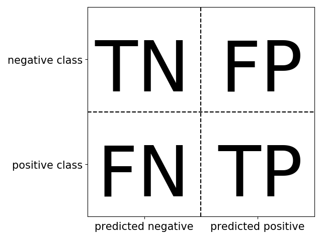

# 04-06 Metrics

损失函数除了作为模型训练时候的优化目标，也能够作为模型好坏的一种评价指标，但通常人们还会从其它角度评估模型的好坏，这就是 **评估指标**，通常损失函数都可以作为评估指标，如 MAE，MSE，CategoricalCrossentropy 等也是常用的评估指标，但评估指标不一定可以作为损失函数，例如 AUC，Accuracy，Precision，因为评估指标不要求连续可导，而损失函数通常要求连续可导

编译模型时，可以通过列表形式指定多个评估指标

如果有需要，也可以自定义评估指标，自定义评估指标需要接收两个张量 `y_true, y_pred` 作为输入参数，并输出一个标量作为评估值，也可以对 `tf.keras.metrics.Metric` 进行子类化，重写初始化方法，`update_state` 方法，`result`方法实现评估指标的计算逻辑，从而得到评估指标的类的实现形式

由于训练的过程通常是分批次训练的，而评估指标要跑完一个 Epoch 才能够得到整体的指标结果，因此，类形式的评估指标更为常见，即需要编写初始化方法以创建与计算指标结果相关的一些中间变量，编写 `update_state` 方法在每个 `batch` 后更新相关中间变量的状态，编写 `result` 方法输出最终指标结果

如果编写函数形式的评估指标，则只能取 Epoch 中各个 `batch` 计算的评估指标结果的平均值作为整个 Epoch上的评估指标结果，这个结果通常会偏离整个 Epoch 数据一次计算的结果

## About Confusion Matrix

使用混淆矩阵是表示二元分类评估结果最全面的方法之一，在 Sklearn 中，可以采用

```
from sklearn.metrics import confusion_matrix
```

来调出混淆矩阵，`confusion_matrix` 的输出是一个二乘二的数组，其中行对应于真实类，列对应于预测类，对于每次预测，计算该行所给的类中有多少个数据点是该列所给的预测类的数据点

混淆矩阵的主对角线上的元素（二维数组或矩阵 A 的主对角线是 A[i, i] ）对应于正确的分类，而其他元素则告诉我们有多少个类别的样本被误归为另一个类别

如果定义好了正类，可以把混淆矩阵的元素与假阳性和假阴性的术语联系起来，为了完成图示，把属于阳性类的正确分类的样本称为真阳性，而属于阴性类的正确分类的样本称为真阴性，即

- **真正例（TP）**，实际上是正例的数据点被标记为正例
- **假正例（FP）**，实际上是反例的数据点被标记为正例
- **真反例（TN）**，实际上是反例的数据点被标记为反例
- **假反例（FN）**，实际上是正例的数据点被标记为反例

```python
import mglearn
mglearn.plots.plot_binary_confusion_matrix()
```



显然

$$
TP + FP + FN + TN = \mathrm{Total\ Number\ of\ Samples}
$$

## Commonly used Built-In Evaluation Indicators

- `MeanSquaredError`，均方误差，用于回归，可以简写为 MSE，函数形式为 `mse`
- `MeanAbsoluteError`，平均绝对值误差，用于回归，可以简写为 MAE，函数形式为 `mae`
- `MeanAbsolutePercentageError`，平均百分比误差，用于回归，可以简写为 MAPE，函数形式为 `mape`
- `RootMeanSquaredError`，均方根误差，用于回归
- `Accuracy`，准确率，用于分类，要求 `y_true` 和 `y_pred` 都为类别序号编码，
    
    $$
    \mathrm{Accuracy} = \frac{TP+TN}{TP+TN+FP+FN}
    $$

- `Precision`，精确率，用于二分类，

    $$
    \mathrm{Precision} = \frac{TP}{TP + FP}
    $$

- `Recall`，召回率，用于二分类，

    $$
    \mathrm{Recall} = \frac{TP}{TP+FN}
    $$

- `TruePositives`，真正例，用于二分类
- `TrueNegatives`，真负例，用于二分类
- `FalsePositives`，假正例，用于二分类
- `FalseNegatives`，假负例，用于二分类
- `AUC`，ROC 曲线（TPR vs FPR）下的面积，用于二分类，直观解释为随机抽取一个正样本和一个负样本，正样本的预测值大于负样本的概率
- `CategoricalAccuracy`，分类准确率，与 Accuracy 含义相同，要求 `y_true` 即 Label 为 One-Hot 编码形式
- `SparseCategoricalAccuracy`，稀疏分类准确率，与 Accuracy 含义相同，要求 `y_true` 即 Label 为序号编码形式
- `MeanIoU`，Intersection-Over-Union，常用于图像分割
- `TopKCategoricalAccuracy`，多分类 TopK 准确率，要求 `y_true` 即 Label 为 One-Hot 编码形式
- `SparseTopKCategoricalAccuracy`，稀疏多分类 TopK 准确率，要求 `y_true` 即 Label 为序号编码形式
- `Mean`，平均值
- `Sum`，求和

## Custom Evaluation Indicators

以金融风控领域常用的 KS 指标为例，示范自定义评估指标，KS 指标适合二分类问题，其计算方式为

$$
\mathrm{KS} = \max (TPR-FPR)
$$

其中

$$
TPR = \frac{TP}{TP + FN}, \quad\quad
FPR = \frac{FP}{FP+TN}
$$

TPR 曲线实际上就是 **正样本的累积分布曲线（CDF）**，FPR 曲线实际上就是 **负样本的累积分布曲线**

KS 指标就是正样本和负样本累积分布曲线差值的最大值


### Function Implementation

```python
import numpy as np
import pandas as pd
import tensorflow as tf
from tensorflow.keras import layers, models, losses, metrics

# 函数形式的自定义评估指标
@tf.function
def ks(y_true, y_pred):
    y_true = tf.reshape(y_true, (-1,))
    y_pred = tf.reshape(y_pred, (-1,))
    length = tf.shape(y_true)[0]
    t = tf.math.top_k(y_pred, k=length, sorted=False)
    y_pred_sorted = tf.gather(y_pred, t.indices)
    y_true_sorted = tf.gather(y_true, t.indices)
    cum_positive_ratio = tf.truediv(
        tf.cumsum(y_true_sorted), tf.reduce_sum(y_true_sorted))
    cum_negative_ratio = tf.truediv(
        tf.cumsum(1 - y_true_sorted), tf.reduce_sum(1 - y_true_sorted))
    ks_value = tf.reduce_max(tf.abs(cum_positive_ratio - cum_negative_ratio)) 
    return ks_value
```

查看示例

```python
y_true = tf.constant([[1], [1], [1], [0], [1], [1], [1], [0], [0], [0], [1], [0], [1], [0]])
y_pred = tf.constant([[0.6], [0.1], [0.4], [0.5], [0.7], [0.7], [0.7],
                      [0.4], [0.4], [0.5], [0.8], [0.3], [0.5], [0.3]])
tf.print(ks(y_true, y_pred))
```

**output**

```console
0.625
```

### Class Implementation

```python
# 类形式的自定义评估指标
class KS(metrics.Metric):
    
    def __init__(self, name="ks", **kwargs):
        super(KS, self).__init__(name=name, **kwargs)
        self.true_positives = self.add_weight(
            name="tp", shape=(101,), initializer="zeros")
        self.false_positives = self.add_weight(
            name="fp", shape=(101,), initializer="zeros")
   
    @tf.function
    def update_state(self, y_true, y_pred):
        y_true = tf.cast(tf.reshape(y_true, (-1,)), tf.bool)
        y_pred = tf.cast(100 * tf.reshape(y_pred, (-1,)), tf.int32)
        
        for i in tf.range(0, tf.shape(y_true)[0]):
            if y_true[i]:
                self.true_positives[y_pred[i]].assign(
                    self.true_positives[y_pred[i]] + 1.0)
            else:
                self.false_positives[y_pred[i]].assign(
                    self.false_positives[y_pred[i]] + 1.0)
        return (self.true_positives, self.false_positives)
    
    @tf.function
    def result(self):
        cum_positive_ratio = tf.truediv(
            tf.cumsum(self.true_positives), tf.reduce_sum(self.true_positives))
        cum_negative_ratio = tf.truediv(
            tf.cumsum(self.false_positives), tf.reduce_sum(self.false_positives))
        ks_value = tf.reduce_max(tf.abs(cum_positive_ratio - cum_negative_ratio)) 
        return ks_value
```

查看示例

```python
y_true = tf.constant([[1], [1], [1], [0], [1], [1], [1], [0], [0], [0], [1], [0], [1], [0]])
y_pred = tf.constant([[0.6], [0.1], [0.4], [0.5], [0.7], [0.7], [0.7],
                      [0.4], [0.4], [0.5], [0.8], [0.3], [0.5], [0.3]])

myks = KS()
myks.update_state(y_true, y_pred)
tf.print(myks.result())
```

**output**

```console
0.625
```
