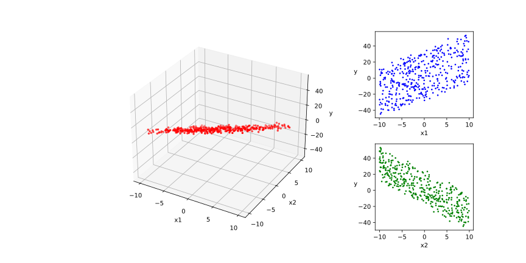
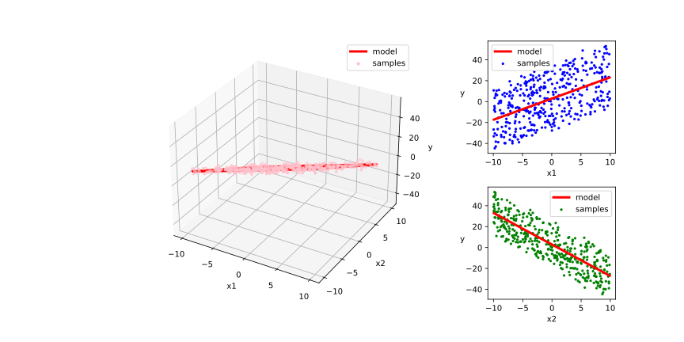
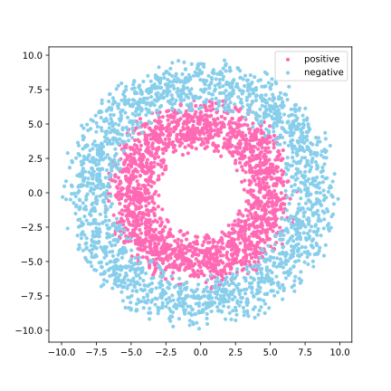
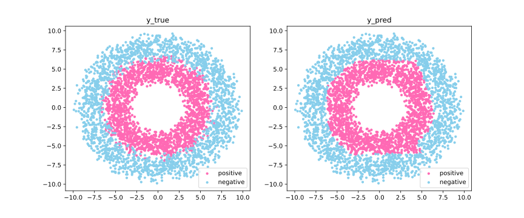

# 04-09 Mid-level API: Demonstration

下面的范例使用 TensorFlow 的 **中阶 API** 实现 **线性回归** 模型和和 **DNN 二分类** 模型，主要包括各种 **模型层**，**损失函数**，**优化器**，**数据管道**，**特征列** 等等

首先，导入一些必要的 Package

```python
import numpy as np
import pandas as pd
from matplotlib import pyplot as plt
from matplotlib.ticker import MultipleLocator, FormatStrFormatter

import tensorflow as tf
from tensorflow.keras import layers, losses, metrics, optimizers
```

在训练的时候，打印时间分割线的函数

```python
# 打印时间分割线
@tf.function
def printbar():
    today_ts = tf.timestamp() % (24 * 60 * 60)

    hour = tf.cast(today_ts // 3600 + 8, tf.int32) % tf.constant(24)
    minite = tf.cast((today_ts % 3600) // 60, tf.int32)
    second = tf.cast(tf.floor(today_ts % 60), tf.int32)

    def timeformat(m):
        if tf.strings.length(tf.strings.format("{}", m)) == 1:
            return(tf.strings.format("0{}", m))
        else:
            return(tf.strings.format("{}", m))

    timestring = tf.strings.join([timeformat(hour), timeformat(minite), 
                timeformat(second)], separator=":")
    tf.print("==========" * 8 + timestring)
```

## Linear Regression Model

### Prepare Regression Data

```python
# 样本数量
n = 400

# 生成测试用数据集
X = tf.random.uniform([n, 2], minval=-10, maxval=10) 
w0 = tf.constant([[2.0], [-3.0]])
b0 = tf.constant([[3.0]])
Y = X @ w0 + b0 + tf.random.normal([n, 1], mean=0.0, stddev=2.0)    # @ 表示矩阵乘法，增加正态扰动
```

可以将需要回归的数据可视化，以便有一个直观的理解

```python
# 数据可视化
%matplotlib inline
%config InlineBackend.figure_format = 'svg'

plt.figure(figsize=(12, 6))
plt.subplots_adjust(wspace=0.05, hspace=0.3)
ax1 = plt.subplot2grid((2, 4), (0, 0), rowspan=2, colspan=3, projection="3d")
ax1.scatter3D(X[:, 0], X[:, 1], Y[:, 0], c="r", s=6)
ax1.xaxis.set_major_locator(MultipleLocator(5))
ax1.yaxis.set_major_locator(MultipleLocator(5))
ax1.zaxis.set_major_locator(MultipleLocator(20))
ax1.xaxis.set_label_text("x1")
ax1.yaxis.set_label_text("x2")
ax1.zaxis.set_label_text("y")

ax2 = plt.subplot2grid((2, 4), (0, 3), rowspan=1, colspan=1)
ax2.scatter(X[:, 0], Y, c="b", s=3)
plt.xlabel("x1")
plt.ylabel("y", rotation=0)

ax3 = plt.subplot2grid((2, 4), (1, 3), rowspan=1, colspan=1)
ax3.scatter(X[:, 1], Y, c="g", s=3)
plt.xlabel("x2")
plt.ylabel("y", rotation=0)

# plt.savefig("figs/4-9-regression-data-visualization.svg")
plt.show()
```



接着，来构建一下输入数据管道

```python
ds = tf.data.Dataset.from_tensor_slices((X, Y)) \
     .shuffle(buffer_size=100).batch(10) \
     .prefetch(tf.data.experimental.AUTOTUNE)
```

### Regression Model Definition

```python
model = layers.Dense(units=1) 
model.build(input_shape=(2,))   # 用 build 方法创建 variables
model.loss_func = losses.mean_squared_error
model.optimizer = optimizers.SGD(learning_rate=0.001)
```

### Training Regression Model

```python
# 使用 autograph 机制转换成静态图加速
@tf.function
def train_step(model, features, labels):
    with tf.GradientTape() as tape:
        predictions = model(features)
        loss = model.loss_func(tf.reshape(labels, [-1]), tf.reshape(predictions, [-1]))
    grads = tape.gradient(loss, model.variables)
    model.optimizer.apply_gradients(zip(grads, model.variables))
    return loss

# 测试 train_step 效果
features,labels = next(ds.as_numpy_iterator())
train_step(model, features, labels)
```

**output**

```console
<tf.Tensor: shape=(), dtype=float32, numpy=924.5001>
```

执行训练

```python
def train_model(model, epochs):
    for epoch in tf.range(1, epochs + 1):
        loss = tf.constant(0.0)
        for features, labels in ds:
            loss = train_step(model, features, labels)
        if epoch % 50 == 0:
            printbar()
            tf.print("epoch =", epoch, "loss =", loss)
            tf.print("w =", model.variables[0])
            tf.print("b =", model.variables[1])

train_model(model, epochs=200)
```

**output**

```console
================================================================================17:32:22
epoch = 50 loss = 4.20363188
w = [[2.00577021]
 [-3.01689124]]
b = [2.79725599]
================================================================================17:32:23
epoch = 100 loss = 3.36914
w = [[2.02378654]
 [-3.00638294]]
b = [2.85010695]
================================================================================17:32:24
epoch = 150 loss = 3.4407959
w = [[2.03187418]
 [-3.01342249]]
b = [2.85248518]
================================================================================17:32:25
epoch = 200 loss = 4.92183208
w = [[2.03104281]
 [-3.0136857]]
b = [2.85189033]
```

回归拟合结果可视化

```python
%matplotlib inline
%config InlineBackend.figure_format = 'svg'

w, b = model.variables # get the parameters

plt.figure(figsize=(12, 6))
plt.subplots_adjust(wspace=0.05, hspace=0.3)
ax1 = plt.subplot2grid((2, 4), (0, 0), rowspan=2, colspan=3, projection="3d")
ax1.scatter3D(X[:, 0], X[:, 1], Y[:, 0], c="pink", s=10, label="samples")
ax1.plot3D(X[:, 0], X[:, 1], 
           w[0] * X[:, 0] + w[1] * X[:, 1] + b[0], "-r", linewidth=3.0, label="model")
ax1.xaxis.set_major_locator(MultipleLocator(5))
ax1.yaxis.set_major_locator(MultipleLocator(5))
ax1.zaxis.set_major_locator(MultipleLocator(20))
ax1.xaxis.set_label_text("x1")
ax1.yaxis.set_label_text("x2")
ax1.zaxis.set_label_text("y")
ax1.legend()

ax2 = plt.subplot2grid((2, 4), (0, 3), rowspan=1, colspan=1)
ax2.scatter(X[:, 0], Y, c="b", s=5, label="samples")
ax2.plot(X[:, 0], w[0] * X[:, 0] + b[0], "-r", linewidth=3.0, label="model")
ax2.legend()
plt.xlabel("x1")
plt.ylabel("y", rotation=0)

ax3 = plt.subplot2grid((2, 4), (1, 3), rowspan=1, colspan=1)
ax3.scatter(X[:, 1], Y, c="g", s=5, label="samples")
ax3.plot(X[:, 1], w[1] * X[:, 1] + b[0], "-r", linewidth=3.0, label="model")
ax3.legend()
plt.xlabel("x2")
plt.ylabel("y", rotation=0)
# plt.savefig("figs/4-9-visualization-of-regression-results.svg")
plt.show()
```



## DNN Two-Classes Model

### Prepare Two-Class Data

```python
%matplotlib inline
%config InlineBackend.figure_format = 'svg'

# 正负样本数量
n_positive, n_negative = 2000, 2000

# 生成正样本, 小圆环分布
r_p = 5.0 + tf.random.truncated_normal([n_positive, 1], 0.0, 1.0)
theta_p = tf.random.uniform([n_positive, 1], 0.0, 2 * np.pi) 
Xp = tf.concat([r_p * tf.cos(theta_p), r_p * tf.sin(theta_p)], axis=1)
Yp = tf.ones_like(r_p)

# 生成负样本, 大圆环分布
r_n = 8.0 + tf.random.truncated_normal([n_negative, 1], 0.0, 1.0)
theta_n = tf.random.uniform([n_negative, 1], 0.0, 2 * np.pi) 
Xn = tf.concat([r_n * tf.cos(theta_n), r_n * tf.sin(theta_n)], axis=1)
Yn = tf.zeros_like(r_n)

# 汇总样本
X = tf.concat([Xp, Xn], axis=0)
Y = tf.concat([Yp, Yn], axis=0)

# 可视化
plt.figure(figsize=(6, 6))
plt.scatter(Xp[:, 0].numpy(), Xp[:, 1].numpy(), c="hotpink", s=10)
plt.scatter(Xn[:, 0].numpy(), Xn[:, 1].numpy(), c="skyblue", s=10)
plt.legend(["positive", "negative"])
# plt.savefig("figs/4-9-categorical-data-visualization.svg")
plt.show()
```



接着，来构建一下输入数据管道

```python
ds = tf.data.Dataset.from_tensor_slices((X, Y)) \
     .shuffle(buffer_size=4000).batch(100) \
     .prefetch(tf.data.experimental.AUTOTUNE) 
```

### Two-Class Model Definition

```python
class DNNModel(tf.Module):
    def __init__(self,name = None):
        super(DNNModel, self).__init__(name=name)
        self.dense1 = layers.Dense(4, activation="relu") 
        self.dense2 = layers.Dense(8, activation="relu")
        self.dense3 = layers.Dense(1, activation="sigmoid")


    # 正向传播
    @tf.function(input_signature=[tf.TensorSpec(shape=[None, 2], dtype=tf.float32)])  
    def __call__(self,x):
        x = self.dense1(x)
        x = self.dense2(x)
        y = self.dense3(x)
        return y
    
model = DNNModel()
model.loss_func = losses.binary_crossentropy
model.metric_func = metrics.binary_accuracy
model.optimizer = optimizers.Adam(learning_rate=0.001)
```

测试模型结构

```python
# 测试模型结构
(features,labels) = next(ds.as_numpy_iterator())

predictions = model(features)

loss = model.loss_func(tf.reshape(labels, [-1]), tf.reshape(predictions, [-1]))
metric = model.metric_func(tf.reshape(labels, [-1]), tf.reshape(predictions, [-1]))

tf.print("init loss:", loss)
tf.print("init metric", metric)
```

**output**

```console
init loss: 0.760362566
init metric 0.45
```

### Training Two-Class Model

```python
# 使用 autograph 机制转换成静态图加速
@tf.function
def train_step(model, features, labels):
    with tf.GradientTape() as tape:
        predictions = model(features)
        loss = model.loss_func(tf.reshape(labels, [-1]), tf.reshape(predictions, [-1]))
    grads = tape.gradient(loss,model.trainable_variables)
    model.optimizer.apply_gradients(zip(grads, model.trainable_variables))
    
    metric = model.metric_func(tf.reshape(labels, [-1]), tf.reshape(predictions, [-1]))
    
    return loss, metric

# 测试 train_step 效果
features,labels = next(ds.as_numpy_iterator())
train_step(model,features,labels)
```

**output**

```console
(<tf.Tensor: shape=(), dtype=float32, numpy=0.7825246>,
 <tf.Tensor: shape=(), dtype=float32, numpy=0.55>)
```

执行训练

```python
def train_model(model, epochs):
    for epoch in tf.range(1, epochs + 1):
        loss, metric = tf.constant(0.0), tf.constant(0.0)
        for features, labels in ds:
            loss, metric = train_step(model, features, labels)
        if epoch % 10 == 0:
            printbar()
            tf.print(
                "epoch = " + tf.as_string(epoch) + "; " +
                "loss = " + tf.as_string(loss) +  "; " + 
                "accuracy = " + tf.as_string(metric)
            )

train_model(model, epochs=60)
```

**output**

```console
================================================================================17:48:35
epoch = 10; loss = 0.107685; accuracy = 0.950000
================================================================================17:48:36
epoch = 20; loss = 0.187018; accuracy = 0.920000
================================================================================17:48:36
epoch = 30; loss = 0.136061; accuracy = 0.940000
================================================================================17:48:36
epoch = 40; loss = 0.068381; accuracy = 0.970000
================================================================================17:48:37
epoch = 50; loss = 0.090711; accuracy = 0.960000
================================================================================17:48:37
epoch = 60; loss = 0.125459; accuracy = 0.950000
```

将二分类结果可视化

```python
# 结果可视化
fig, (ax1, ax2) = plt.subplots(nrows=1, ncols=2, figsize=(12, 5))
ax1.scatter(Xp[:, 0], Xp[:, 1], c="hotpink", s=10)
ax1.scatter(Xn[:, 0], Xn[:, 1], c="skyblue", s=10)
ax1.legend(["positive", "negative"])
ax1.set_title("y_true")

Xp_pred = tf.boolean_mask(X, tf.squeeze(model(X) >= 0.5), axis=0)
Xn_pred = tf.boolean_mask(X, tf.squeeze(model(X) < 0.5), axis=0)

ax2.scatter(Xp_pred[:, 0], Xp_pred[:, 1], c="hotpink", s=10)
ax2.scatter(Xn_pred[:, 0], Xn_pred[:, 1], c="skyblue", s=10)
ax2.legend(["positive", "negative"])
ax2.set_title("y_pred")
# plt.savefig("figs/4-9-visualization-of-categorical-data-results.svg")
plt.show()
```


