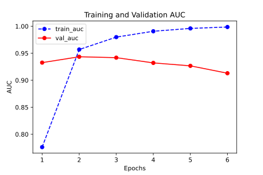
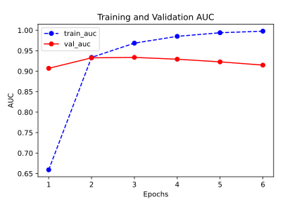
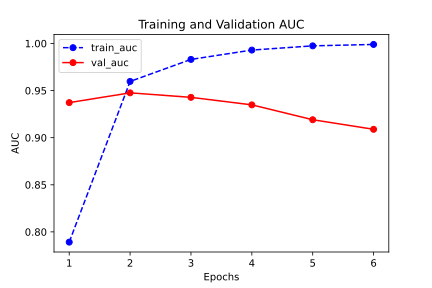

# 05-01 Three Ways of Modeling

可以使用以下 3 种方式构建模型

- 使用 Sequential 按层顺序构建模型
    - 顺序结构的模型
- 使用函数式 API 构建任意结构模型
    - 模型有多输入或者多输出
    - 模型需要共享权重
    - 模型具有残差连接等非顺序结构
- 继承 Model 基类构建自定义模型
    - 如果无特定必要，尽可能避免使用 Model 子类化的方式构建模型
    - 提供了极大的灵活性，但也有更大的概率出错

## Data Preparation

下面以 IMDB 电影评论的分类问题为例，演示 3 种创建模型的方法

```python
import numpy as np 
import pandas as pd 
import tensorflow as tf
from tqdm import tqdm
from tensorflow.keras import *

train_token_path = "../chapter01/data/imdb/train_token.csv"
test_token_path = "../chapter01/data/imdb/test_token.csv"

MAX_WORDS = 10000   # We will only consider the top 10,000 words in the dataset
MAX_LEN = 200       # We will cut reviews after 200 words
BATCH_SIZE = 20

# 构建管道
def parse_line(line):
    t = tf.strings.split(line, "\t")
    label = tf.reshape(tf.cast(tf.strings.to_number(t[0]), tf.int32), (-1,))
    features = tf.cast(tf.strings.to_number(tf.strings.split(t[1], " ")), tf.int32)
    return (features, label)

ds_train = tf.data.TextLineDataset(filenames=[train_token_path]) \
   .map(parse_line, num_parallel_calls=tf.data.experimental.AUTOTUNE) \
   .shuffle(buffer_size=1000).batch(BATCH_SIZE) \
   .prefetch(tf.data.experimental.AUTOTUNE)

ds_test = tf.data.TextLineDataset(filenames=[test_token_path]) \
   .map(parse_line, num_parallel_calls=tf.data.experimental.AUTOTUNE) \
   .shuffle(buffer_size=1000).batch(BATCH_SIZE) \
   .prefetch(tf.data.experimental.AUTOTUNE)
```

## Sequential Creates Models in Hierarchical Order

```python
tf.keras.backend.clear_session()

model = models.Sequential()

model.add(layers.Embedding(MAX_WORDS, 7, input_length=MAX_LEN))
model.add(layers.Conv1D(filters=64, kernel_size=5, activation="relu"))
model.add(layers.MaxPool1D(2))
model.add(layers.Conv1D(filters=32, kernel_size=3, activation="relu"))
model.add(layers.MaxPool1D(2))
model.add(layers.Flatten())
model.add(layers.Dense(1, activation="sigmoid"))

model.compile(
    optimizer='Nadam',
    loss='binary_crossentropy',
    metrics=["accuracy", "AUC"]
)

model.summary()
```

**output**

```console
Model: "sequential"
_________________________________________________________________
Layer (type)                 Output Shape              Param #
=================================================================
embedding (Embedding)        (None, 200, 7)            70000
_________________________________________________________________
conv1d (Conv1D)              (None, 196, 64)           2304
_________________________________________________________________
max_pooling1d (MaxPooling1D) (None, 98, 64)            0
_________________________________________________________________
conv1d_1 (Conv1D)            (None, 96, 32)            6176
_________________________________________________________________
max_pooling1d_1 (MaxPooling1 (None, 48, 32)            0
_________________________________________________________________
flatten (Flatten)            (None, 1536)              0
_________________________________________________________________
dense (Dense)                (None, 1)                 1537
=================================================================
Total params: 80,017
Trainable params: 80,017
Non-trainable params: 0
_________________________________________________________________
```

更直观的结构如下图所示


```python
import datetime
# baselogger = tf.keras.callbacks.BaseLogger(stateful_metrics=["AUC"])
logdir = "./data/keras_model/" + datetime.datetime.now().strftime("%Y%m%d-%H%M%S")
tensorboard_callback = tf.keras.callbacks.TensorBoard(logdir, histogram_freq=1)
history = model.fit(
    ds_train, validation_data=ds_test, epochs=6,
    # callbacks=[baselogger, tensorboard_callback]
    callbacks=[tensorboard_callback]
)
```

**output**

```console
Epoch 1/6
1000/1000 [==============================] - 13s 13ms/step - loss: 0.5368 - accuracy: 0.6751 - auc: 0.7762 - val_loss: 0.3349 - val_accuracy: 0.8580 - val_auc: 0.9327
Epoch 2/6
1000/1000 [==============================] - 13s 13ms/step - loss: 0.2666 - accuracy: 0.8920 - auc: 0.9569 - val_loss: 0.3287 - val_accuracy: 0.8676 - val_auc: 0.9435
Epoch 3/6
1000/1000 [==============================] - 13s 13ms/step - loss: 0.1806 - accuracy: 0.9326 - auc: 0.9799 - val_loss: 0.3668 - val_accuracy: 0.8612 - val_auc: 0.9418
Epoch 4/6
1000/1000 [==============================] - 13s 13ms/step - loss: 0.1205 - accuracy: 0.9550 - auc: 0.9907 - val_loss: 0.4774 - val_accuracy: 0.8556 - val_auc: 0.9322
Epoch 5/6
1000/1000 [==============================] - 14s 14ms/step - loss: 0.0747 - accuracy: 0.9746 - auc: 0.9960 - val_loss: 0.5552 - val_accuracy: 0.8580 - val_auc: 0.9267
Epoch 6/6
1000/1000 [==============================] - 13s 13ms/step - loss: 0.0418 - accuracy: 0.9859 - auc: 0.9986 - val_loss: 0.7405 - val_accuracy: 0.8538 - val_auc: 0.9130
```

查看每个 Epoch 下 Training 和 Validation 的 AUC 情况

```python
%matplotlib inline
%config InlineBackend.figure_format = 'svg'

import matplotlib.pyplot as plt

def plot_metric(history, metric):
    train_metrics = history.history[metric]
    val_metrics = history.history['val_' + metric]
    epochs = range(1, len(train_metrics) + 1)
    plt.plot(epochs, train_metrics, 'bo--')
    plt.plot(epochs, val_metrics, 'ro-')
    plt.title('Training and Validation ' + metric.upper())
    plt.xlabel("Epochs")
    plt.ylabel(metric.upper())
    plt.legend(["train_" + metric, 'val_' + metric])
    # plt.savefig("figs/5-1-fit-model.svg")
    plt.show()

plot_metric(history, "auc")
```



## Functional API to Create Arbitrary Structural Models

```python
tf.keras.backend.clear_session()

inputs = layers.Input(shape=[MAX_LEN])
x  = layers.Embedding(MAX_WORDS, 7)(inputs)

branch1 = layers.SeparableConv1D(64, 3, activation="relu")(x)
branch1 = layers.MaxPool1D(3)(branch1)
branch1 = layers.SeparableConv1D(32, 3, activation="relu")(branch1)
branch1 = layers.GlobalMaxPool1D()(branch1)

branch2 = layers.SeparableConv1D(64, 5, activation="relu")(x)
branch2 = layers.MaxPool1D(5)(branch2)
branch2 = layers.SeparableConv1D(32, 5, activation="relu")(branch2)
branch2 = layers.GlobalMaxPool1D()(branch2)

branch3 = layers.SeparableConv1D(64, 7, activation="relu")(x)
branch3 = layers.MaxPool1D(7)(branch3)
branch3 = layers.SeparableConv1D(32, 7, activation="relu")(branch3)
branch3 = layers.GlobalMaxPool1D()(branch3)

concat = layers.Concatenate()([branch1, branch2, branch3])
outputs = layers.Dense(1, activation="sigmoid")(concat)

model = models.Model(inputs=inputs, outputs=outputs, name="model")

model.compile(
    optimizer='Nadam',
    loss='binary_crossentropy',
    metrics=['accuracy', "AUC"]
)

model.summary()
```

**output**

```console
Model: "model"
__________________________________________________________________________________________________
Layer (type)                    Output Shape         Param #     Connected to
==================================================================================================
input_1 (InputLayer)            [(None, 200)]        0
__________________________________________________________________________________________________
embedding (Embedding)           (None, 200, 7)       70000       input_1[0][0]
__________________________________________________________________________________________________
separable_conv1d (SeparableConv (None, 198, 64)      533         embedding[0][0]
__________________________________________________________________________________________________
separable_conv1d_2 (SeparableCo (None, 196, 64)      547         embedding[0][0]
__________________________________________________________________________________________________
separable_conv1d_4 (SeparableCo (None, 194, 64)      561         embedding[0][0]
__________________________________________________________________________________________________
max_pooling1d (MaxPooling1D)    (None, 66, 64)       0           separable_conv1d[0][0]
__________________________________________________________________________________________________
max_pooling1d_1 (MaxPooling1D)  (None, 39, 64)       0           separable_conv1d_2[0][0]
__________________________________________________________________________________________________
max_pooling1d_2 (MaxPooling1D)  (None, 27, 64)       0           separable_conv1d_4[0][0]
__________________________________________________________________________________________________
separable_conv1d_1 (SeparableCo (None, 64, 32)       2272        max_pooling1d[0][0]
__________________________________________________________________________________________________
separable_conv1d_3 (SeparableCo (None, 35, 32)       2400        max_pooling1d_1[0][0]
__________________________________________________________________________________________________
separable_conv1d_5 (SeparableCo (None, 21, 32)       2528        max_pooling1d_2[0][0]
__________________________________________________________________________________________________
global_max_pooling1d (GlobalMax (None, 32)           0           separable_conv1d_1[0][0]
__________________________________________________________________________________________________
global_max_pooling1d_1 (GlobalM (None, 32)           0           separable_conv1d_3[0][0]
__________________________________________________________________________________________________
global_max_pooling1d_2 (GlobalM (None, 32)           0           separable_conv1d_5[0][0]
__________________________________________________________________________________________________
concatenate (Concatenate)       (None, 96)           0           global_max_pooling1d[0][0]
                                                                 global_max_pooling1d_1[0][0]
                                                                 global_max_pooling1d_2[0][0]
__________________________________________________________________________________________________
dense (Dense)                   (None, 1)            97          concatenate[0][0]
==================================================================================================
Total params: 78,938
Trainable params: 78,938
Non-trainable params: 0
__________________________________________________________________________________________________
```

更直观的结构如下图所示


```python
import datetime
logdir = "./data/keras_model/" + datetime.datetime.now().strftime("%Y%m%d-%H%M%S")
tensorboard_callback = tf.keras.callbacks.TensorBoard(logdir, histogram_freq=1)
history = model.fit(
    ds_train, validation_data=ds_test, epochs=6,
    callbacks=[tensorboard_callback]
)
```

**output**

```console
Epoch 1/6
1000/1000 [==============================] - 21s 21ms/step - loss: 0.6240 - accuracy: 0.5911 - auc: 0.6592 - val_loss: 0.3894 - val_accuracy: 0.8284 - val_auc: 0.9070
Epoch 2/6
1000/1000 [==============================] - 21s 21ms/step - loss: 0.3290 - accuracy: 0.8578 - auc: 0.9337 - val_loss: 0.3353 - val_accuracy: 0.8546 - val_auc: 0.9326
Epoch 3/6
1000/1000 [==============================] - 22s 22ms/step - loss: 0.2275 - accuracy: 0.9091 - auc: 0.9685 - val_loss: 0.3522 - val_accuracy: 0.8544 - val_auc: 0.9337
Epoch 4/6
1000/1000 [==============================] - 20s 20ms/step - loss: 0.1535 - accuracy: 0.9457 - auc: 0.9850 - val_loss: 0.4127 - val_accuracy: 0.8510 - val_auc: 0.9293
Epoch 5/6
1000/1000 [==============================] - 20s 20ms/step - loss: 0.0917 - accuracy: 0.9727 - auc: 0.9939 - val_loss: 0.5071 - val_accuracy: 0.8522 - val_auc: 0.9228
Epoch 6/6
1000/1000 [==============================] - 20s 20ms/step - loss: 0.0479 - accuracy: 0.9872 - auc: 0.9977 - val_loss: 0.6271 - val_accuracy: 0.8524 - val_auc: 0.9148
```

查看每个 Epoch 下 Training 和 Validation 的 AUC 情况

```python
plot_metric(history, "auc")
```



## Model Subclasses to Create Custom Models

```python
# 先自定义一个残差模块，为自定义 Layer
class ResBlock(layers.Layer):
    def __init__(self, kernel_size, **kwargs):
        super(ResBlock, self).__init__(**kwargs)
        self.kernel_size = kernel_size
    
    def build(self, input_shape):
        self.conv1 = layers.Conv1D(
            filters=64,
            kernel_size=self.kernel_size,
            activation="relu",
            padding="same"
        )
        self.conv2 = layers.Conv1D(
            filters=32,
            kernel_size=self.kernel_size,
            activation = "relu",
            padding="same"
        )
        self.conv3 = layers.Conv1D(
            filters=input_shape[-1],
            kernel_size=self.kernel_size,
            activation = "relu",
            padding="same"
        )
        self.maxpool = layers.MaxPool1D(2)
        super(ResBlock, self).build(input_shape)    # 相当于设置 self.built = True
    
    def call(self, inputs):
        x = self.conv1(inputs)
        x = self.conv2(x)
        x = self.conv3(x)
        x = layers.Add()([inputs, x])
        x = self.maxpool(x)
        return x
    
    # 如果要让自定义的 Layer 通过 Functional API 组合成模型时可以序列化，需要自定义 get_config 方法
    def get_config(self):  
        config = super(ResBlock, self).get_config()
        config.update({'kernel_size': self.kernel_size})
        return config
```

测试 `ResBlock`

```python
resblock = ResBlock(kernel_size=3)
resblock.build(input_shape=(None, 200, 7))
resblock.compute_output_shape(input_shape=(None, 200, 7))
```

**output**

```console
TensorShape([None, 100, 7])
```

自定义模型

```python
# 自定义模型，实际上也可以使用 Sequential 或者 Functional API
class ImdbModel(models.Model):
    def __init__(self):
        super(ImdbModel, self).__init__()
        
    def build(self,input_shape):
        self.embedding = layers.Embedding(MAX_WORDS, 7)
        self.block1 = ResBlock(7)
        self.block2 = ResBlock(5)
        self.dense = layers.Dense(1, activation="sigmoid")
        super(ImdbModel, self).build(input_shape)
    
    def call(self, x):
        x = self.embedding(x)
        x = self.block1(x)
        x = self.block2(x)
        x = layers.Flatten()(x)
        x = self.dense(x)
        return(x)
```

查看模型结构

```python
tf.keras.backend.clear_session()

model = ImdbModel()
model.build(input_shape=(None, 200))
model.summary()

model.compile(optimizer='Nadam',
            loss='binary_crossentropy',
            metrics=['accuracy', "AUC"])
```

**output**

```console
Model: "imdb_model"
_________________________________________________________________
Layer (type)                 Output Shape              Param #   
=================================================================
embedding (Embedding)        multiple                  70000     
_________________________________________________________________
res_block (ResBlock)         multiple                  19143     
_________________________________________________________________
res_block_1 (ResBlock)       multiple                  13703     
_________________________________________________________________
dense (Dense)                multiple                  351       
=================================================================
Total params: 103,197
Trainable params: 103,197
Non-trainable params: 0
_________________________________________________________________
```

更直观的结构如下图所示


```python
import datetime

logdir = "./data/keras_model/" + datetime.datetime.now().strftime("%Y%m%d-%H%M%S")
tensorboard_callback = tf.keras.callbacks.TensorBoard(logdir, histogram_freq=1)
history = model.fit(ds_train,validation_data = ds_test,
                    epochs=6, callbacks=[tensorboard_callback])
```

**output**

```console
Epoch 1/6
1000/1000 [==============================] - 47s 47ms/step - loss: 0.5629 - accuracy: 0.6618 - AUC: 0.7548 - val_loss: 0.3422 - val_accuracy: 0.8510 - val_AUC: 0.9286
Epoch 2/6
1000/1000 [==============================] - 43s 43ms/step - loss: 0.2648 - accuracy: 0.8903 - AUC: 0.9576 - val_loss: 0.3276 - val_accuracy: 0.8650 - val_AUC: 0.9410
Epoch 3/6
1000/1000 [==============================] - 42s 42ms/step - loss: 0.1573 - accuracy: 0.9439 - AUC: 0.9846 - val_loss: 0.3861 - val_accuracy: 0.8682 - val_AUC: 0.9390
Epoch 4/6
1000/1000 [==============================] - 42s 42ms/step - loss: 0.0849 - accuracy: 0.9706 - AUC: 0.9950 - val_loss: 0.5324 - val_accuracy: 0.8616 - val_AUC: 0.9292
Epoch 5/6
1000/1000 [==============================] - 43s 43ms/step - loss: 0.0393 - accuracy: 0.9876 - AUC: 0.9986 - val_loss: 0.7693 - val_accuracy: 0.8566 - val_AUC: 0.9132
Epoch 6/6
1000/1000 [==============================] - 44s 44ms/step - loss: 0.0222 - accuracy: 0.9926 - AUC: 0.9994 - val_loss: 0.9328 - val_accuracy: 0.8584 - val_AUC: 0.9052
```

查看每个 Epoch 下 Training 和 Validation 的 AUC 情况

```python
plot_metric(history, "auc")
```


