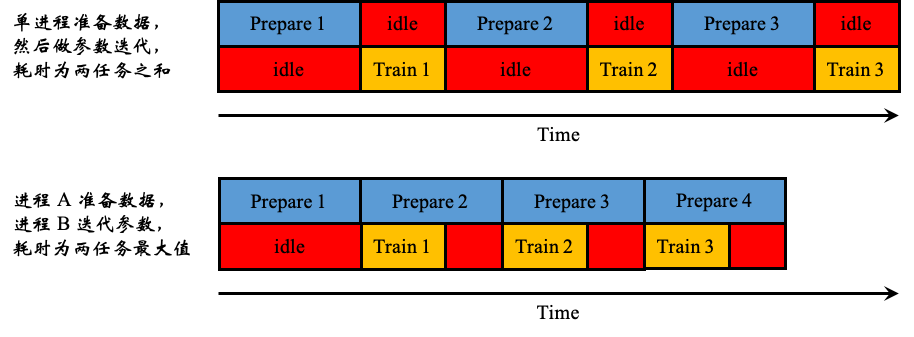

# 05-03 Model Training Using Single GPU

虽然前面的例子并不复杂，但深度学习的训练过程常常非常耗时，一个模型训练几个小时是家常便饭，训练几天也是常有的事情，有时候甚至要训练几十天

## Time-Consuming in the Training Process

训练过程的耗时主要来自于两个部分
- **数据准备**，当此过程是模型训练时间的主要瓶颈时，可以使用更多进程来准备数据
- **参数迭代**，当此过程成为训练时间的主要瓶颈时，通常的方法是应用 GPU 或者 Google 的 TPU 来进行加速

由于喂养深度学习模型的训练集数据可以大到 GB 数量级以上，无法一次载入内存，因此需要在训练过程中从磁盘中不断读入并做适当转换，IO 过程和转换过程是比较费时的，为了减少这部分时间的占用，一般通过多进程或多线程的方式构建并行数据输入管道来准备数据



当数据准备过程还是模型训练时间的主要瓶颈时，可以使用更多进程或线程来准备数据

而参数迭代过程主要是大量的简单矩阵运算，参数矩阵越大模型越深迭代次数越多耗时越长，矩阵运算本质上是一种简单重复的并行计算，当前的普通 CPU 通常只有 4-8 个 Core，因此做大型矩阵运算效率并不高，而普通的 GPU 通常都有几百上千个 Core，做矩阵运算有天然的优势


当参数迭代过程成为训练时间的主要瓶颈时，我们通常的方法是应用 GPU 或者 Google 的 TPU 来进行加速，可以简单地把 TPU 看成打包在一起的多个 GPU

## Access GPU Computing Resources

获取 GPU 计算资源的方法大概可以分成以下 3 种

### The Rich's Choice

直接 **购买 GPU 硬件**，通常一块用于深度学习的 GPU 价格在几千到几万元人民币不等，企业或者有较强经济实力的的个人一般采用该方案

土豪之选方案的优点是一次付费长期使用，稳定可靠，可以根据任务需要训练足够长时间的模型，该方案的缺点是比较费钱，并且需要费些时间去安装 Cuda，cuDNN，以及 TensorFlow-GPU 等以支持 Keras 使用 GPU 进行模型训练

### The Middle Class' Choice

**购买云端 GPU 计算时长**，各家主要的云厂商都提供了 GPU 计算资源的按需租用服务，但比较推荐的是 Floydhub 和国内的极客云这两个深度学习云平台，这些深度学习云平台提供了已经配置好了各种机器学习库和 GPU 支持的云端 Jupyter Notebook，只要上传数据就可以直接跑模型，非常贴心

中产之选方案的优点是非常省心，扩展灵活，只把时长用在刀刃上的话价格不贵，该方案的缺点是 Heavy-User 容易因此破产

### The Poor's Choice

**使用云端免费 GPU 资源**，目前发现的比较可靠的提供免费 GPU 计算资源的有两个平台

- **Google Colaboratory**
- **Kaggle Kernel**，由于 Kaggle 在 2017 年被 Google 收购了，所以可以认为都是 Google 在后面买单

由于国内防火墙的原因，Colab 要搭建梯子后才能够访问使用，而 Kaggle Kernel 除了在注册时获取验证码和上传数据集时需要短暂连接国外网站外，此后无需梯子也可以正常使用，从使用体验上来讲，两个平台都是第一流的，但 Colab 上传数据似乎更加高效方便一些，故这里介绍 Colab 的使用攻略

难民之选方案的优点是非常省钱，Colab 还可以使用 TPU，缺点是只有一个 GPU，计算资源有限且不方便扩展，并且由于是外网，上传数据速度往往会比较慢，而且，任务计算时长超过 12 个小时后会断开连接，如果是训练特别大的模型，需要设置断点续训，不过，对于大部分学习任务或参加一些小比赛为主要目的来说，12 个小时已经足够了

## Colab Guide

无论是内置 `fit` 方法，还是自定义训练循环，从 `CPU` 切换成单 `GPU` 训练模型都是非常方便的，无需更改任何代码，当存在可用的 `GPU` 时，如果不特意指定 Device，TensorFlow 会自动优先选择使用 GPU 来创建张量和执行张量计算

但如果是在公司或者学校实验室的服务器环境，存在多个 GPU 和多个使用者时，为了不让单个任务占用全部 GPU 资源导致其他人无法使用（TensorFlow 默认获取全部 GPU 的全部内存资源权限，但实际上只使用一个 GPU 的部分资源），我们通常会在开头增加以下几行代码以控制每个任务使用的 GPU 编号和显存大小，以便其他人也能够同时训练模型

### Login the Google Drive

首先登陆 [Google Drive](https://drive.google.com/drive/)，如果没有 Google 账号，需要注册 Google 的 Gmail 邮箱账号

这一步本来应该非常简单，主要的困难可能来自于无法访问 Google，网络上有大量有关科学上网的教程，如发生喝茶的情况，这边先撇清一下关系

### Create a Colab Notebook

依次点击 **新建/更多/Colabarory** 即可


### Set GPU Acceleration Options

在 Colab 笔记本中，依次点击 **修改/笔记本设置**


在 **硬件加速器** 中选择 **GPU**


通过运行 `!nvidia-smi` 命令，可以查看 GPU 的一些基本信息


## GPU Demo on Colab

以下代码可以通过 Colab 链接测试效果【 [TF2.3 Demo with Single GPU](https://colab.research.google.com/drive/1O8TnuGH0hCytT13Wl7Gf7KMzdyik0ETq?usp=sharing) 】

```python
%tensorflow_version 2.x
import tensorflow as tf
print(tf.__version__)
```

定义时间分割线函数

```python
from tensorflow.keras import *

# 打印时间分割线
@tf.function
def printbar():
    today_ts = tf.timestamp() % (24 * 60 * 60)

    hour = tf.cast(today_ts // 3600 + 8, tf.int32) % tf.constant(24)
    minite = tf.cast((today_ts%3600) // 60, tf.int32)
    second = tf.cast(tf.floor(today_ts % 60), tf.int32)
    
    def timeformat(m):
        if tf.strings.length(tf.strings.format("{}", m)) == 1:
            return(tf.strings.format("0{}", m))
        else:
            return(tf.strings.format("{}", m))

    timestring = tf.strings.join([timeformat(hour), timeformat(minite),
                timeformat(second)], separator=":")
    tf.print("==========" * 8 + timestring)
```

### GPU Settings

```python
gpus = tf.config.list_physical_devices("GPU")

if gpus:
    gpu0 = gpus[0]  # 如果有多个 GPU，仅使用第 0 个 GPU
    tf.config.experimental.set_memory_growth(gpu0, True)    # 设置 GPU 显存用量按需使用
    # 或者也可以设置 GPU 显存为固定使用量(例如：4G)
    # tf.config.experimental.set_virtual_device_configuration(gpu0,
    #     [tf.config.experimental.VirtualDeviceConfiguration(memory_limit=4096)]) 
    tf.config.set_visible_devices([gpu0], "GPU")
```

比较 GPU 和 CPU 的计算速度

```python
printbar()
with tf.device("/gpu:0"):
    tf.random.set_seed(0)
    a = tf.random.uniform((10000, 100), minval=0, maxval=3.0)
    b = tf.random.uniform((100, 100000), minval=0, maxval=3.0)
    c = a @ b
    tf.print(tf.reduce_sum(tf.reduce_sum(c, axis=0), axis=0))
printbar()
```

**output**

```console
================================================================================09:27:49
2.24953778e+11
================================================================================09:27:50
```

同样的任务，在仅 CPU 的环境下会慢一些

```python
printbar()
with tf.device("/cpu:0"):
    tf.random.set_seed(0)
    a = tf.random.uniform((10000, 100), minval=0, maxval=3.0)
    b = tf.random.uniform((100, 100000), minval=0, maxval=3.0)
    c = a @ b
    tf.print(tf.reduce_sum(tf.reduce_sum(c, axis=0), axis=0))
printbar()
```

**output**

```console
================================================================================09:28:15
2.24953778e+11
================================================================================09:28:21
```

### Data Preparation

```python
MAX_LEN = 300
BATCH_SIZE = 32
(x_train, y_train), (x_test, y_test) = datasets.reuters.load_data()
x_train = preprocessing.sequence.pad_sequences(x_train, maxlen=MAX_LEN)
x_test = preprocessing.sequence.pad_sequences(x_test, maxlen=MAX_LEN)

MAX_WORDS = x_train.max() + 1
CAT_NUM = y_train.max() + 1

ds_train = tf.data.Dataset.from_tensor_slices((x_train, y_train)) \
          .shuffle(buffer_size=1000).batch(BATCH_SIZE) \
          .prefetch(tf.data.experimental.AUTOTUNE).cache()
   
ds_test = tf.data.Dataset.from_tensor_slices((x_test, y_test)) \
          .shuffle(buffer_size=1000).batch(BATCH_SIZE) \
          .prefetch(tf.data.experimental.AUTOTUNE).cache()
```

### Model Defination

```python
tf.keras.backend.clear_session()

def create_model():
    
    model = models.Sequential()

    model.add(layers.Embedding(MAX_WORDS, 7, input_length=MAX_LEN))
    model.add(layers.Conv1D(filters=64, kernel_size=5, activation="relu"))
    model.add(layers.MaxPool1D(2))
    model.add(layers.Conv1D(filters=32, kernel_size=3, activation="relu"))
    model.add(layers.MaxPool1D(2))
    model.add(layers.Flatten())
    model.add(layers.Dense(CAT_NUM, activation="softmax"))
    return(model)

model = create_model()
model.summary()
```

**output**

```console
Model: "sequential"
_________________________________________________________________
Layer (type)                 Output Shape              Param #   
=================================================================
embedding (Embedding)        (None, 300, 7)            216874    
_________________________________________________________________
conv1d (Conv1D)              (None, 296, 64)           2304      
_________________________________________________________________
max_pooling1d (MaxPooling1D) (None, 148, 64)           0         
_________________________________________________________________
conv1d_1 (Conv1D)            (None, 146, 32)           6176      
_________________________________________________________________
max_pooling1d_1 (MaxPooling1 (None, 73, 32)            0         
_________________________________________________________________
flatten (Flatten)            (None, 2336)              0         
_________________________________________________________________
dense (Dense)                (None, 46)                107502    
=================================================================
Total params: 332,856
Trainable params: 332,856
Non-trainable params: 0
_________________________________________________________________
```

### Model Training

```python
optimizer = optimizers.Nadam()
loss_func = losses.SparseCategoricalCrossentropy()

train_loss = metrics.Mean(name='train_loss')
train_metric = metrics.SparseCategoricalAccuracy(name='train_accuracy')

valid_loss = metrics.Mean(name='valid_loss')
valid_metric = metrics.SparseCategoricalAccuracy(name='valid_accuracy')

@tf.function
def train_step(model, features, labels):
    with tf.GradientTape() as tape:
        predictions = model(features, training=True)
        loss = loss_func(labels, predictions)
    gradients = tape.gradient(loss, model.trainable_variables)
    optimizer.apply_gradients(zip(gradients, model.trainable_variables))

    train_loss.update_state(loss)
    train_metric.update_state(labels, predictions)

@tf.function
def valid_step(model, features, labels):
    predictions = model(features)
    batch_loss = loss_func(labels, predictions)
    valid_loss.update_state(batch_loss)
    valid_metric.update_state(labels, predictions)


def train_model(model, ds_train, ds_valid, epochs):
    for epoch in tf.range(1, epochs + 1):
        for features, labels in ds_train:
            train_step(model, features, labels)

        for features, labels in ds_valid:
            valid_step(model, features, labels)

        logs = 'Epoch {}/{}, Loss:{}, Accuracy:{}, Valid Loss:{}, Valid Accuracy:{}'

        if epoch % 1 == 0:
            printbar()
            tf.print(tf.strings.format(
                logs, (epoch, epochs, train_loss.result(), train_metric.result(),
                valid_loss.result(), valid_metric.result())))

        train_loss.reset_states()
        valid_loss.reset_states()
        train_metric.reset_states()
        valid_metric.reset_states()

train_model(model, ds_train, ds_test, 10)
```

**output**

```console
================================================================================10:28:48
Epoch 1/10, Loss:2.0073669, Accuracy:0.471498549, Valid Loss:1.66914284, Valid Accuracy:0.568566322
================================================================================10:28:49
Epoch 2/10, Loss:1.4657172, Accuracy:0.62101984, Valid Loss:1.49848425, Valid Accuracy:0.636242211
================================================================================10:28:51
Epoch 3/10, Loss:1.1323694, Accuracy:0.708528161, Valid Loss:1.49151099, Valid Accuracy:0.650044501
================================================================================10:28:52
Epoch 4/10, Loss:0.838534236, Accuracy:0.783455789, Valid Loss:1.65224731, Valid Accuracy:0.649599314
================================================================================10:28:53
Epoch 5/10, Loss:0.609992206, Accuracy:0.847584069, Valid Loss:1.90519154, Valid Accuracy:0.64870882
================================================================================10:28:55
Epoch 6/10, Loss:0.457634479, Accuracy:0.890781581, Valid Loss:2.11347938, Valid Accuracy:0.64870882
================================================================================10:28:56
Epoch 7/10, Loss:0.368558317, Accuracy:0.913271, Valid Loss:2.23916888, Valid Accuracy:0.649154067
================================================================================10:28:58
Epoch 8/10, Loss:0.31301406, Accuracy:0.928189695, Valid Loss:2.33982539, Valid Accuracy:0.649154067
================================================================================10:28:59
Epoch 9/10, Loss:0.275207847, Accuracy:0.933422387, Valid Loss:2.45692682, Valid Accuracy:0.643811226
================================================================================10:29:00
Epoch 10/10, Loss:0.247766301, Accuracy:0.938989103, Valid Loss:2.57388735, Valid Accuracy:0.639804125
```

如果对比上一节 CPU 下的运行效果，发现速度有了明显提升
