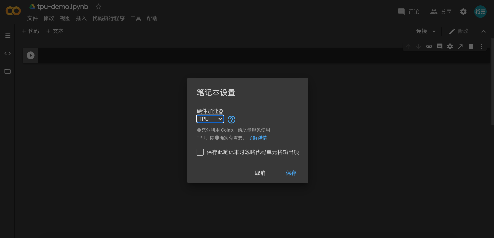

# Model Training Using TPU

如果想尝试使用 Google Colab 上的 TPU 来训练模型，也是非常方便，仅需添加 6 行代码

## TPU Settings

详见上一节内容，首先登陆 [Google Drive](https://drive.google.com/drive/)，在 Colab 笔记本中，依次点击 **修改/笔记本设置**，在 **硬件加速器** 中选择 **TPU**



TPU 没有像 `nvidia-smi` 这样的命令，但是仍然可以在命令行中查看一些信息，首先确认 TensorFlow 的版本号

```python
%tensorflow_version 2.x
import tensorflow as tf
print(tf.__version__)
from tensorflow.keras import *
```

**output**

```console
2.3.0
```

然后查看 TPU 的运行节点

```python
import os

try:
    resolver = tf.distribute.cluster_resolver.TPUClusterResolver(
        tpu='grpc://' + os.environ['COLAB_TPU_ADDR']
    )
    print('Running on TPU ', resolver.master())
except ValueError:
    resolver = None
except KeyError:
    resolver = None
```

**output**

```console
Running on TPU  grpc://10.1.185.170:8470
```

也可以查看 TPU 的对象参数

```python
if resolver:
    tf.print(resolver.__dict__)
else:
    tf.print("[INFO] No TPU Drive!")
```

**output**

```console
{'_cloud_tpu_client': <tensorflow.python.tpu.client.client.Client at 0x7f9e3fcb2c18>,
 '_coordinator_address': None,
 '_coordinator_name': None,
 '_task_id': 0,
 '_task_type': 'worker',
 '_tpu': 'grpc://10.1.185.170:8470'}
```

## TPU Colab Demo

以下代码可以通过 Colab 链接测试效果 【 [TF2.3 Demo with TPU](https://colab.research.google.com/drive/1cmxP8rsdLoZ0XD31wDgb3lvoPgpXBCiH?usp=sharing) 】

### Data Preparation

```python
MAX_LEN = 300
BATCH_SIZE = 32
(x_train, y_train), (x_test, y_test) = datasets.reuters.load_data()
x_train = preprocessing.sequence.pad_sequences(x_train, maxlen=MAX_LEN)
x_test = preprocessing.sequence.pad_sequences(x_test, maxlen=MAX_LEN)

MAX_WORDS = x_train.max() + 1
CAT_NUM = y_train.max() + 1

ds_train = tf.data.Dataset.from_tensor_slices((x_train, y_train)) \
          .shuffle(buffer_size=1000).batch(BATCH_SIZE) \
          .prefetch(tf.data.experimental.AUTOTUNE).cache()

ds_test = tf.data.Dataset.from_tensor_slices((x_test, y_test)) \
          .shuffle(buffer_size=1000).batch(BATCH_SIZE) \
          .prefetch(tf.data.experimental.AUTOTUNE).cache()
```

### Model Defination

```python
tf.keras.backend.clear_session()
def create_model():

    model = models.Sequential()

    model.add(layers.Embedding(MAX_WORDS, 7, input_length=MAX_LEN))
    model.add(layers.Conv1D(filters=64, kernel_size=5, activation="relu"))
    model.add(layers.MaxPool1D(2))
    model.add(layers.Conv1D(filters=32, kernel_size=3, activation="relu"))
    model.add(layers.MaxPool1D(2))
    model.add(layers.Flatten())
    model.add(layers.Dense(CAT_NUM, activation="softmax"))
    return(model)

def compile_model(model):
    model.compile(
        optimizer=optimizers.Nadam(),
        loss=losses.SparseCategoricalCrossentropy(from_logits=True),
        metrics=[
            metrics.SparseCategoricalAccuracy(), 
            metrics.SparseTopKCategoricalAccuracy(5)
        ]
    )
    return(model)

tf.keras.backend.clear_session()
```

### Model Training

```python
# 增加以下代码
# import os
# resolver = tf.distribute.cluster_resolver.TPUClusterResolver(
#     tpu='grpc://' + os.environ['COLAB_TPU_ADDR']
# )

if resolver:
    tf.config.experimental_connect_to_cluster(resolver)
    tf.tpu.experimental.initialize_tpu_system(resolver)
    strategy = tf.distribute.experimental.TPUStrategy(resolver)
else:
    strategy = tf.distribute.get_strategy()

print("REPLICAS: ", strategy.num_replicas_in_sync)

with strategy.scope():
    model = create_model()
    model.summary()
    model = compile_model(model)
```

**output**

```console
WARNING:tensorflow:TPU system grpc://10.1.185.170:8470 has already been initialized. Reinitializing the TPU can cause previously created variables on TPU to be lost.
WARNING:tensorflow:TPU system grpc://10.1.185.170:8470 has already been initialized. Reinitializing the TPU can cause previously created variables on TPU to be lost.
INFO:tensorflow:Initializing the TPU system: grpc://10.1.185.170:8470
INFO:tensorflow:Initializing the TPU system: grpc://10.1.185.170:8470
INFO:tensorflow:Clearing out eager caches
INFO:tensorflow:Clearing out eager caches
INFO:tensorflow:Finished initializing TPU system.
INFO:tensorflow:Finished initializing TPU system.
WARNING:absl:`tf.distribute.experimental.TPUStrategy` is deprecated, please use  the non experimental symbol `tf.distribute.TPUStrategy` instead.
INFO:tensorflow:Found TPU system:
INFO:tensorflow:Found TPU system:
INFO:tensorflow:*** Num TPU Cores: 8
INFO:tensorflow:*** Num TPU Cores: 8
INFO:tensorflow:*** Num TPU Workers: 1
INFO:tensorflow:*** Num TPU Workers: 1
INFO:tensorflow:*** Num TPU Cores Per Worker: 8
INFO:tensorflow:*** Num TPU Cores Per Worker: 8
INFO:tensorflow:*** Available Device: _DeviceAttributes(/job:localhost/replica:0/task:0/device:CPU:0, CPU, 0, 0)
INFO:tensorflow:*** Available Device: _DeviceAttributes(/job:localhost/replica:0/task:0/device:CPU:0, CPU, 0, 0)
INFO:tensorflow:*** Available Device: _DeviceAttributes(/job:localhost/replica:0/task:0/device:XLA_CPU:0, XLA_CPU, 0, 0)
INFO:tensorflow:*** Available Device: _DeviceAttributes(/job:localhost/replica:0/task:0/device:XLA_CPU:0, XLA_CPU, 0, 0)
INFO:tensorflow:*** Available Device: _DeviceAttributes(/job:worker/replica:0/task:0/device:CPU:0, CPU, 0, 0)
INFO:tensorflow:*** Available Device: _DeviceAttributes(/job:worker/replica:0/task:0/device:CPU:0, CPU, 0, 0)
INFO:tensorflow:*** Available Device: _DeviceAttributes(/job:worker/replica:0/task:0/device:TPU:0, TPU, 0, 0)
INFO:tensorflow:*** Available Device: _DeviceAttributes(/job:worker/replica:0/task:0/device:TPU:0, TPU, 0, 0)
INFO:tensorflow:*** Available Device: _DeviceAttributes(/job:worker/replica:0/task:0/device:TPU:1, TPU, 0, 0)
INFO:tensorflow:*** Available Device: _DeviceAttributes(/job:worker/replica:0/task:0/device:TPU:1, TPU, 0, 0)
INFO:tensorflow:*** Available Device: _DeviceAttributes(/job:worker/replica:0/task:0/device:TPU:2, TPU, 0, 0)
INFO:tensorflow:*** Available Device: _DeviceAttributes(/job:worker/replica:0/task:0/device:TPU:2, TPU, 0, 0)
INFO:tensorflow:*** Available Device: _DeviceAttributes(/job:worker/replica:0/task:0/device:TPU:3, TPU, 0, 0)
INFO:tensorflow:*** Available Device: _DeviceAttributes(/job:worker/replica:0/task:0/device:TPU:3, TPU, 0, 0)
INFO:tensorflow:*** Available Device: _DeviceAttributes(/job:worker/replica:0/task:0/device:TPU:4, TPU, 0, 0)
INFO:tensorflow:*** Available Device: _DeviceAttributes(/job:worker/replica:0/task:0/device:TPU:4, TPU, 0, 0)
INFO:tensorflow:*** Available Device: _DeviceAttributes(/job:worker/replica:0/task:0/device:TPU:5, TPU, 0, 0)
INFO:tensorflow:*** Available Device: _DeviceAttributes(/job:worker/replica:0/task:0/device:TPU:5, TPU, 0, 0)
INFO:tensorflow:*** Available Device: _DeviceAttributes(/job:worker/replica:0/task:0/device:TPU:6, TPU, 0, 0)
INFO:tensorflow:*** Available Device: _DeviceAttributes(/job:worker/replica:0/task:0/device:TPU:6, TPU, 0, 0)
INFO:tensorflow:*** Available Device: _DeviceAttributes(/job:worker/replica:0/task:0/device:TPU:7, TPU, 0, 0)
INFO:tensorflow:*** Available Device: _DeviceAttributes(/job:worker/replica:0/task:0/device:TPU:7, TPU, 0, 0)
INFO:tensorflow:*** Available Device: _DeviceAttributes(/job:worker/replica:0/task:0/device:TPU_SYSTEM:0, TPU_SYSTEM, 0, 0)
INFO:tensorflow:*** Available Device: _DeviceAttributes(/job:worker/replica:0/task:0/device:TPU_SYSTEM:0, TPU_SYSTEM, 0, 0)
INFO:tensorflow:*** Available Device: _DeviceAttributes(/job:worker/replica:0/task:0/device:XLA_CPU:0, XLA_CPU, 0, 0)
INFO:tensorflow:*** Available Device: _DeviceAttributes(/job:worker/replica:0/task:0/device:XLA_CPU:0, XLA_CPU, 0, 0)
REPLICAS:  8
Model: "sequential_2"
_________________________________________________________________
Layer (type)                 Output Shape              Param #   
=================================================================
embedding_2 (Embedding)      (None, 300, 7)            216874    
_________________________________________________________________
conv1d_4 (Conv1D)            (None, 296, 64)           2304      
_________________________________________________________________
max_pooling1d_4 (MaxPooling1 (None, 148, 64)           0         
_________________________________________________________________
conv1d_5 (Conv1D)            (None, 146, 32)           6176      
_________________________________________________________________
max_pooling1d_5 (MaxPooling1 (None, 73, 32)            0         
_________________________________________________________________
flatten_2 (Flatten)          (None, 2336)              0         
_________________________________________________________________
dense_2 (Dense)              (None, 46)                107502    
=================================================================
Total params: 332,856
Trainable params: 332,856
Non-trainable params: 0
_________________________________________________________________
```

执行训练

```python
history = model.fit(ds_train, validation_data=ds_test, epochs=10)
```

**output**

```console
Epoch 1/10
  1/281 [..............................] - ETA: 11s - loss: 3.2399 - sparse_categorical_accuracy: 0.6250 - sparse_top_k_categorical_accuracy: 0.6875WARNING:tensorflow:Callbacks method `on_train_batch_end` is slow compared to the batch time (batch time: 0.0014s vs `on_train_batch_end` time: 0.0154s). Check your callbacks.
WARNING:tensorflow:Callbacks method `on_train_batch_end` is slow compared to the batch time (batch time: 0.0014s vs `on_train_batch_end` time: 0.0154s). Check your callbacks.
279/281 [============================>.] - ETA: 0s - loss: 3.2544 - sparse_categorical_accuracy: 0.6102 - sparse_top_k_categorical_accuracy: 0.7217WARNING:tensorflow:Callbacks method `on_test_batch_end` is slow compared to the batch time (batch time: 0.0011s vs `on_test_batch_end` time: 0.0104s). Check your callbacks.
WARNING:tensorflow:Callbacks method `on_test_batch_end` is slow compared to the batch time (batch time: 0.0011s vs `on_test_batch_end` time: 0.0104s). Check your callbacks.
281/281 [==============================] - 6s 23ms/step - loss: 3.2544 - sparse_categorical_accuracy: 0.6102 - sparse_top_k_categorical_accuracy: 0.7214 - val_loss: 3.2922 - val_sparse_categorical_accuracy: 0.5744 - val_sparse_top_k_categorical_accuracy: 0.7168
Epoch 2/10
281/281 [==============================] - 6s 22ms/step - loss: 3.2538 - sparse_categorical_accuracy: 0.6109 - sparse_top_k_categorical_accuracy: 0.7212 - val_loss: 3.2907 - val_sparse_categorical_accuracy: 0.5744 - val_sparse_top_k_categorical_accuracy: 0.7137
Epoch 3/10
281/281 [==============================] - 6s 22ms/step - loss: 3.2532 - sparse_categorical_accuracy: 0.6113 - sparse_top_k_categorical_accuracy: 0.7227 - val_loss: 3.2901 - val_sparse_categorical_accuracy: 0.5761 - val_sparse_top_k_categorical_accuracy: 0.7128
Epoch 4/10
281/281 [==============================] - 6s 22ms/step - loss: 3.2529 - sparse_categorical_accuracy: 0.6117 - sparse_top_k_categorical_accuracy: 0.7209 - val_loss: 3.2980 - val_sparse_categorical_accuracy: 0.5663 - val_sparse_top_k_categorical_accuracy: 0.7124
Epoch 5/10
281/281 [==============================] - 6s 23ms/step - loss: 3.2531 - sparse_categorical_accuracy: 0.6113 - sparse_top_k_categorical_accuracy: 0.7216 - val_loss: 3.2914 - val_sparse_categorical_accuracy: 0.5744 - val_sparse_top_k_categorical_accuracy: 0.7110
Epoch 6/10
281/281 [==============================] - 6s 22ms/step - loss: 3.2517 - sparse_categorical_accuracy: 0.6129 - sparse_top_k_categorical_accuracy: 0.7206 - val_loss: 3.2927 - val_sparse_categorical_accuracy: 0.5730 - val_sparse_top_k_categorical_accuracy: 0.7124
Epoch 7/10
281/281 [==============================] - 6s 23ms/step - loss: 3.2519 - sparse_categorical_accuracy: 0.6126 - sparse_top_k_categorical_accuracy: 0.7203 - val_loss: 3.2919 - val_sparse_categorical_accuracy: 0.5730 - val_sparse_top_k_categorical_accuracy: 0.7159
Epoch 8/10
281/281 [==============================] - 6s 23ms/step - loss: 3.2509 - sparse_categorical_accuracy: 0.6133 - sparse_top_k_categorical_accuracy: 0.7206 - val_loss: 3.2875 - val_sparse_categorical_accuracy: 0.5779 - val_sparse_top_k_categorical_accuracy: 0.7155
Epoch 9/10
281/281 [==============================] - 6s 22ms/step - loss: 3.2510 - sparse_categorical_accuracy: 0.6132 - sparse_top_k_categorical_accuracy: 0.7210 - val_loss: 3.2895 - val_sparse_categorical_accuracy: 0.5757 - val_sparse_top_k_categorical_accuracy: 0.7159
Epoch 10/10
281/281 [==============================] - 6s 22ms/step - loss: 3.2506 - sparse_categorical_accuracy: 0.6134 - sparse_top_k_categorical_accuracy: 0.7212 - val_loss: 3.2890 - val_sparse_categorical_accuracy: 0.5752 - val_sparse_top_k_categorical_accuracy: 0.7142
```
