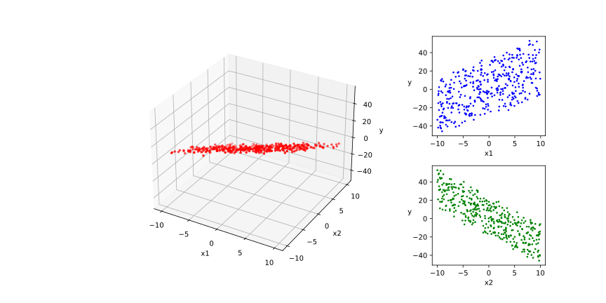

# 05-08 High-level API: Demonstration

下面的范例使用 TensorFlow 的高阶 API 实现 **线性回归** 模型和 **DNN二分类** 模型

TensorFlow 的高阶 API 主要为 `tf.keras.models` 提供的模型的类接口

使用 Keras 接口有以下 3 种方式构建模型

- 使用 Sequential 按层顺序构建模型
- 使用函数式 API 构建任意结构模型
- 继承 Model 基类构建自定义模型

此处分别演示使用 Sequential 按层顺序构建模型以及继承 Model 基类构建自定义模型

首先，导入一些必要的 Package

```python
import numpy as np
import pandas as pd
from matplotlib import pyplot as plt
from matplotlib.ticker import MultipleLocator, FormatStrFormatter

import tensorflow as tf
from tensorflow.keras import models, layers, losses, metrics, optimizers
```

在训练的时候，打印时间分割线的函数

```python
# 打印时间分割线
@tf.function
def printbar():
    today_ts = tf.timestamp() % (24 * 60 * 60)

    hour = tf.cast(today_ts // 3600 + 8, tf.int32) % tf.constant(24)
    minite = tf.cast((today_ts % 3600) // 60, tf.int32)
    second = tf.cast(tf.floor(today_ts % 60), tf.int32)

    def timeformat(m):
        if tf.strings.length(tf.strings.format("{}", m)) == 1:
            return(tf.strings.format("0{}", m))
        else:
            return(tf.strings.format("{}", m))

    timestring = tf.strings.join([timeformat(hour), timeformat(minite), 
                timeformat(second)], separator=":")
    tf.print("==========" * 8 + timestring)
```

## Linear Regression Model

此范例我们使用 Sequential 按层顺序构建模型，并使用内置 `model.fit` 方法训练模型

### Prepare Regression Data

```python
# 样本数量
n = 400

# 生成测试用数据集
X = tf.random.uniform([n, 2], minval=-10, maxval=10) 
w0 = tf.constant([[2.0], [-3.0]])
b0 = tf.constant([[3.0]])
Y = X @ w0 + b0 + tf.random.normal([n, 1], mean=0.0, stddev=2.0)    # @ 表示矩阵乘法，增加正态扰动
```

可以将需要回归的数据可视化，以便有一个直观的理解

```python
# 数据可视化
%matplotlib inline
%config InlineBackend.figure_format = 'svg'

plt.figure(figsize=(12, 6))
plt.subplots_adjust(wspace=0.05, hspace=0.3)
ax1 = plt.subplot2grid((2, 4), (0, 0), rowspan=2, colspan=3, projection="3d")
ax1.scatter3D(X[:, 0], X[:, 1], Y[:, 0], c="r", s=6)
ax1.xaxis.set_major_locator(MultipleLocator(5))
ax1.yaxis.set_major_locator(MultipleLocator(5))
ax1.zaxis.set_major_locator(MultipleLocator(20))
ax1.xaxis.set_label_text("x1")
ax1.yaxis.set_label_text("x2")
ax1.zaxis.set_label_text("y")

ax2 = plt.subplot2grid((2, 4), (0, 3), rowspan=1, colspan=1)
ax2.scatter(X[:, 0], Y, c="b", s=3)
plt.xlabel("x1")
plt.ylabel("y", rotation=0)

ax3 = plt.subplot2grid((2, 4), (1, 3), rowspan=1, colspan=1)
ax3.scatter(X[:, 1], Y, c="g", s=3)
plt.xlabel("x2")
plt.ylabel("y", rotation=0)

# plt.savefig("figs/5-8-regression-data-visualization.svg")
plt.show()
```



### Regression Model Definition

```python
tf.keras.backend.clear_session()

model = models.Sequential()
model.add(layers.Dense(1, input_shape=(2,)))
model.summary()
```

**output**

```console
Model: "sequential"
_________________________________________________________________
Layer (type)                 Output Shape              Param #
=================================================================
dense (Dense)                (None, 1)                 3
=================================================================
Total params: 3
Trainable params: 3
Non-trainable params: 0
_________________________________________________________________
```

### Training Regression Model

```python
# 使用 fit 方法进行训练
model.compile(optimizer="adam", loss="mse", metrics=["mae"])
model.fit(X, Y, batch_size=10, epochs=200)  

tf.print("w =", model.layers[0].kernel)
tf.print("b =", model.layers[0].bias)
```

**output**

```console
Epoch 1/200
40/40 [==============================] - 0s 1ms/step - loss: 209.9401 - mae: 11.7425
Epoch 2/200
40/40 [==============================] - 0s 1ms/step - loss: 201.7068 - mae: 11.5135
Epoch 3/200
40/40 [==============================] - 0s 1ms/step - loss: 193.6049 - mae: 11.2839
Epoch 4/200
40/40 [==============================] - 0s 921us/step - loss: 185.7780 - mae: 11.0517
Epoch 5/200
40/40 [==============================] - 0s 1ms/step - loss: 178.1419 - mae: 10.8242
...
Epoch 196/200
40/40 [==============================] - 0s 1ms/step - loss: 4.0821 - mae: 1.6471
Epoch 197/200
40/40 [==============================] - 0s 2ms/step - loss: 4.0859 - mae: 1.6477
Epoch 198/200
40/40 [==============================] - 0s 2ms/step - loss: 4.0820 - mae: 1.6470
Epoch 199/200
40/40 [==============================] - 0s 2ms/step - loss: 4.0810 - mae: 1.6474
Epoch 200/200
40/40 [==============================] - 0s 2ms/step - loss: 4.0821 - mae: 1.6471
w = [[1.99607968]
 [-3.01163626]]
b = [2.9376483]
```

回归拟合结果可视化

```python
%matplotlib inline
%config InlineBackend.figure_format = 'svg'

w, b = model.variables # get the parameters

plt.figure(figsize=(12, 6))
plt.subplots_adjust(wspace=0.05, hspace=0.3)
ax1 = plt.subplot2grid((2, 4), (0, 0), rowspan=2, colspan=3, projection="3d")
ax1.scatter3D(X[:, 0], X[:, 1], Y[:, 0], c="pink", s=10, label="samples")
ax1.plot3D(X[:, 0], X[:, 1], 
           w[0] * X[:, 0] + w[1] * X[:, 1] + b[0], "-r", linewidth=3.0, label="model")
ax1.xaxis.set_major_locator(MultipleLocator(5))
ax1.yaxis.set_major_locator(MultipleLocator(5))
ax1.zaxis.set_major_locator(MultipleLocator(20))
ax1.xaxis.set_label_text("x1")
ax1.yaxis.set_label_text("x2")
ax1.zaxis.set_label_text("y")
ax1.legend()

ax2 = plt.subplot2grid((2, 4), (0, 3), rowspan=1, colspan=1)
ax2.scatter(X[:, 0], Y, c="b", s=5, label="samples")
ax2.plot(X[:, 0], w[0] * X[:, 0] + b[0], "-r", linewidth=3.0, label="model")
ax2.legend()
plt.xlabel("x1")
plt.ylabel("y", rotation=0)

ax3 = plt.subplot2grid((2, 4), (1, 3), rowspan=1, colspan=1)
ax3.scatter(X[:, 1], Y, c="g", s=5, label="samples")
ax3.plot(X[:, 1], w[1] * X[:, 1] + b[0], "-r", linewidth=3.0, label="model")
ax3.legend()
plt.xlabel("x2")
plt.ylabel("y", rotation=0)
# plt.savefig("figs/5-8-visualization-of-regression-results.svg")
plt.show()
```


## DNN Two-Classes Model

此范例我们使用继承 Model 基类构建自定义模型，并构建自定义训练循环

### Prepare Two-Class Data

```python
%matplotlib inline
%config InlineBackend.figure_format = 'svg'

# 正负样本数量
n_positive, n_negative = 2000, 2000

# 生成正样本, 小圆环分布
r_p = 5.0 + tf.random.truncated_normal([n_positive, 1], 0.0, 1.0)
theta_p = tf.random.uniform([n_positive, 1], 0.0, 2 * np.pi) 
Xp = tf.concat([r_p * tf.cos(theta_p), r_p * tf.sin(theta_p)], axis=1)
Yp = tf.ones_like(r_p)

# 生成负样本, 大圆环分布
r_n = 8.0 + tf.random.truncated_normal([n_negative, 1], 0.0, 1.0)
theta_n = tf.random.uniform([n_negative, 1], 0.0, 2 * np.pi) 
Xn = tf.concat([r_n * tf.cos(theta_n), r_n * tf.sin(theta_n)], axis=1)
Yn = tf.zeros_like(r_n)

# 汇总样本
X = tf.concat([Xp, Xn], axis=0)
Y = tf.concat([Yp, Yn], axis=0)

#样本洗牌
data = tf.concat([X, Y], axis=1)
data = tf.random.shuffle(data)
X = data[:, :2]
Y = data[:, 2:]

# 可视化
plt.figure(figsize=(6, 6))
plt.scatter(Xp[:, 0].numpy(), Xp[:, 1].numpy(), c="hotpink", s=10)
plt.scatter(Xn[:, 0].numpy(), Xn[:, 1].numpy(), c="skyblue", s=10)
plt.legend(["positive", "negative"])
# plt.savefig("figs/5-8-categorical-data-visualization.svg")
plt.show()
```


数据切片，分割为训练集和交叉验证集

```python
ds_train = tf.data.Dataset.from_tensor_slices((X[0: n * 3 // 4, :], Y[0: n * 3 // 4, :])) \
     .shuffle(buffer_size=1000).batch(20) \
     .prefetch(tf.data.experimental.AUTOTUNE) \
     .cache()

ds_valid = tf.data.Dataset.from_tensor_slices((X[n * 3 // 4:, :], Y[n * 3 // 4:, :])) \
     .batch(20) \
     .prefetch(tf.data.experimental.AUTOTUNE) \
     .cache()
```

### Two-Class Model Definition

```python
tf.keras.backend.clear_session()
class DNNModel(models.Model):
    def __init__(self):
        super(DNNModel, self).__init__()

    def build(self,input_shape):
        self.dense1 = layers.Dense(4, activation="relu", name="dense1") 
        self.dense2 = layers.Dense(8, activation="relu", name="dense2")
        self.dense3 = layers.Dense(1, activation="sigmoid", name="dense3")
        super(DNNModel,self).build(input_shape)
 
    # 正向传播
    @tf.function(input_signature=[tf.TensorSpec(shape=[None, 2], dtype=tf.float32)])  
    def call(self, x):
        x = self.dense1(x)
        x = self.dense2(x)
        y = self.dense3(x)
        return y

model = DNNModel()
model.build(input_shape=(None, 2))

model.summary()
```

**output**

```console
Model: "dnn_model"
_________________________________________________________________
Layer (type)                 Output Shape              Param #
=================================================================
dense1 (Dense)               multiple                  12
_________________________________________________________________
dense2 (Dense)               multiple                  40
_________________________________________________________________
dense3 (Dense)               multiple                  9
=================================================================
Total params: 61
Trainable params: 61
Non-trainable params: 0
_________________________________________________________________
```

### Training Two-Class Model

```python
# 自定义训练循环
optimizer = optimizers.Adam(learning_rate=0.01)
loss_func = tf.keras.losses.BinaryCrossentropy()

train_loss = tf.keras.metrics.Mean(name='train_loss')
train_metric = tf.keras.metrics.BinaryAccuracy(name='train_accuracy')

valid_loss = tf.keras.metrics.Mean(name='valid_loss')
valid_metric = tf.keras.metrics.BinaryAccuracy(name='valid_accuracy')


@tf.function
def train_step(model, features, labels):
    with tf.GradientTape() as tape:
        predictions = model(features)
        loss = loss_func(labels, predictions)
    grads = tape.gradient(loss, model.trainable_variables)
    optimizer.apply_gradients(zip(grads, model.trainable_variables))

    train_loss.update_state(loss)
    train_metric.update_state(labels, predictions)

@tf.function
def valid_step(model, features, labels):
    predictions = model(features)
    batch_loss = loss_func(labels, predictions)
    valid_loss.update_state(batch_loss)
    valid_metric.update_state(labels, predictions)
    

def train_model(model,ds_train, ds_valid,epochs):
    for epoch in tf.range(1, epochs + 1):
        for features, labels in ds_train:
            train_step(model, features, labels)

        for features, labels in ds_valid:
            valid_step(model, features, labels)

        logs = 'Epoch={}, Loss:{}, Accuracy:{}, Valid Loss:{}, Valid Accuracy:{}'
        
        if  epoch % 100 == 0:
            printbar()
            tf.print(
                tf.strings.format(
                    logs,
                    (
                        epoch, 
                        train_loss.result(),
                        train_metric.result(),
                        valid_loss.result(),
                        valid_metric.result()
                    )
                )
            )

        train_loss.reset_states()
        valid_loss.reset_states()
        train_metric.reset_states()
        valid_metric.reset_states()

train_model(model, ds_train, ds_valid, 1000)
```

**output**

```console
================================================================================14:55:41
Epoch=100, Loss:0.0808783397, Accuracy:0.97, Valid Loss:0.15558663, Valid Accuracy:0.940270245
================================================================================14:55:59
Epoch=200, Loss:0.0626327917, Accuracy:0.976666689, Valid Loss:0.177519068, Valid Accuracy:0.93972975
================================================================================14:56:12
Epoch=300, Loss:0.0564668849, Accuracy:0.976666689, Valid Loss:0.198961481, Valid Accuracy:0.940540552
================================================================================14:56:23
Epoch=400, Loss:0.0470629744, Accuracy:0.976666689, Valid Loss:0.247450933, Valid Accuracy:0.930540562
================================================================================14:56:39
Epoch=500, Loss:0.0440494567, Accuracy:0.98, Valid Loss:0.229247257, Valid Accuracy:0.937027037
================================================================================14:56:52
Epoch=600, Loss:0.0697792768, Accuracy:0.973333359, Valid Loss:0.264802456, Valid Accuracy:0.936486483
================================================================================14:57:04
Epoch=700, Loss:0.07772246, Accuracy:0.976666689, Valid Loss:0.256198585, Valid Accuracy:0.934324324
================================================================================14:57:15
Epoch=800, Loss:0.0720365494, Accuracy:0.98, Valid Loss:0.250068367, Valid Accuracy:0.935405433
================================================================================14:57:27
Epoch=900, Loss:0.0663554296, Accuracy:0.973333359, Valid Loss:0.244732589, Valid Accuracy:0.935675681
================================================================================14:57:38
Epoch=1000, Loss:0.0519070067, Accuracy:0.976666689, Valid Loss:0.246506721, Valid Accuracy:0.935945928
```

将二分类结果可视化

```python
# 结果可视化
fig, (ax1, ax2) = plt.subplots(nrows=1, ncols=2, figsize=(12, 5))
ax1.scatter(Xp[:, 0], Xp[:, 1], c="hotpink", s=10)
ax1.scatter(Xn[:, 0], Xn[:, 1], c="skyblue", s=10)
ax1.legend(["positive", "negative"])
ax1.set_title("y_true")

Xp_pred = tf.boolean_mask(X, tf.squeeze(model(X) >= 0.5), axis=0)
Xn_pred = tf.boolean_mask(X, tf.squeeze(model(X) < 0.5), axis=0)

ax2.scatter(Xp_pred[:, 0], Xp_pred[:, 1], c="hotpink", s=10)
ax2.scatter(Xn_pred[:, 0], Xn_pred[:, 1], c="skyblue", s=10)
ax2.legend(["positive", "negative"])
ax2.set_title("y_pred")
# plt.savefig("figs/5-8-visualization-of-categorical-data-results.svg")
plt.show()
```


